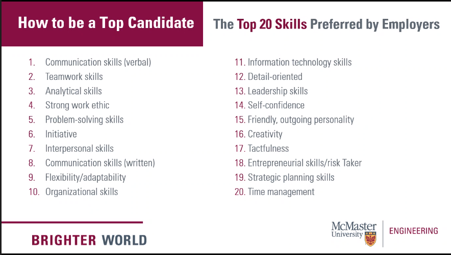

# ENGINEER 3CX3

## Lecture 1 | 2020-09-21

#### Overview

**Instructor:** Stephen Mattucci `mattucs@mcmaster.ca`

**TA:** Danielle Pearlston `pearlstd@mcmaster.ca`

**Meeting Time:**  7:00 - 10:00 pm Monday / Wednesday

- Poll prefence for Teams, will use Teams unless workshop instructor prefers Zoom

- Reviewed Syllabus & discussed the class structure & organization. 
  - Ice breakers with classmates

**Pass / Fail**

## Lecture 2 | 2020-09-21

### Reflection

==Experience $\neq$ deep learning==

Experential education can be provided by **educators** *but* learning through experience is up to the student.

#### Prompts for Reflection

- the most impactful learning:
  - There are many professors who are actually very dedicated to teaching and spend a lot of time preparing and getting it right and adjusting 

- something that surprised you
  - MSU has instituted mandatory $5 clubs fee, and raised minimum number of students in a club to 25 minus exec
- your biggest take-away
  - you need to make the time and self prioritize in async learning
- a challenge you've overcome
  - Disorganization & constant messaging 
- an adversity you've faced
  - 
- a challenge you're still struggling with
  - not being able to disconnect; anxiety I'm forgetting something
- something you're most grateful for
  - friends and family

Group ideas into themes

Online and asynchronous education has shifted a lot of the assessments to take home assignments to account for the inability to proctor / administer tests or labs or in class work. Because of this, and as well as due to the many challenges online school has brought to running clubs, it has become more overwhelming to keep up with deadlines. Due to the async nature, it always feels as if I could be doing something, and its hard to have down time without feeling guilty. There's always the anxiety that there is a deadline that might be missed.

## Workshop - Sponsorship & Marketing

Building a personal brand 

Program | Position | Passion T

Follow companies you want to collaborate with