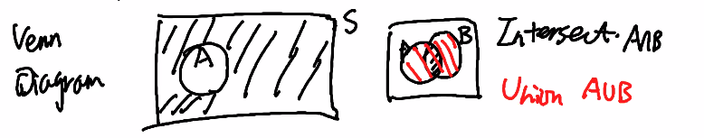
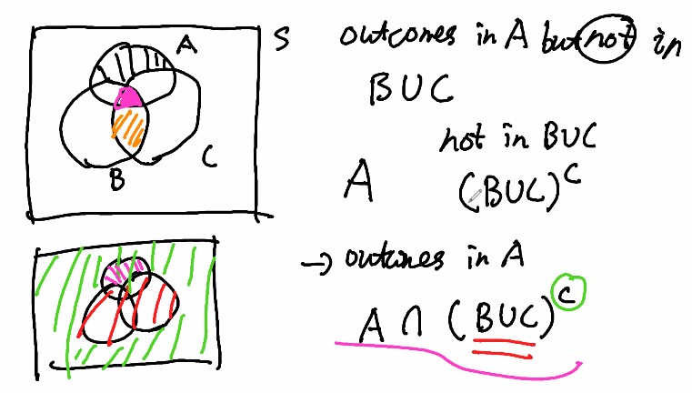
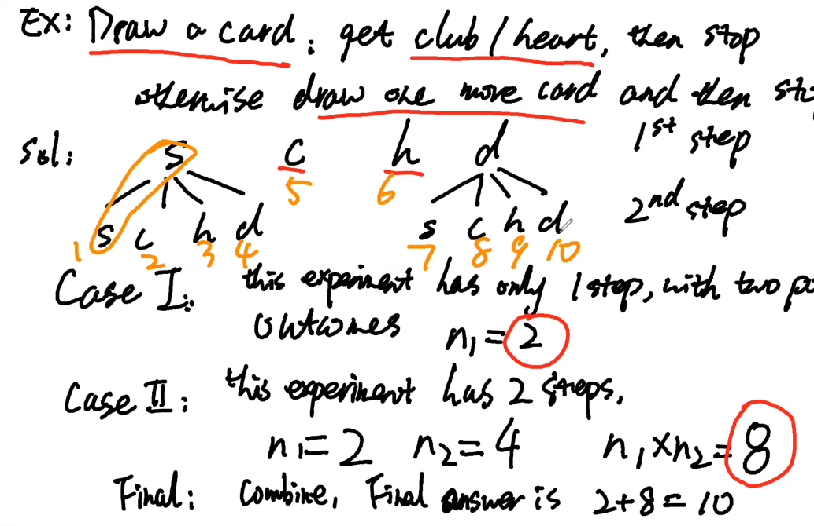
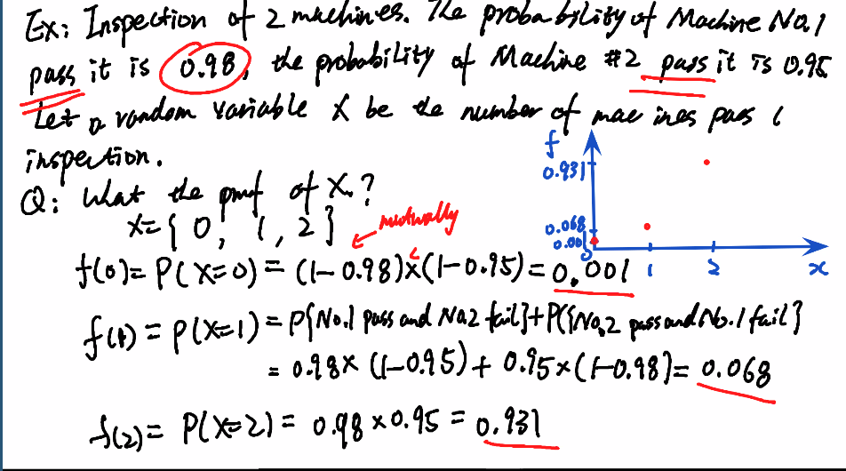
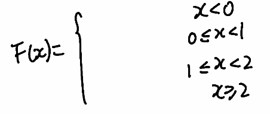
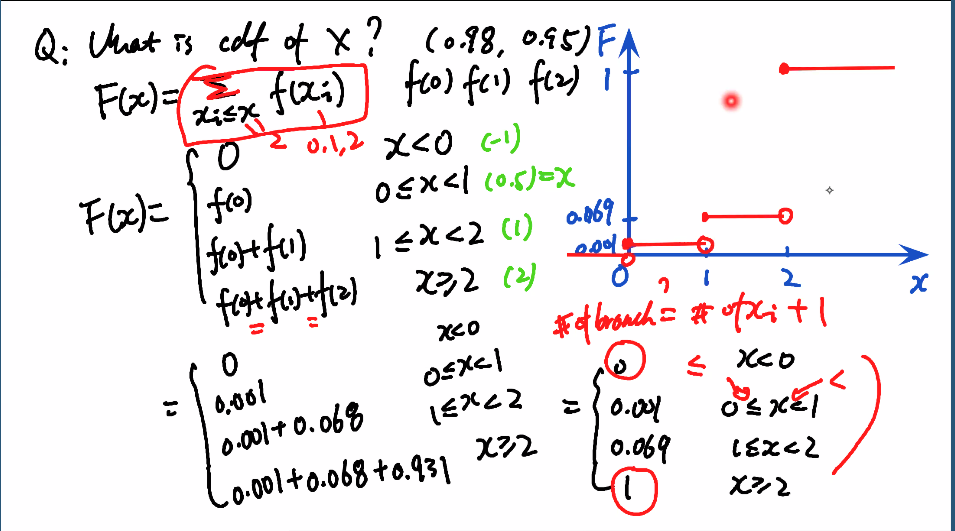
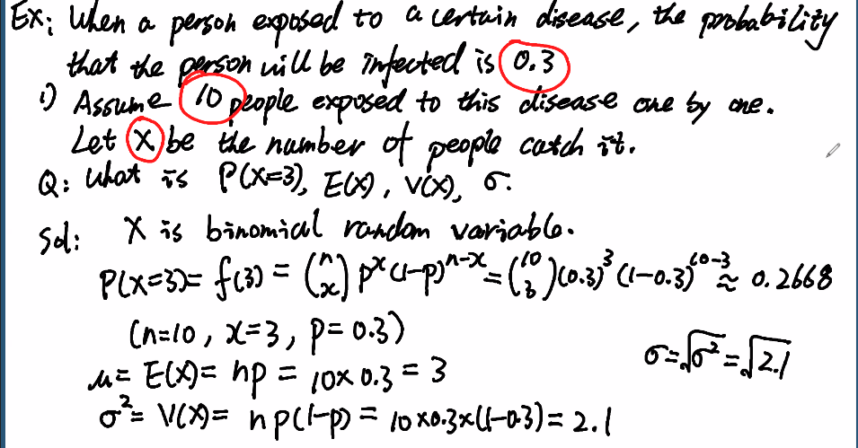
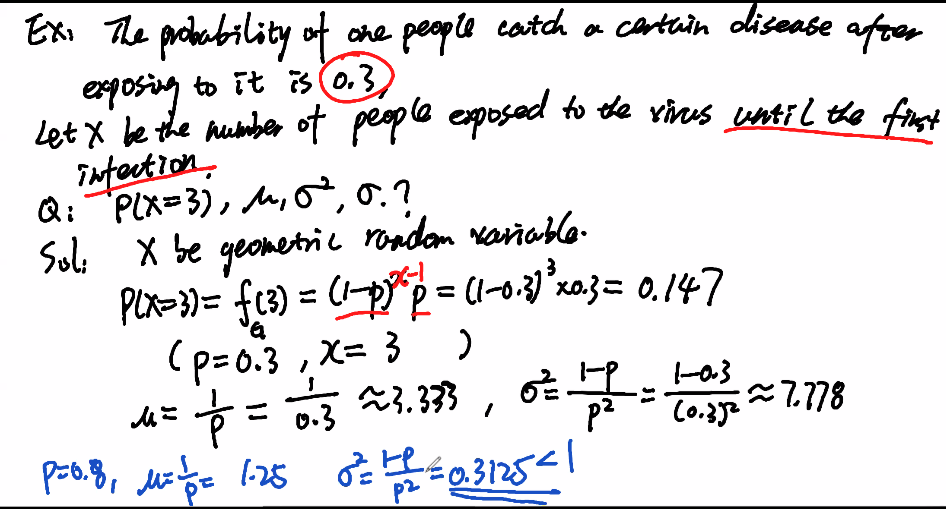
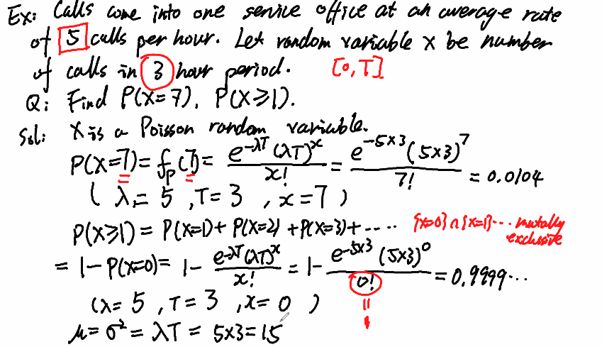

# Statistics 3Y03 

## Lecture 1 | 2020-09-09

### Introduction to Probability Theory

- Stats is the science of *collecting, analyzing, and inferring* from **data**
- **Probability** = mathematics of random events, intimately related to statistics
- **Experiment** = anything that produces **data**, while a ***random experiment*** is an experiement that can produce *different* outcomes from the same process
- **Sample Space** $:= S$ = the set of all outcomes of a **random experiment**

  - **Discrete** iff *finite* or *countably infinite*
  - **Continuous** iff *infinite*
- **Event** $:= E  \sube S$
- An *event* E, is a subset of the sample space *S* , where E is a set of outcomes
  - *E = {HHH, HHT, HTH, THH} ⊆⊆ {HHH, HHT, …} = S*
- Given some events, new events can be defined: 
- Given $E$, $E_1$, $E_2 \sube S$
  - **Union**: $E_1 \cup E_2 := \{ x \in S : x \in E_1 \lor x \in E_2\}$
- **Intersection**: $E_1 \cap E_2 := \{x \in S : x \in E_1 \land x \in E_2 \}$
  - **Complement:** $E' = \{x \in S : x \notin E\}$

If $E \sube S$ is any event, then $E \cup E' = S$ and $E \cap E'= \emptyset$

$S$ and $\empty$ are events, and $S' = \empty$ , given sample space $S$

- **Mutualy Exclusivity = ** Given $E_1, E_2, \sube S$ , two events are **mutually exclusive** if:
  - $E_1 \cap E_2 = \empty $
  - Inutition is that events cannot happen simultaneously, which using the coin exmaple with space $S = \{H, T\}$ would be the events $E_1 = \{H\}$ and $E_2 = \{T\}$
- Useful rules for **manipulating events** algebraically using events $A, B, C, \sube S$
- (A’)’ = A
- Distributivity:
  - (A ∪∪ B) ∩∩ C = (A ∩∩ C) ∪∪ (B ∩∩ C)
  - (A ∩∩ B) ∪∪ C = (A ∪∪ C) ∩∩ (B ∪∪ C)
- DeMorgan’s Laws:
  - (A ∪∪ B)’ = A’ ∩∩ B’
  - (A ∩∩ B)’ = A’ ∪∪ B’

### Counting Techniques

- **Basic Counting Principle**:

  - Suppose we have *r-many* experiments, and suppose the *ith* experiment has *n~i~* possible outcomes

  - The ***total number of outcomes*** from running all the experiments ***consecutively*** is

    $\displaystyle\prod_{i=1}^{r}{n_i =n_1*n_2 ... n_{r-1}n_r}$

  - **ex. coin flip:** if we toss a coin **3 times**, and each coin toss has **2 outcomes**, the the total number of outcomes if $\displaystyle\prod_{i=1}^{3}{2} = 2*2*2 = 2^3 = 8$

- **Permutations**: $n! = n ( n - 1 ) (n - 2) ... 3 * 2 * 1$

  - Given *n* **distinct** objects, the number of ways to permute them is *n* **factorial**

  - In general,  the formula for a set of n distinct objects, the number of ways to permute $r \leq n$ of them is:

    $P^n_r = n Pr = n (n -1 ) .... ( n - r + 1) = \dfrac{n!}{(n-r)!}$

    - r = length of sequence, n = size of set to draw from. 
  
- Ex. number of 3 letter words with no repeats: $P_3^{26} = \frac{26!}{(26-3)!}$ = $26 * 25 *  24$
  
- Not all objects may be unique, ex. "**BANANA**"
  
- If all the letters were unique, there would be $6!$ perumtations, but since there are 3 As, and 2 Ns, some of the permutations leave the word unchanged
  
- There are 3! ways to permute the A's and 2! ways to permute the Ns. If we "cancel" the permuations that do nothing, we have $\frac{6!}{3!2!}$ = 60 many unique permutations
  
- Given $n = n_1 + n_2 + ... + n_r$ many objects with $n_i$ identical many objects of type i, there are
  
  $\dfrac{n!}{n_1!n_2!...n_r!}$
  
  ​    

### **Combinations**

Given a group of n distinct objects, the number of ways to choose $r \leq n$ of them is

$C_r^n = n C r = (\dfrac{n}{r}) = \dfrac{n(n-1)..(n- r + 1)}{(n-r)!} = \dfrac{n!}{(n-r)! r!}$

n "choose" r

- **Binomial Coefficients** =  $(\dfrac{n}{r})$ 

  - Appear in many places, such as the binomial theorem

    $\forall x,y$ :  $(x + y)^n = \displaystyle\sum^{n}_{r=0}(\dfrac{n}{r}) x^{r}y^{n-r}$

## Lecture 2 | 2020-09-10

**Recap**

- Each week, several sections of the textbook will be covered
  - What will be covered in each lecture can be found in the `Lecture Schedule` section of the course page
  - Can then go through the textbook to look over what content will be covered, all units correspond to the textbook’s sections
- Slides are a “shorter version” of the lecture notes, should still look @ class notes from 2019 to fully get all information

### Sample Space

1. What is the sample space for a coin flip?
   SOLN:
   The sample space is all possible outcomes of an experiment, therefore:
   **S = {Heads, Tails} = {H, T}**
   NOTE: S is usually used to refer to a sample space, but sometimes Omega (ΩΩ) is also used

2. What is the sample space for flipping two coins?

   SOLN:

   The first coin flip can either be a H or a T, and the second can also be a H or a T. A tree diagram can be made to branch out to all possibilities.

   S = {HH, HT, TH, TT}

   

   - Many of these issues can get out of control very fast, recommended to always do a tree diagram to make sure you get everything
   - Is this sample space continuous or discrete?
     SOLN:
     **Discrete**, since it is limited and/or countably infinite.

3. Measure the height of a tree (not a sample space tree, just a regular tree). Sample space?
   SOLN:
   **S = {x | x ≥≥ 0}, this sample space is continuous**
   This doesn’t give a unit though, so it should be
   **S = {x | x ≥≥ 0cm}**
   or
   **S = {x | 100000cm ≥≥ x ≥≥ 0cm}**
   NOTE: This experiment gives little to no information for assumptions, so we could assume the second to be correct. The third is more to display limits, as we can assume there isn’t a tree taller than 100000cm.

- SIDE QUESTION: Is money continuous?
  SOLN:
  Depends what kind. If it is paying through cash and change, it is discrete, since there is a minimum measure of money ($0.01). However, for stock markets and for other types of money trading, there are commonly many decimals in an amount of money, with no defined minimum, so it would be continuous.

**Events**

1. Flip two coins, and give the event for…
   a) Getting one H
   SOLN:
   **E1 = {HT, TH}**
   b) Getting two H
   SOLN:
   **E2 = {HH}**
   c) The first coin is H
   SOLN:
   **E3 = {HH, HT}**

**Rule of Sets** (this was reviewed in Week 1 notes)

1. Intersect (and): Outcomes in sets A **and** B, A ∩∩ B

2. Union (or): Outcomes in sets A **or** B, A ∪∪ B

3. Compliment (not): Outcomes

   

   not

    

   in A, A’

   - These can also all be displayed through venn diagrams  - An extra problem with venn diagrams can be seen here: 

## Lecture 3 | 2020-09-14

### Further Set Questions

**Multiplication Rules**

- **Q1**: Flip two coins, how many outcomes are in the sample space?
  SOLN:
  Each coin has 2 possible outcomes, each independent of one another,
  n1=n2=2n1=n2=2
  Therefore, the number of outcomes in this sample space is:
  **n1xn2=2x2=4n1xn2=2x2=4**
- **Q2**: Draw a card, stop if you get a club/heart, otherwise draw one more card and then stop. How many outcomes are in the sample space?
  SOLN:
  We begin with the first card draw. We can only have four possible cases of card draw results (S, C, H, D). For C and H, that is the end of the experiment, and there is no following move. For S and D, there are another four possible outcomes. This can be done through tree diagrams, but also through case analysis:
  **Case I**: This experiment has only 1 step, with 2 possible outcomes, therefore:
  n1=2n1=2
  **Case II**: This experiment has 2 steps, n1n1 is for getting S or C, and n2n2 is for any other card, therefore:
  n1=2n1=2, n2=4n2=4
  n1xn2=8n1xn2=8
  **Final**: Combine Case I and Case II:
  **2+8=102+8=10**
  

**Permutations and Combinations**

- We have n objects, and we would like to select objects from them. How many different selections do we have?

- Key difference between the two is **order** (permutations care about order, combinations do not)

- Q1

  : Suppose a hospital office has to schedule 2 brain surgeries, 3 knee surgeries, and 1 shoulder surgery.

  - How many possible schedules can we have?

    SOLN:

    Some examples of a schedule can be as follows:

    b b k k k s

    b k b k k s

    Note though, there is no specification of two surgeries of the same type (ie no difference between the 3 knee surgeries), it is a

     

    permutation of similar objects

    .

    - The equation for calculating this type of permutation is as follows:
      For n objects with r types of object, with n1n1, n2n2, … nrnr objects of each type, the amount of permutations is:
      **n!n1!n2!…nr!n!n1!n2!…nr!**

  - Using this equation, we can now fill in these values:
    r = 3 (brain, knee, shoulder)
    n1n1 = 2
    n2n2 = 3
    n3n3 = 1
    n = n1+n2+n3n1+n2+n3 = 6
    Therefore, the number of possible schedules is:
    **6!2!3!1!=606!2!3!1!=60**

- Q2

  : Assume we have a batch of 75 semi-conductors. 70 are standard, and 5 are not.

  - Randomly select 3 samples from this batch, what’s the number of selections we can have?

    SOLN:

    There is no differentials between semi-conductors, so we don’t care about order. This makes this question a

     

    combination

     

    question.

    - If you have n objects and select r from them, ignoring order, the number of selections is:
      **n!r!(n−r)!n!r!(n−r)!**

  - In this question,
    n = 75
    r = 3
    therefore, the number of possible selections is:
    **75!3!(75−3!)75!3!(75−3!)**

  - How many selections will have exactly 2 standard chips?
    SOLN:
    This is a two-step experiment, getting the choice of one non-standard and 2 standard ones, giving us:
    **(51)x(702)**

## Lecture 4 | 2020-09-16

### Further Probability Examples

Choose/Permutation Questions

- Ex1: 75 semi-conductors, 70 standard and 5 not

  - Q: Select 3 samples
    SOLN:
    Common sense: assume the 75 semi-conductors are numbered ( 1, 2, 3, …, 75, where 70-75 are non-standard)
    Since it is an unordered arrangement, the group 3, 1, *75* is the same as 1, 3, *75*, since there are no differences between the semi-conductors in each group
    (This is just an explanation for a question last lecture, look there for the full solution)

- Ex2: Flip a coin (S = {

  

  H,TH,T

  }). Show that the coin is fair (

  

  P(H)=P(T)=12P(H)=P(T)=12

  )

  - SOLN

    The axiom of probability says that:

    1. Each probability is >/= 0
    2. The sum of the weights is = 1

  - Therefore, we can get that

    

    P(H)+P(T)=1P(H)+P(T)=1

    

    P(H)=P(T)P(H)=P(T)

    - Solving these equations gets us the line that P(H)=P(T)=12P(H)=P(T)=12

- Ex3: A heating system has the following probabilities for a shutdown (E = electrical failure, G = gas leak): |

   

  

  EE

   

  |

   

  

  E′E′

   

  |

   

  

  GG

   

  | 32 | 5|

   

  

  G′G′

  | 21 | 12|

  What is the probability of…

  - a) P(E)P(E)
    SOLN:
    This probability is the total chance of E happening (number of shutdown caused by E), which would be E over the full total (number of total shutdowns)
    P(E)=32+2132+21+5+12P(E)=32+2132+21+5+12
    **=5370=5370**
  - b) P(E∩G)P(E∩G)
    SOLN:
    This probability is the chance of E and G both happening in a shutdown. This would just be the cell with E and G, which is 32
    **P(E∩G)=3270P(E∩G)=3270**
  - c) P(E∪G′)P(E∪G′)
    SOLN:
    This probability is the total chance of a shutdown caused by E or not by G (NOTE: Do not count overlap, so we’re really looking for P(E)+P(G)−P(E∩G′)P(E)+P(G)−P(E∩G′))
    P(E∪G′)=(32+21)+(12)70P(E∪G′)=(32+21)+(12)70
    **=6570=6570**
  - d) P(E|G)P(E|G)
    SOLN:
    What is the equation for conditional probability anyways?
    P(E|G)=P(E∩G)P(G)P(E|G)=P(E∩G)P(G)
    We can now plug in values to this equation and solve our problem
    =32/7037/70=32/7037/70
    **=3237=3237**

- Ex4: Circuits and reliability. Take a circuit with probability that parts D1 and D2 (in series) will work as D1=0.8D1=0.8, D2=0.9D2=0.9. What’s the probability that the system will work?
  SOLN:
  P(system function)=P(D1∩D2)P(system function)=P(D1∩D2)
  NOTE: D1 is independent with D2 (in series, not in parallel), which means the intersection would be:
  =P(D1)xP(D2)=P(D1)xP(D2)
  =0.8x0.9=0.8x0.9
  **=0.72=0.72**

- Ex5: New circuit, with working probability D1=0.8D1=0.8, D2=0.9D2=0.9, but the parts are in parallel. What’s the probability the system would work?
  SOLN:
  NOTE: Since it is in parallel, now either one just needs to work, making this a union example P(system function)=P(D1∪D2)P(system function)=P(D1∪D2)
  =P(D1)+P(D2)−P(D1∩D2)=P(D1)+P(D2)−P(D1∩D2)
  =0.8+0.9−0.72=0.8+0.9−0.72
  **=0.98=0.98**

- Ex6: Newer circuit, with top in series as D1=0.8D1=0.8, D2=0.9D2=0.9, and the bottom in series as D3=0.7D3=0.7. What is the probability the system would work?
  SOLN:
  P(system function)=P(upper∪lower)P(system function)=P(upper∪lower)
  =P(upper)+P(lower)−(P(upper)xP(lower))=P(upper)+P(lower)−(P(upper)xP(lower))
  =0.72+0.7−(0.72x0.7)=0.72+0.7−(0.72x0.7)
  **=0.916**

## Lecture 5 | 2020-09-17

### Probablity Examples

Ex1: Flip 3 coins. Win $1 whenever I get a head. X is a random variable of how much money I get in this experiment.

- The possible values for X is:
  X=(0,1,2,3)=(TTT),(HTT,THT,TTH),(HHT,HTH,THH),(HHH)X=(0,1,2,3)=(TTT),(HTT,THT,TTH),(HHT,HTH,THH),(HHH)
  There are 8 outcomes in total, each divided amongst the possible values of X. The probability of these values of X are:
  P(X=0)=P([TTT])=18P(X=0)=P([TTT])=18
  P(X=1)=P([HTT,THT,TTH])=38P(X=1)=P([HTT,THT,TTH])=38
  P(X=2)=38P(X=2)=38
  P(X=3)=18P(X=3)=18
  NOTE: The random variable is given here and will be given in early questions, but it is always based on something we are interested in for a question that can take on multiple values

Assignment Qs:

- Q6: 15 day shift, 13 swing, and 9 graveyard, select 6
  - a) Probability all 6 are from the same shift?
    SOLN:
    P(select 6 from day) + P(select 6 from swing) + P(select 6 from graveyard)
    Total workers = 37
    P(day)=(156)(376)P(day)=(156)(376)
    Do the same with others and add them together
  - b) Probability **at least** 2 different shifts represented
    SOLN:
    This is the same as saying everyone is not from one shift, just do 1 - a)
  - c) Probability exactly 3 come from the day shift
    SOLN:
    This would be 3 from day and 3 from other, making the numerator 2 parts:
    (153)∗((13+9)3)(376)(153)∗((13+9)3)(376)
- Q7: A system has given defects with given probability systems. Find the probability that the system has…
  - a) Exactly 2/3 defects
    SOLN:
    Draw it out in a venn diagram, we can calculate the intersections given:
    P(A1∪A2)=P(A1)+P(A2)−P(A1∩A2)P(A1∪A2)=P(A1)+P(A2)−P(A1∩A2)
    Do this for all and add up the intersections
  - b) Type 1 defect given it does not have Type 2 or 3
    SOLN:
    P(A1|(A2∪A3)′)P(A1|(A2∪A3)′)
    Look into demorgans for solving this
- Q10: Surgeries, 2 knee, 5 hip, and 6 shoulder, probability that
  - a) All knee surgeries completed first
  - b) Probability that the schedule begins with a hip surgery given all the shoulder surgeries are last
  - **Look @ previous lectures for an example on this, email if it still doesn’t make sense**

Test Date announced

- Friday, October 2nd @ 7:00 PM
- Full layout and information is given on ChildsMath site

## Lecture 6 | 2020-09-21

### Examples

##### Ex 1. PMF & CDF

##### Question

Inspection of **2 machines**. The *probablity of machine #1 pass* is **0.98**, the *probablity of machine #2* is **0.95** . Let the **random variable** $X$ be the *number of machines pass the inspection*

Q: What the **p.m.f** of X

$f(x_i) = P(X=x_i)$ - probablity mass function

##### Answer

x = { 0, 1, 2}

0 pass, 1 pass, 2 pass

$f(0)=P(x=0)$ = (1 - 0.98) * (1 - 0.95)  = 0.001 --- by mutual exclusion and independence

$f(1) = P(x=1)$ = $P(\#1 pass, \#2 fail)$+$P(\#2 pass, \#1 fail)$$ = (0.98)*(1-0.95) + (1-0.98) *(0.95) = 0.068

by mutual exclusion and independence

$f(2) = P(x=2) = 0.98 * 0.95 = 0.931$

These are both independent, and as such we can use multipliation to compute the probablity

You should check that they satisfy the three requirements of a pmf

1. **All values are $\leq 1$** , : in our case, yes, all values are less than or equal to 1
2.  **sum of all values,  should = 1** : in our case, yes. 0.931+-.068+0.001 = 1

##### Graph 

To graph a pmf, it is $f$ x $x$ on the axis

##### Professor's Solution

##### CDF: Cumulative Distribution Function 

(0.98 , 0.95)

**Note:** we use capital F to represent cdf

$F(x) = \displaystyle\sum_{x_i\leq x} f(x_i)$ 

where $x$ is the value of the random variable

in our case , $x_i \in \{0,1,2\}$

- Our three values in our **pmf** are f(0), f(1), f(2)

  There is no value of $x_i$ that is less than 0, and so there is no result, we will set to 0

- For $0 \leq x < 1$ we have $x_i = 0$, which has value $f(0)$

- For $1\leq x<2$ we have $x_i = 1$, which has value $f(0)+f(1)$

- For $x \geq 2$ we have $x_i= 2$ which is $f(0) + f(1) + f(2)$

##### Professor's Solution

**NOTE:** The circles indicate at the point which value is included in the interval. A property of **CDF** is that the closed circle (inclusive) will always be at the start of the interval, and the open circle (excluded point) is always at the end

##### Mean & Variance

Q: What is the **mean**, **variance**, and **std** of $X$

A: $\mu = E(X) = \displaystyle\sum_{x_i} x_i f(x_i) = 0 f(0) +1 f(1) + 2(f2)$

$= 0 * 0.001 + 1 * 0.068 + 2 * 0.931 = 1.93$

^ This is the expected number of machines that will work*

Weighted average with respect to probablity

$\sigma^2 = V(X) = \displaystyle\sum_{x_i}(x_i-\mu)^2f(x_i)$

$= (0 - 1.93)^2f(0) + (1-1.93)^2f(1) +(2 - 1.93)^2f(2)$

$= 0.106624$

$\sigma = \sqrt{V(X)} = \sqrt{0.106624}$

## Lecture 7 | 2020-09-23

## Examples

## Lecture 8 | 2020-09-24

#### Poisson Distribution

