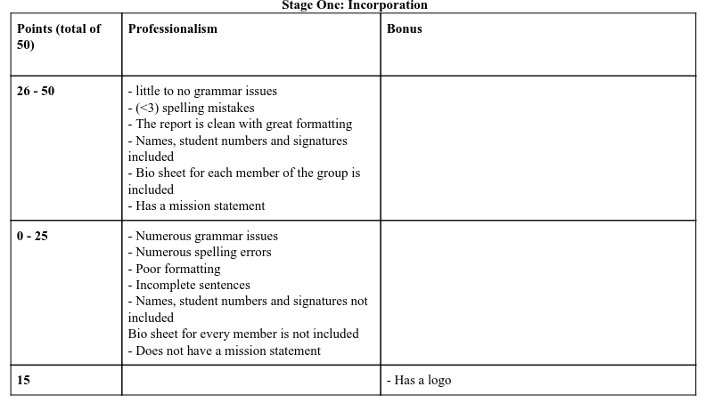

# 4A03 | Ethics, Equity, and Law in Engineering

**Instructor:** Cam Churchill `church@mcmaster.ca`

**Grading**:

- Quizzes					                       10%
- Ethics Tribunal                               5%
- Law Tribunal                                   5%
- Stage One: Incorporation              5%
- Stage Two: Risk Assessment      10%
- Stage Three: Ethical Analysis      10%
- Stage Four: Field Analysis            10%
- Stage Five: Technology Policy     10%
- Stage Six: Inquiry                            10%
- Stage Seven: Solution Proposal   10%

**Topics Covered**

|         | Lecture                                         | Game Stage                                      |
| ------- | ----------------------------------------------- | ----------------------------------------------- |
| WEEK 1  | Introduction, inquiry, game                     |                                                 |
| WEEK 2  | Risk & Technology Assessment                    |                                                 |
| WEEK 3  | Ethics & Whistleblowing                         | Stage One: Incorporation                        |
| WEEK 4  | Micro/Macro Ethics & Central question           | Stage Two: Field Analysis                       |
| WEEK 5  | Ethics and Misconduct (mention ethics tribunal) | Stage Three: Risk Assessment & Central question |
| WEEK 6  | Reading Week                                    |                                                 |
| WEEK 7  | Equity I                                        | Stage Four: Ethical Analysis                    |
| WEEK 8  | Equity II & Technologly Policy                  |                                                 |
| WEEK 9  | Engineers Act                                   | Stage Five: Technology Policy                   |
| WEEK 10 | Engineering Law Introduction                    |                                                 |
| WEEK 11 | Tort Law                                        | Stage Six: Inquiry                              |
| WEEK 12 | Contract Law                                    |                                                 |
| WEEK 13 | Wrap-up                                         | Stage Seven: Solution Proposal                  |

```
The Professional Engineers' Code of Ethics (Section 77 of the Regulation -O.Reg. 941)

1. It is the duty of a practitioner to the public, to the practitioner's employer, to the practitioner's clients, to other members of the practitioner's profession, and to the practitioner to act at all timeswith, 
	i. fairness and loyalty to the practitioner's associates, employers, clients, subordinates and employees,
    ii. fidelity to public needs, 
    iii. devotion to high ideals of personal honourand professional integrity, 	   iv. knowledge of developments in the area of professional engineering relevant to any services that are undertaken, and 
    v. competence in the performance of any professional engineering services that are undertake
```

# Lecture 1

## Gamification Stages

### Stage One: Incorporation

- **==Declaration of Incorporation==** :
  - Logo
  - 1 page bio-sheet per person (headshot, name, hometown, interests in & out of eng)
  - Points for *professionalism* (50) and *aesthetics* (15)

##### Roles

- **Chief Executive Officer** $-$ organizes and leads team meetings.
  - Ensures opinions are heard
- **Chief Financial Officer** $-$ Responsible for financial planning, management of financial risks, record-keeping, and financial reporting
- **Chief Legal Officer** $-$ Identifies and advises on all legal and ethical issues
- **Chief Sustainability Officer** $-$  Communicating work done on sustainability inside and outside the organization

