# 4AA4 | Real Time Systems and Control Applications

# Lecture 1 | 2020-09-8

**Instructor**: Wenbo He --- `hew11@mcmaster.ca`

## Outline

#### Major Contents 

- Introduction to Real-time systems
- Real-time Scheduling Algorithms
- Introduction to Digital Control Systems

#### Labs

#### Grading 

5 Labs 	30%

Midterm	30% (October 20th)

Final		40%


# Lecture 2 | 2020-09-10

## General Systems

- A set of interacting or independent components parts forming a complex/intricate whole 

- in control systems and applications, **response delays** is an important characteristics of the given systems 

#### Computing Systems

- Characteristcs of computing systems
  - accuracy
  - functionality
  - robustness
  - usability
  - repsonse speed (delay)

#### Real Time Systems (RTS)

- **Response time**
  - Time interval between a *stimulus* (or **input**) and the *corresponding response* (or **output**)
- A real time system
  - System where a **timely** response to external stimuli is vital
  - What is meant by **timely**?

##### Classifications of RTS

- ==**soft** RTS==$:=$ one in which performance is *degraded* **but not** *destroyed* by failure to meet response-time contraints
- ==**firm** RTS==$:=$ one in which missing a few deadlines **will not lead to total failture**, but *missing more than a few may lead to a complete and catastrophic failure*
- ==**hard** RTS== $:=$ one in which **failure to meet a single deadline** may lead to complete and catasrophic system failure


##### Examples of RTS

##### 

##### Comments About RTS


- Multi-tasks
  - Periodic Tasks
  - Aperiodic tasks
- Schedulability
  - The ability of tasks to meet all hard deadlines 
- Performance 
  - Response time
  - Cost of missing deadline

## RTOS and Kernel Module


#### Kernel and Kernel Space


#### User and kernel ( or Supervisor ) Modes


- The set of instructions are usually divided into two classes:

  - Those that can be executed by a **user**

  - Those that can be executed by **the kernel**

    | Operation Modes | Kernel Mode                                            | User Mode                                                    |
    | --------------- | ------------------------------------------------------ | ------------------------------------------------------------ |
    | 1               | All the instruction are allowed, including OS routings | Only limited instructions are allowed                        |
    | 2               | Unlimited hardware access                              | Direct access to the hardware and the memory is prohibited to avoid malicious users |

  

#### How OS Delivers The Services To User Process?

- User processes request a service from **Kernel** by ==making a **System Call**==
- The **library procedure** involved in a system call
  - This procedure puts parameters of the system call in a suitable registers and then issues a **TRAP** instruction
  - The control is passed on to **Kernel**, it checks the validity of parameters, performs the requested service
  - When finished a code is put in a register telling if the operation was carried out successfully or if failed
  - A return from **TRAP** instruction is then executed and the control is passed back to the user process

#### System Call and Argument Passing


#### Real-Time Operating System (RTOS)

- **==RTOS==** :
  - Designed for real-time tasks, where correctness depends on logic of the result and time
  - Hard or Soft RTS depends on how to define cost of missing deadline
- Examples : QNX, VxWorks, RTLinux, LynxOS, Windows CE, RTAI
- What makes an OS Real Time?
  - Gurantee that deadlines are met
  - Predictability
  - Not necessarily fast, and may be mediorce throughputs

#### Process Scheduling

- OS must decide which process to run first, and in what order the reminaing process should run
- A good scheduling algorithm for non-real-time system has the following objective:
  1. **Fairness**: make sure that each process gets its fair share of CPU
  2. **Efficiency**: Keep the CPU busy to serve as much workload as possible
  3. **Response Time**: Minimize waiting time of users to obtain results
  4. **Throughput**: Maximize the number of tasks processed per hour

#### OS v. RTOS


Linux is not an RTOS

# Lecture 3 | 2020-09-15

# Lecture 4 | 2020-09-17

## Lab 2 Overview

Requirements:

- Connection to VPN
- SSH client 
- Connect to myRIO device in lab

Load and use kernel modules and look at the functions output to the kernel messages log file. C program files are provided. Later lab parts require modification of C program files to add liscence and authors. 

- Description: "4AA4_lab1"
- Author
- Liscence: "GPL"

#### Notes:


## Real-Time Scheduling: Processes & Threads

### Processes

- a **program** in execution
- an **abstraction** of a running program
- the **logical unit** of of work scheduled by operating system 

**Processes** are *independent*, carry considerate **state** information, have *seperate address spaces* and interact through system proveded inter-process communication mechanisms

#### Program in Virtual Memory

- **==Stack==** = structure used to store function arguements, and local variables, and the return address of functions that called the current function
- **==Heap==** = Memory is dynamically located by system calls
- **==BSS Segment==** = ***Uninitialized*** data
- **==Data Segment==** = ***initialized*** data
- **==Text==** = Read-only region containing program instructions (or program code)


#### Stack vs. Heap 

|                       | Stack                                                        | Heap                                          |
| --------------------- | ------------------------------------------------------------ | --------------------------------------------- |
| Creation of an object | Member m;                                                    | Member* m = new Member();                     |
| Lifetime              | Function runs to completion                                  | delete, free is called                        |
| Grow in size?         | Fixed size                                                   | Heap framentation                             |
| Which one to use?     | Know the size of memory to be used, or when data size is small | When you need a large scale of dynamic memory |

#### Multiple Processes

- We could divide a program into multiple tasks by creating multiple processes using the **fork()** command
  - **Fork()** creates a ***child process*** that is *identical* to its **parent**
  - **fork()** returns a **value of 0** to the child process and teturns the ***process ID*** of the child process to the parent process


##### Before v. After fork


##### Fork() Call

- Lot of overhead to create process as *everything* is duplicated
  - Data space isn't shared, so harder to communicated
- Variables initiated **before** fork() will be duplicated in *both* parent and child process.
- **After** fork(), branch is needed to seperate the parent and the child 

```c
void main(void)
{
    pid_t pid;
    pid = fork();
    
    if (pid == 0)
        ChildProcess();
    else
        ParentProcess();
}
```

### Threads

- Threads gives us a **more efficient** way to implement a task
- With threads, *multiple* subtasks can be implemented as seperate streams in a single process
- In the threads model, we break the **memory space** of a process into **two parts**
  1. Contains the program-wide resources such as a global data and program instructions
  2. Contains infromation pertaining to the execution state of control stream, such as the PC and the stack

#### Memory Layout for Multithreaded Program


#### Single and Multi-threaded Processes


#### Advantages of Threads

- Shared address space implies that the ==communication among threads is more efficient==
- ==**Context switching** between threads in the *same* **process** is typically *faster*== than **context switching** *between* **processes**
- It is ==*much* quicker to create a **thread** than a **process**==
  - Less overhead; doesn't copy entire **memory space**
- Thread programming is supported by **POSIX**

#### Disadavantages of Threads

- **Need of Syncrhonizations** - gloabl variables are shared between threads
  - Inadvertent modification of shared variables can be disatrous
  - Thread safety is needed
- **Security** - Many library functions are *not* **thread safe**
- **Lack of Robustness** - if *one* thread crashes, the *whole* application crashes
  - Shared **memory space** and overhead

### Question To Think

- Do we benefit from using a **multi-threaded** process when it runs on a **uni-processor** system?
  - Speed of a program is either **I/O bound** or **CPU bound**
  - If **I/O bound** ==*multiple* ***threads** will make the **process** more **efficient**==

### What is POSIX

- **==POSIX==** = Portable Operating System Interface
  - IEEE and ANSI developed and approved
  - Portability of applications across variations of \*NIX\* systems
  - Provides system calls for creation of a **process** or a **thread**
- Has real time extensions

### Coding Examples

#### Pthread

```c
#include <pthread.h>
//Define a worker function
void *foo(void *args) { }
//Initialize pthread attr t
pthread_attr_t attr;
pthread_attr_init(attr);
//Create a thread
pthread_t thread;
pthread_create(&thread, &attr, worker function, arg);

//Exit Current Thread

pthread_exit(status)

```


#### Thread Programming Example

```c
#include <stdio.h>
#include <pthread.h>
#define NUM_THREAD 5

void *print_hello(void *threadid)
{
	long tid;
	tid = (long) threadid;
    printf("Hello World! It's me, thread #%1d!\n", tid);
    pthread_exit(NULL);
}

int main(int argc, char *argv[])
{
    pthread_t threads[NUM_THREADS];
    int rc;
    long t;
    for (t = 0; t < NUM_THREADS; t++){
        printf("In main: creating thread %1d\n",t);
        rc = pthread_create(threads + t, NULL, print_hello, (void *) t);
        if (rc)
        {
            printf("ERROR; return code from pthread_create() is %d\n", rc);
            return -1;
        }
    }
    return 0;
}

```


## Lecture 5 | Event Driven Programming - 2020-09-

### After fork() is Called

- Can child process acccess the data created by parent process before fork()?

  - **Yes**, but the modification can be seen ***only in child process*** and the value in the **parent** **will not** be changed

- Is data allocated on the heap (*dynamically allocated memory*) before **fork()** call is also available to the child?

  - Yes 

  ```c
  #include <stdio.h>
  #include <stdlib.h>
  #include <string.h>
  #include <sys/types.h>
  
  int main(){
      pid_t pid;
      char * str;
      str = malloc(100);
      strcpy(str, "Hello");
      pid = fork();
      
      if(pid == 0){
          printf("in child, the string is: %s\n", str);
          strcpy(str, "Goodbye"); //this will add goobye to the child process
          printf("in child, the string is: %s\n", str);
          free(str);
      }
      
      else if(pid >0 ){
          printf("In Parent, the string is: %s\n",str);
          sleep(1);
          print("in Parent, the string is: %s\n",str);
          free(str);
      }
      
      else 
          printf("error with fork()\n")
  
      return 0;
  }
  ```

  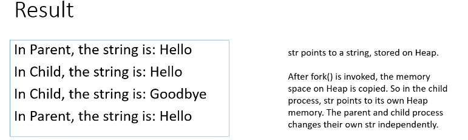


### Race Conditions

- **==Race Conditions==** = An error condition in parallel programs in which the outcome of a program changes as the relative scheduling of different control flow varies
  - Can happen where the **ordering of events** can affect the outcome of some computation
  - Why is it bad? We need progaams that are**predictable**, and **repeatable**

#### Example 1

```c
#include <stdio.h>
#include <pthread.h>

void *aThread(void *var)
{
    int* num = (int*) var;
    (*num)++;
    pthread_exit(NULL);
}

int main(int argc, char *argv[])
{
    pthread_t thread;
    int rc, i=1;
    if(rc = pthread_create(&thread, NULL, aThread,(void *) &i))
    {
        printf("ERROR; return code from pthread_create() is %d\n",rc);
        return -1;
    }
    
    else
    {
        sleep(1);
        printf("The value of i is %d\n",i)
		return 0;
    }
}


```


- What is the output?
- What is the output if we remove "sleep(1);"?
  - Race condition!


#### Example 2

```c
#include <stdio.h>
#include <pthread.h>

int g = 0;

void *aThread()
{
    g++;
    sleep(1);
    pthread_exit(NULL);
}

int main(int argc, char *argv[])
{
    int i;
    pthread_t thread[20];
    for(i=0; i<20; i++)
    {
        if(pthread_create(thread+i, NULL, aThread, NULL))
        {
            printf("ERROR; return code from pthread_create()\n")
            return -1;
        }
	printf("The value of g is %d after creating thread %d\n", g, i);
    }
    
    return 0;
}
```

##### Possible Output:

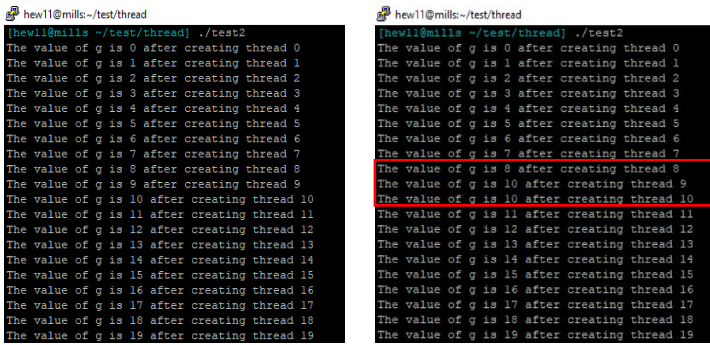

### Event Driven Program

- **==Event Driven Programming==** = [programming paradigm](https://en.wikipedia.org/wiki/Programming_paradigm) in which the [flow of the program](https://en.wikipedia.org/wiki/Control_flow) is determined by [events](https://en.wikipedia.org/wiki/Event_(computing)) such as user actions ([mouse](https://en.wikipedia.org/wiki/Computer_mouse) clicks, key presses), [sensor](https://en.wikipedia.org/wiki/Sensor) outputs, or [messages](https://en.wikipedia.org/wiki/Message_passing) from other programs or [threads](https://en.wikipedia.org/wiki/Thread_(computer_science))

- Two examples implementing the same functionality
- 

```c
#include<stdio.h>
#include<pthread.h>
#include<stdlib.h>
#include<signal.h>

intr1=0;
intr2=0;
intsum=0;
intstopped=0;
void *myThread()
{
    inti;
    for(i=0; i<5; i++)
    {
        sleep(1);
        time_tt;
        //initialize random number generator
        srand((unsigned) time(&t));
        r1=rand();
        r2=rand();
        sum=r1+r2;
        printf("i=%d, Sum=%d\n", i,sum);
    }
    stopped=1;
    pthread_exit(NULL);
}
int main ()
{
    pthread_tthread;
    if( pthread_create(&thread, NULL, myThread, NULL) )
    {
        printf("ERROR; return code from pthread_create()\n");
        return -1;
    }
    while(!stopped);
    	pthread_join(thread, NULL);
	return 0;
}
```

### Race Condition Example Question

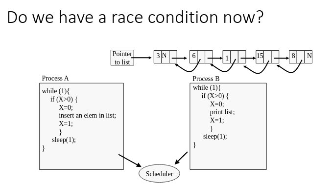

`int X=1`is a shared variable used to enforce mutually exclusive access to a linked list

#### Solutions

- What are the possible solutions to race conditions in a uniprocessor system?
  - Disable preemptions when scheduling processes(only process itself can voluntarily relinquish the CPU)
  - use semaphores as **atomic** operation

## Lecture 6 | Priority - 2020-09-

- A certain task can be implemented a s **process** or a **thread**
  - can you set priority of a **process** or a **thread**?

### Linux Priority Levels and Nice Values

- **Linux** has a static priority ranged from **0 to 139**, 
  -  **0-99** are reserved for **real time tasks**
  - **100-139** are for users
- The priority is represented as a **nice value (niceness)** 
  - ranges from **[-20, 19]**
  - maps to priority level **100 - 139**
  - The *lower* the **nice value**, the *higher* the **priority** for the process
  - 0 by default

#### Changing Process Priority

**`nice`:** change process priority on Linux

- Example:
  - `nice -10 <aProcess>`: *set* the process with a priority which has **nice value** 10
  - `nice -n -10 <aProcess>`: *increase* the **nice** **value** of a process by 10

#### Get and Set Process Priority in C

```c
# include <sys/resource.h>

int getpriority(int which, id_t who);

int setpriority(int which, id_t who, int value;)
```

***which*** may have values: **PRIO_PROCESS, PRIO_PGRP, PRIO_USER**

##### Code Example

```c
# include <sys/resource.h>

int getpriority(int which, id_t who);
int setpriority(int which, id_t who, int value;)
    //...
int which = PRIO_PROCESS;
id_t pid;
int ret;
pid = getpid();
int priority = -20;

ret = getpriority(which, pid);
ret = setpriority(which, pid, priority);
	//...
```

*alternatively*, you can use the `nice()` function:

- `int nice(int inc); ` *increase* the **process priority** by *inc*
  - ex. `nice(10)` sets the priority as **current+10**
  - *unprivileged user can only **lower** the **process priority***

### Creating a Thread With a Specified Priority

- Structure `sched_param` is declared in `#include <sched.h>.` One of the fields is *sched_priority*, which is used to set the process priority.

  ```c
  struct sched_param param;
  param.sched_priority=20;
  ```

- Functions to set priority:

  ```c
  pthread_attr_getschedparam(&tattr, &param);
  param.sched_priority= 10;
  pthread_attr_setschedparam(&tattr, &param);
  // Or.. 
  pthread_create(&thread, &tattr, worker function, arg);
  ```

  example:

  ```c
  	//...
  pthread_attr_t attr;
  pthread_attr_init(&attr);
  pthread_attr_getschedparam(&attr, &param);
  param.sched_priority= 20;
  pthread_create(threads, &attr, print_hello, arg)
      //...
  ```

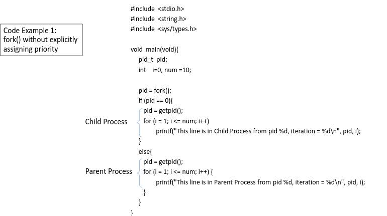

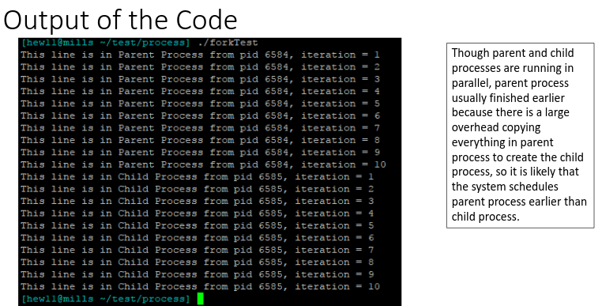

## Lecture 8 | Concepts of Real Time Scheduling- Polling v. Interrupt 

## Real-Time Tasks

- In **real-time systems**, *several* **tasks** execute **concurrently**
- Each **task** has a **real-time constraint**

**Task Categories:**

- **Periodic Tasks** = inter-arrival time between two instances *almost* same
- **Sporadic Task** = inter-arrival time between consecutive instances differ widely (*hard timing constraints*)
- **Aperiodic Tasks** = inter-arrival time between consecutive instances differ widely (*soft deadlines*)

#### Pre-emtivity of Tasks

- A **task** is ***pre-emptable*** if its execution can be suspended *any time* to allow execution of other **jobs**

- Priority Based Preemptive Scheduling

  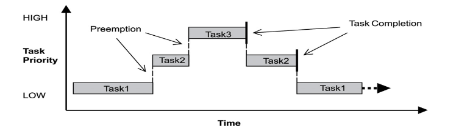

#### Temporal Parameters

- In order to meet the real time requirements of hard real-time tasks, it is assumed that many parameter of these tasks are known at all times. Some of these parameters are described below:
  - Number of Tasks( $n$)
  - Release Time *or* Arrival Time($r_{ij}$)
  - Absolute Deadline ($d_i$)
  - Relative Deadline($D_i$) $\rarr$ $d_i = r_{ij} + D_i$
  - Execution Time ($E_i$)
  - Response Time $(R_i)$

#### Number of Tasks

- In many embedded systems, the number of tasks is fixed as long as the system remains in an operation mode
- In some systems the number of tasks may change as tasks are added or deleted while the system executes, still the number of tasks with hard timing constraints is known at all times.

#### Relative Deadline vs. Absolute Deadline

- **==Relative Deadline==** = an interval
- **==Absolute Deadline==** = moment int time at which the job ***must be completed***

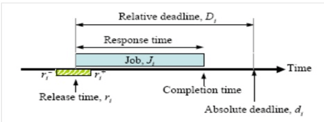

#### Execution Time

- **Execution Time** with no other tasks sharing resources
  - depends on **processor** speed and complexity of instructions
  - variations due to cache, pipelining, software structures, such as conditional branches
  - Depends on which branch is taken

What time should be used? The ***worst case execution time***

#### Response Time v. Execution Time

- **Response Time:** The time span between the task activation and its completion
- **Execution Time:** The actual amount of time required by a job to complete its execution. It may vary for many reasons. What can be determined a priori through analysis and measurements is the **max and min amount of time** to *complete* execution. It normally refers to the ***maximum time***


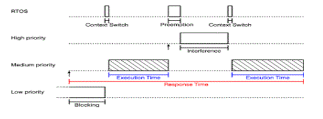

### Periods and Phases of Periodic Tasks

- **==Period $(p_i)$==** = **minimum length** of *all* time intervals between **release times** of **consecutive tasks** for a periodic tasks $T_i$
- **==Phase of a Task $(\phi_i)$==** = The **release time $r_{i1}$** of a task $T_i$ is called the phase of $T_i$
  - $\phi_i = \displaystyle r_{i1}$
- The first instances of several tasks may be released simultaneously. They are called ***in phase*** and have a **zero phase**

### Typical Task Model for Periodic Tasks

- All tasks in the task set are strictly periodic
- The relative deadline of a task is equal to its period (if not specified) 
- All tasks are independent, ie there are no precedence constraints
- No task has any non-preemtible section and the cost of preemption is negligible
- CPU processing requirements are significant; memory and I/O requirements are negligible


#### Representation of Periodic Tasks

- A **periodic task** $T_i$ can be represented by a 4 tuple: $(\phi_i,P_i,e_i,D_i)$

  - If using 3 tuple $(P_i,e_i,D_i) \implies (0, P_i,e_i,D_i)$
  - If using 2 tuple $(P_i,e_i) \implies (0, P_i, e_i, P_i), i.e. P_i = D_i$

  $\phi_i$ – is the phase of the task. Phase is release time of the first job in the task. If the phase is not mentioned then release time of first job is assumed to be zero.

  $P_i$ – is the period of the task i.e. the time interval between the release times of two consecutive jobs.

  $e_i$– is the execution time of the task.

  $D_i$ – is the relative deadline of the task.

### CPU Utilisation

- **==CPU Utilisation==**  a measure of the percentage of non-idle processing, denoted  $U$

  - Calculated by summing the contribution of utlization factors for each task.

  - Utilisation faction: $u_i$ for task $T_i$ with execution time $e_i$ and period $p_i$:

    $u_i = \dfrac{e_i}{p_i}$

  - For a system with $n$ tasks, the overall system utilisation is:

    $U = \displaystyle\sum^n_{i=1} u_i = \displaystyle\sum^n_{i=1} \dfrac{e_i}{p_i}$

### Polling and Interrupt

How Does a Process Know that an Event Occurs?

#### Polling

- **==Polling==** = constantly reading a memory location, in order to receive updates of an event or input value

  - We test a flag to capture the occurrence of an event

  - Ex: consider a system that handles a packet of data that arrives at the rate of 1 per second. On arrival of a packet a flag `packet-here` is set to 1

    ```c
    for (;;){
        if (packet-here)
        {
            process-data();
            packet-here = 0;
        }
    }
    ```

##### Pros and Cons

**Pro**:

- Simple to write and debug
- Response time easy to determine

**Cons**

- Generally not sufficient to handle complex systems or burst events
- Waste of CPU time particularly when events polled occur infrequently

#### Interrupt

- **==Interrupt==** = Upon receiving an interrupt signal, the processor interrupts whatever it is doing and serves the request

  - Ex:

    ``` c
    signal(signal, handler);
    
    void handler(int sig)
    {
        process-data();
    }
    
    int main()
    {
        ...
        while(1)
        {
            //Do some work
        }
    }
    ```


#### Handling Multiple Tasks

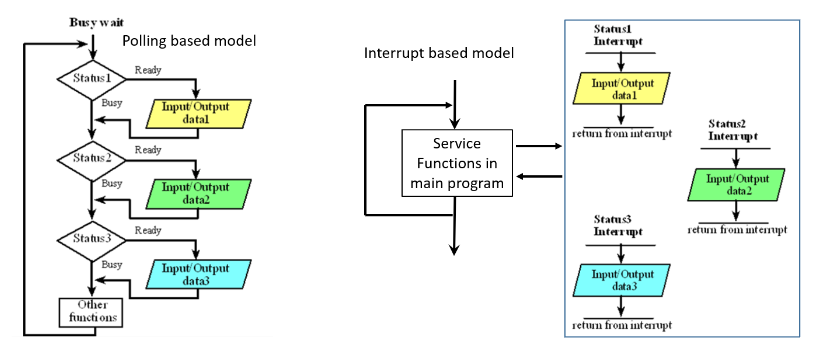

#### Comparison

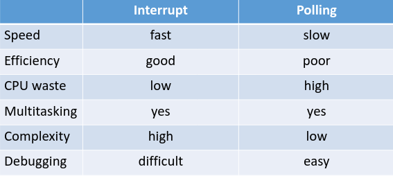

### Implementing Periodic Tasks

- You can use **sleep(),** **nanosleep(), clock_nanosleep()**, to *generate* **periodic tasks**

```c
#include <unistd.h> 
unsigned intsleep(unsigned int seconds); 
#include <time.h>
int nanosleep(const struct timespec *req, struct timespec *rem);
#include <time.h>
int clock_nanosleep(clockid_t clockid, intflags, const struct timespec *request, struct timespec *remain); 
```

#### sleep() v. nanosleep() & clock_nanosleep()

- They suspend the execution of the calling process/thread

- **low resolution:** sleep()

- **high resolution:** nanosleep(), clock_nanosleep()

  - use timespec to represent time

    ```c
    struct timespec{
        time_t tv_sec; /*seconds */
        long tv_nsec; /* nanoseconds [ 0 .. 9999999999]
    }
    ```

#### nanosleep v. clock_nanosleep()

- Clock_nanosleep() can sleep on timers and with a real-time clock

  - more flexible

    ```c
    int clock_nanosleep(clockid_t clock_id, int flags, const struct timespect *request, struct timespec *remain)
    ```

    **Example**:

    `clock_nanosleep(CLOCK_MONOTONIC, TIMER_ABSTIME, &t, NULL);`

  - **clockid** takes one of the following values:

    - **CLOCK_REALTIME**, **CLOCK_MONOTONIC**, **CLOCK_PROCESS_CPUTIME_ID**

  - If **flags** is 0 or **TIMER_ABSTIME** then the value specified in ***request*** is interpreted as an interval or an absolute time as measured by the clock, ***clock_id***

    ````c
    struct timespec{
        time_t tv_sec; //seconds
        long tv_nsec;  // nanoseconds
    };
    ````

  - **remain**: if not **NULL**, it is remaining time to sleep when it has been interrupted by a signal before it reaches sleep time

Suspends the execution of calling thread until the time value of the clock specified by **clock_id** reaches the absolute time specified by the time argument, or the process is terminated.

## Lecture 9 |  Quiz - 2020-09-28

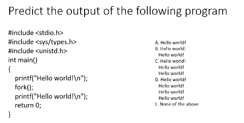

answer: c

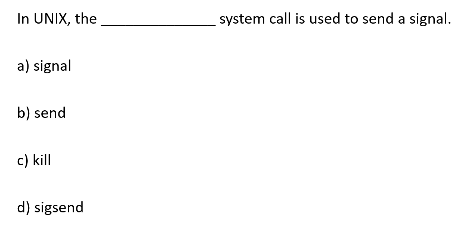

answer: c

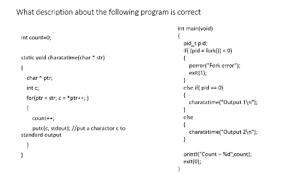

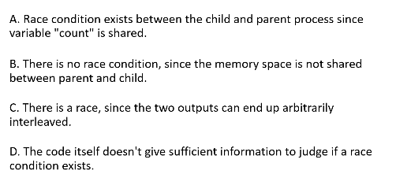

answer: c

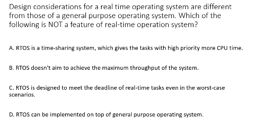

answer: a

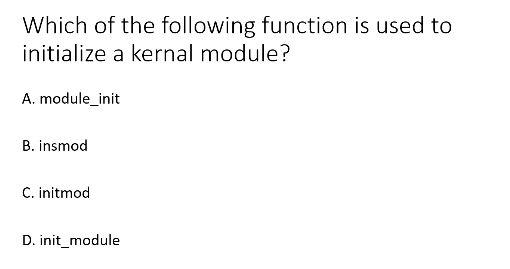

answer: B

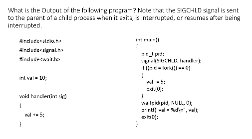

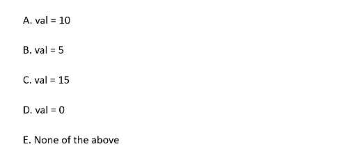

answer: c

## Lecture 10 | Scheduling Algorithms - 2020-09-29

### Cyclic Executives (CE)

#### Review: Real-time Task Representations

- **Periodic Task**  ($T_i$) = 4 tuple $(\phi_i, P_i, e_i,D_i)$                  ($\phi_i,P_i,e_i,D_i$)

  ​									 = 3 tuple ($P_i,e_i,D_i$) 		= 4 tuple $(0,P_i,e_i, P_i)$

  ​									 = 2 tuple ($P_i,e_i$)        		= 4 tuple $(0,P_i,e_i,P_i)$

  ==$\phi_i$==  – ***phase*** of **task** $T_i$

  ==$P_i$==  – ***period*** of **task** $T_i$

  ==$e_i$==   – ***execution*** ***time*** of **task** $T_i$

  ==$D_i$==  – ***relative*** ***deadline*** of  **task** $T_i$

#### Definition: Cyclic Executive

- **Cyclic Executive** - *table-driven* scheduling algorithm that gives **offline static-schedules** which specifies ***when*** each **job** executes
  - **Assumptions:**
    - Parameters of **jobs** with **hard deadlines** are *known*
    - Task scheduling is **non-preemptive**
  - **non-periodic** work can be run during time slots *not* used by **periodic tasks**
  - Sophisticated algorithms can be used

##### Ex: Consider 4 Periodic Tasks

​	$T_1 =(4;1),\\T_2 =(5;1.8),\\T_3 = (20;1),\\T_4=(20;2)$

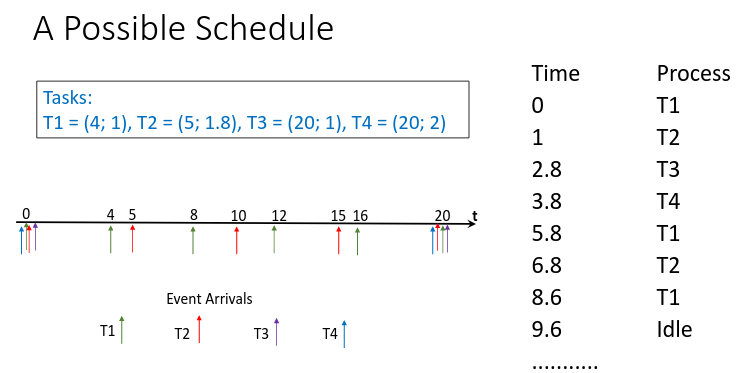

##### Hyper-period

- **Hyper-period** = the least common multiple (**LCM**) of the **periods** *of all* the **periodic** $T_i$

  - $N$ - **max number** of arriving **jobs** in a **hyper-period** 

    $N = \displaystyle\sum^n_{i=i} \dfrac{H}{p_i} $

  - $p_i$ - **period** of $T_i$

- In above example, hyper-period $H = 20$  for the four tasks, and $N = 11$

  $T_1 =(4;1),\\T_2 =(5;1.8),\\T_3 = (20;1),\\T_4=(20;2)$

  $20 = 4 * 5 \therefore 4 T_1 , 5T_2$ ; $N = \frac{20}{4} + \frac{20}{5} + 2 * \frac{20}{20} = 11$

#### Frames

**Problem**: We wish that **scheduling decisions** made at *regular* intervals rather than at *arbitrary* times

**Solution**: 

- **Frame** = a division of a **hyper-period**

  - **timing** is **enforced** *only* at **frame boundaries**

  - Each **task** *must* fit within a *single* **frame**

    $f = $ **frame** size (in units of time)

    $F = \dfrac{H}{f}$ - number of **frames** *per hyper-period* is hyper-period / frame size

##### Frame Size Constraints

1. A **job/instance** *must* fit into a **frame**

   $f \geq \displaystyle\max_{1 \leq i\leq n} e_i, \forall T_i$

   - **Justification**: non-preemptive tasks should finish executing within a single frame

2. $H$ *must* be evenly divided by $f$

   - **i.e.** the **hyper-period** $H$ has an integer number of frames
   - **Justification**: keep the **cyclic schedule** table size small

3.  $f$ should be sufficiently small, so that there should be a *complete* **frame** *between* the **release** and **deadline** of every **task**

   - Justification: Schedule the **task** *before* **deadline** missing

   - 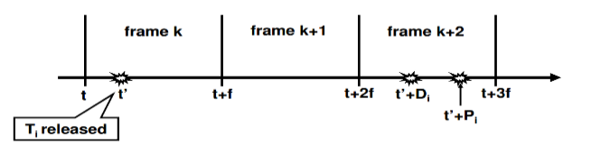

     $\therefore 2f - \text{gcd}(P_i,f) \leq D_i, \forall \text T_i$

#### Example Revisited

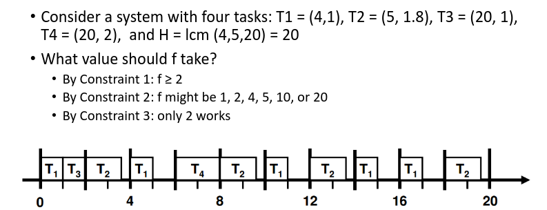

#### Task Slices

- What if **frame size constraints** *cannot* be met?
  - example: $T = \{(4,1),(5,2,7),(20,5)\}$
  - By $C_1: f \geq 5$
  - By $C_3: f \leq 4$

## Lecture 11 RM Schedulability | 2020-10-20

### Review:

- A set of real-time tasks
- A scheduling algorithm

Is the task set schedulable:

- Yes -> all deadlines met, forever
- No -> at some point a deadline might be missed

Ways to Schedule:

- Cyclic executive 
- static priorities
- Dynamic priorities
  - Priorities is computed at run-time
  - More flexible, but less predictable

### Static Priority Assignment 

- A higher priority task is executed first than a lower priority task
- Priority based on **Criticality**?
  - if we consider **hard real time** applications, they are of the *same* level of importance
- Shorter period tasks get higher priority 
  - **Rate Monotonic (RM)**
- Tasks with shorter relative deadlines get higher priority
  - **Deadline Monotonic (DM)**
- Both RM and DM 
  - good theoretical propertieis
  - work well in practice

#### Rate Monotonic Scheduling Algorithm

- **RM ** = static priority preemptive approach, where shorter period tasks get higher priority
  - RM scheduler executes the instance of the ready task that ***has the highest priority***
  - $\text{Priority}(T_i) \propto \dfrac{1}{P_i}$ : the smaller the period, the greater the priority!
    - If two or more tasks have the same period, the scheduler selects one of these jobs at *random*

##### Example

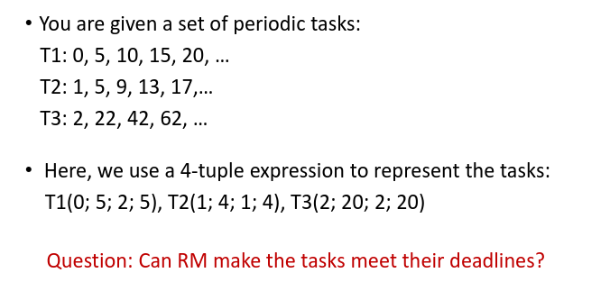

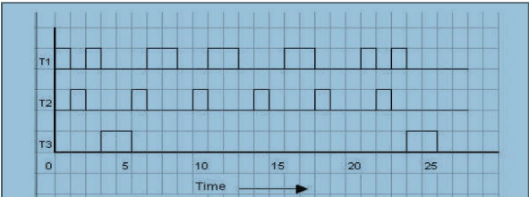

### Schedulability Test

- Test is the test of tasks satisfy conditions of RM

#### Test 1

For *n* **periodic processes**, independent and pre-emptive

​		$D_i \geq p_i$

- **Periods** of all processes are integer multiples of each other
- **CPU Utilization** on a uniprocessor using RM needs to be below 1:

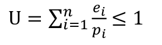

#### Test 2

If the tasks have ***arbitrary periods***, a *sufficient* but no necessary condition is:

​		$U \leq n(2^{\dfrac{1}{n}} -1)$

#### Test 3

**Time Demand Function** for $T_i$ , for $i \in (1 \leq i \leq n)$

​	$\omega_i(t) = \displaystyle\sum^i_{k=1}t[\dfrac{e_k}{p_e}] \leq t$

holds for ***any time instant t*** chosen as follows:

$t = k_jp_j$ 	$j \in (1,i)$, $k_j = (1,|\dfrac{p_i}{p_j}|)$

$i$ is current, $j$ is past

## Earliest Deadline First Scheduling

### Deadline Monotonic (DM) Algorithm

- **Deadline Monotonic** = another fixed priority scheduler
  - Priorities are based on ***relative deadlines:*** *shorter* the deadline, *higher* the priority
    - Versus RM, *shorter the period*, *higher the priority*
  - If every task has the **period** equal to ***relative deadline***, same as RM 
  - For arbitrary deadlines, **DM** algorithm performs better than **RM** algorithm 
  - It may sometimes produce a feasible schedule when RM fails
  - RM algoritm ***always*** fails if **DM** fails 

   **Example**: DM v RM

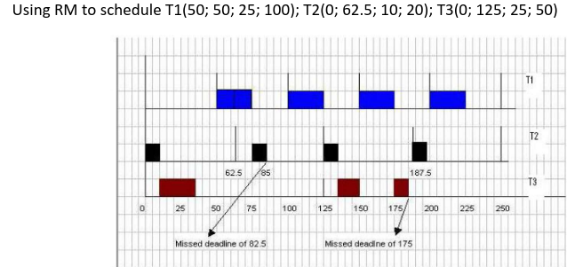

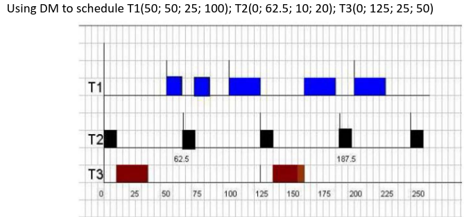

### Dynamic-priority Scheduling: Earliest-Deadline First (EDF)

- **Earliest Deadline First** = the **task priorities** are *not* fixed but change depending upon the closeness of their **absolute deadlines**
  - Processor always executes the **task** whose **absolute deadline** is the earliest
    - Note: **absolute deadline** is the ***arrival time*** of a **task** plus its **relative deadline**
  - If more than one tasks have the same **absolute deadlines**, randomly select one for execution next

**Example**

#### EDF Schedulability Tests

- **Test 1:** A set of *n* periodic tasks, each of whose *relative deadline* is equal to or greater than its period can be feasibly scheduled by **EDF** **iff**:

  $\displaystyle\sum^n_{i=1} \dfrac{e_i}{p_i} \leq 1$

- **Test 2**: No simple test is available where the **relative deadlines** are *not equal to or greater than* their periods

## Priority Inversion

### Critical Sections

- **Race condition** = when two or more processes are competing to use the same resource
- **Mutual Exclusion** = resources can be used by one **task** at a time
- **Serially Reusable** = a resource cannot be interrupted 
- **Critical Section** = code that interacts with serially reusable resources
  - Think using a websocket or reading a database

We can ***avoid*** **race conditions** by making sure that ***no two processess/threads*** enter their **critical sections** at the same time

### Mutex: At *Most* One Process can Hold it

- ****

## Root Locus

### Final Value Theorem