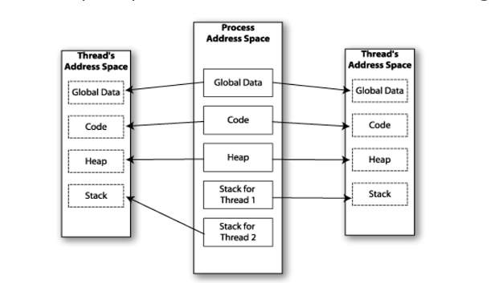

# 4AA4 | Real Time Systems and Control Applications

# Lecture 1 | 2020-09-8

**Instructor**: Wenbo He --- `hew11@mcmaster.ca`

## Outline

#### Major Contents 

- Introduction to Real-time systems
- Real-time Scheduling Algorithms
- Introudction to Digital Control Systems

#### Labs

#### Grading 

5 Labs 	30%

Midterm	30% (October 20th)

Final		40%


# Lecture 2 | 2020-09-10

## General Systems

- A set of interacting or independent components parts forming a complex/intricate whole 

- in control systems and applications, **response delays** is an important characteristics of the given systems 

#### Computing Systems

- Characteristcs of computing systems
  - accuracy
  - functionality
  - robustness
  - usability
  - repsonse speed (delay)

#### Real Time Systems (RTS)

- Response time
  - Time interval between a stimulus (or input) and the corresponding response (or output)
- A real time system
  - System where a **timely** response to external stimuli is vital
  - What is meant by **timely**?

##### Classifications of RTS

- ==**soft** RTS==$:=$ one in which performance is degraded but not destroyed by failure to meet response-time contraints
- ==**firm** RTS==$:=$ one in which missing a few deadlines will not lead to total failture, but missing more than a few may lead to a complete and catastrophic failure
- ==**hard** RTS== $:=$ one in which failure to meet a single deadline may lead to complete and catasrophic system failure


##### Examples of RTS

##### 

##### Comments About RTS


- Multi-tasks
  - Periodic Tasks
  - Aperiodic tasks
- Schedulability
  - The ability of tasks to meet all hard deadlines 
- Performance 
  - Response time
  - Cost of missing deadline

## RTOS and Kernel Module


#### Kernel and Kernel Space


#### User and kernel ( or Supervisor ) Modes


- The set of instructions are usually dividided into two classes:

  - Those that can be executed by a **user**

  - Those that can be executed by **the kernel**

    | Operation Modes | Kernel Mode                                            | User Mode                                                    |
    | --------------- | ------------------------------------------------------ | ------------------------------------------------------------ |
    | 1               | All the instruction are allowed, including OS routings | Only limited instructions are allowed                        |
    | 2               | Unlimited hardware access                              | Direct access to the hardware and the memory is prohibited to avoid malicious users |

  

#### How OS Delivers The Services To User Process?

- User processes request a servi e from **Kernel** by ==making a **System Call**==
- The **library procedure** involved in a system call
  - This procedure puts parameters of the system call in a suitable registers and then issues a **TRAP** instruction
  - The control is passed on to **Kernel**, it checks the validity of parameters, performs the reuqested service
  - When finished a code is put in a register telling if the operation was carried out successfully or if failed
  - A return from **TRAP** instruction is then executed and the control is passed back to the user process

#### System Call and Argument Passing


#### Real-Time Operating System (RTOS)

- **==RTOS==** :
  - Designed for real-time tasks, where correctness depends on logic of the result and time
  - Hard or Soft RTS depends on how to define cost of missing deadline
- Examples : QNX, VxWorks, RTLinux, LynxOS, Windows CE, RTAI
- What makes an OS Real Time?
  - Gurantee that deadlines are met
  - Predictability
  - Not necessarily fast, and may be mediorce throughputs

#### Process Scheduling

- OS must decide which process to run first, and in what order the reminaing process should run
- A good scheduling algorithm for non-real-time system has the following objective:
  1. **Fairness**: make sure that each process gets its fair share of CPU
  2. **Efficiency**: Keep the CPU busy to serve as much workload as possible
  3. **Response Time**: Minimize waiting time of users to obtain results
  4. **Throughput**: Maximize the number of tasks processed per hour

#### OS v. RTOS


Linux is not an RTOS

# Lecture 3 | 2020-09-15

# Lecture 4 | 2020-09-17

## Lab 2 Overview

Requirements:

- Connection to VPN
- SSH client 
- Connect to myRIO device in lab

Load and use kernel modules and look at the functions output to the kernel messages log file. C program files are provided. Later lab parts require modification of C program files to add liscence and authors. 

- Description: "4AA4_lab1"
- Author
- Liscence: "GPL"

#### Notes:


## Real-Time Scheduling: Processes & Threads

### Processes

- a **program** in execution
- an **abstraction** of a running program
- the **logical unit** of of work scheduled by operating system 

**Processes** are *independent*, carry considerate **state** information, have *seperate address spaces* and interact through system proveded inter-process communication mechanisms

#### Program in Virtual Memory

- **==Stack==** = structure used to store function arguements, and local variables, and the return address of functions that called the current function
- **==Heap==** = Memory is dynamically located by system calls
- **==BSS Segment==** = ***Uninitialized*** data
- **==Data Segment==** = ***initialized*** data
- **==Text==** = Read-only region containing program instructions (or program code)


#### Stack vs. Heap 

|                       | Stack                                                        | Heap                                          |
| --------------------- | ------------------------------------------------------------ | --------------------------------------------- |
| Creation of an object | Member m;                                                    | Member* m = new Member();                     |
| Lifetime              | Function runs to completion                                  | delete, free is called                        |
| Grow in size?         | Fixed size                                                   | Heap framentation                             |
| Which one to use?     | Know the size of memory to be used, or when data size is small | When you need a large scale of dynamic memory |

#### Multiple Processes

- We could divide a program into multiple tasks by creating multiple processes using the **fork()** command
  - **Fork()** creates a ***child process*** that is *identical* to its **parent**
  - **fork()** returns a **value of 0** to the child process and teturns the ***process ID*** of the child process to the parent process


##### Before v. After fork


##### Fork() Call

- Lot of overhead to create process as *everything* is duplicated
  - Data space isn't shared, so harder to communicated
- Variables initiated **before** fork() will be duplicated in *both* parent and child process.
- **After** fork(), branch is needed to seperate the parent and the child 

```c
void main(void)
{
    pid_t pid;
    pid = fork();
    
    if (pid == 0)
        ChildProcess();
    else
        ParentProcess();
}
```

### Threads

- Threads gives us a **more efficient** way to implement a task
- With threads, *multiple* subtasks can be implemented as seperate streams in a single process
- In the threads model, we break the **memory space** of a process into **two parts**
  1. Contains the program-wide resources such as a global data and program instructions
  2. Contains infromation pertaining to the execution state of control stream, such as the PC and the stack

#### Memory Layout for Multithreaded Program



#### Single and Multi-threaded Processes


#### Advantages of Threads

- Shared address space implies that the ==communication among threads is more efficient==
- ==**Context switching** between threads in the *same* **process** is typically *faster*== than **context switching** *between* **processes**
- It is ==*much* quicker to create a **thread** than a **process**==
  - Less overhead; doesn't copy entire **memory space**
- Thread programming is supported by **POSIX**

#### Disadavantages of Threads

- **Need of Syncrhonizations** - gloabl variables are shared between threads
  - Inadvertent modification of shared variables can be disatrous
  - Thread safety is needed
- **Security** - Many library functions are *not* **thread safe**
- **Lack of Robustness** - if *one* thread crashes, the *whole* application crashes
  - Shared **memory space** and overhead

### Question To Think

- Do we benefit from using a **multi-threaded** process when it runs on a **uni-processor** system?
  - Speed of a program is either **I/O bound** or **CPU bound**
  - If **I/O bound** ==*multiple* ***threads** will make the **process** more **efficient**==

### What is POSIX

- **==POSIX==** = Portable Operating System Interface
  - IEEE and ANSI developed and approved
  - Portability of applications across variations of \*NIX\* systems
  - Provides system calls for creation of a **process** or a **thread**
- Has real time extensions

### Coding Examples

#### Pthread

```c
#include <pthread.h>
//Define a worker function
void *foo(void *args) { }
//Initialize pthread attr t
pthread_attr_t attr;
pthread_attr_init(attr);
//Create a thread
pthread_t thread;
pthread_create(&thread, &attr, worker function, arg);

//Exit Current Thread

pthread_exit(status)

```


#### Thread Programming Example

```c
#include <stdio.h>
#include <pthread.h>
#define NUM_THREAD 5

void *print_hello(void *threadid)
{
	long tid;
	tid = (long) threadid;
    printf("Hello World! It's me, thread #%1d!\n", tid);
    pthread_exit(NULL);
}

int main(int argc, char *argv[])
{
    pthread_t threads[NUM_THREADS];
    int rc;
    long t;
    for (t = 0; t < NUM_THREADS; t++){
        printf("In main: creating thread %1d\n",t);
        rc = pthread_create(threads + t, NULL, print_hello, (void *) t);
        if (rc)
        {
            printf("ERROR; return code from pthread_create() is %d\n", rc);
            return -1;
        }
    }
    return 0;
}

```


