# 4E03 | Performance Analysis of Computer Systems

**Instructor**: Douglas Down : ` downd@mcmaster.ca`

**Office Hours**:  (instructor) Wednesday 9:30-11:30 will be “open” office hour

**Grading**:

- Midterm 25% (take home midterm) 
- Assignments (weekly)	15% (11, but mark is best of 6)
- Peer-review activities      15%
- Final Exam (2.5 hours)    45%

**Text**: *Performance Modeling and Design of Computer Systems,* **Mor Harchol-Balter** (optional)

**Course Coverage:**

1. Probability Introduction
2. Discrete-Time Markov Chains
3. Introduction to Queuing
4. Operational Laws
5. Simulation 
6. The Exponential Distribution and the Poisson Process
7. Continuous-time Markov Chains
8. Simple queues
9. Multi-server systems
10. Networks of queues
11. Reliability
12. Impact of variance on scheduling 
13. Load Balancing 
14. Applications

## Lecture 2 | A Crash Course in Probability  2020-09-10

- If you do the weekly assignments, the midterms and finals will be simple
  - best 6 of 11; 5 will drop
- Kritik is a tool to enable peer-review actives 
  - Open ended work that is marked by peers

#### Samples and Sample Space

- Suppose we have a data centre that has three servers (A, B, C)
- At any (randomly ) point in time, we look to see which servers are up and which servers are down ( failed) 
- *Experiment*: which servers are up, which are down?
- *Sample Space( $\Omega$*) : set of all possible sample / outcomes 
  - $\Omega$  $=$   \{ \( *w, w, w*),(*w, w, f*), (*w, f, w*), ( *w, f, f*), ( *w, f, f*), (*f,w,w*), (*f, w, f*), (*f, f, w*), (*f, f, f*)}

Where the components indicate if A, B, C, are working ( *w* ) or failed ( *f* )

#### Events 

- An event, $E$ m is any subset of the *sample space* $\Omega$ 
- $E_1$ corresponds to Server A failed:
  - $E_1$ $=$ $\{ ( f, w, w ), (f, w, f), (f, f, w), (f, f, f) \}$
- $E_2$ corresponds to at least two servers failed 
  - *Reminder*: Unions and intersections of events are also events:
  - $E_1 \cap E_2 = \{ (f, w, f), (f, f, w), (f, f, f)\}$  
  - Set of events where Server A and another server failed
- Complement of an event is also an event:
  - $E_{2}^{c} = \{(w, w, w), (w, w, f), (w, f, w), (f, w, w)\}$
  - Set of events where two servers are working

#### Probabilities

- $0 \leq P \{E\} \leq 1$: probability of event $E$ occurring

  

- The probability of an event, is the sum of its events
  
- $P\{E\} = \sum \{ P\{x\} \| x \in E \}$
  
- Probability of the Union of 2 sets sum of the two sets minus the probability of their intersection

  - If $S_1 \cap S_2 \neq \empty $ , then if we do not subtract the set of intersection from the sum, we will count the events probability twice. Therefore:
  - $P\{E\ \cup F\} = P\{E\} + P\{F\} - P\{E \cap F\}$ 

  ##### Theorem: 

  ##### 	$P\{E \cup F\} \leq P\{E\} + P\{F\}$

  - The Probability of the *union* of 2 events will only be the same when they are *mutually exclusive*, meaning their intersection is $\empty$ , the *empty set* 

#### Conditional Probabilities

- ==**Conditional Probability**== $:=$ The conditional probability of $E$ given $F$ is $P\{E | F\}$
  
  - $P\{E | F\} := \dfrac{ P\{E \cap F\}}{P\{F\}}$
  
    -  $\dfrac{ P\{E \cap F\}}{P\{F\}}$ is also called the ***Conditional Probability Test***
  
  - Note: the denominator (*probability of $F$* ) renormalizes over the new sample space ($F$) and the numerator (*probability of the intersection of E and F*) restricts to samples are are in $E$ *and* the new sample space
  
  - ex. we wish to compute the probability that *A* is failed given that exactly one server is failed
  
    

#### Independent Events

- **==Independent Event==** : an event is independent if its probability is not affected by whether or not some other event happens

  - Events *E* and *F* are **independent** if:  $P\{E\cap F \} = P\{E\}P\{F\}$

  - $P\{E\}$ does not depend on $F$:

    
    
    

## Lecture 3 | 2020-09-14

#### 

#### Bayes Law

- ==**Bayes Law**== $:=$ $P\{F | E\} = \dfrac{P\{E|F\}P\{F\}}{P\{E\}}$
  - Suppose that we now the probability of $F$ given $E$,  what is the probability of $E$ given $F$?

Ex. 1

Someone is tested for a rare disease. Suppose that the testing methods for the disease are correct **99% of the time** (if one has the disease, the test is positive 99% of the time, if one does not, the test is negative 99% of the time). Suppose that disease occurs in the general population at the rate of one every 10,000 people. 

What are the chances that someone testing positive ***actually has the disease?***

- Event *A*: one has the disease
- Event *B*: one tests positive

$P\{A|B\} = \dfrac{P\{A|B\}}{P\{B\}}$

What have $P\{A\} = 0.0001$ and $P\{B|A\} = 0.99$, but do not have $P\{B\}$. To calculate this probablity, use the *Law of Total Probablity*

#### Random Variables

- **==Random Variable==** $:=$ a real-valued function of the outcome of an experiment. 
  - Usually denoted $X$
  - Examples
    1. The sum of the rolls of two dice
    2. Number of arrivals to a website by some time *t*
    3. The time until the next arrival to a website
    4. The CPU requirement of an HTTP request
  - 1 & 2 are *discrete*, 3 &4 are *continuous*
  - 2: if *N* is the associated random variable, the we can define events such as *the number of arrivals is less than or equal to five* and *the number of arrivals is between 1 and 3*

#### Distributions

- **==Distribution==** $:=$ $F_{X}(x) = P\{X \leq x\}$
  - Compact way of defining the probablities of events

#### Continuous Random Variables

- For quantities that take on values on a continuum - time is an important one for us

- **Density function** = $f_X(x) = \dfrac{d F_{x}(x)}{dx}$

  

#### Discrete Random Variables

- ==Probablity mass function== (**p.m.f**) gives the probabilities that the random variables equals values in a discrete set (its range of possible values)

  $p_x(i) = P\{X = i\}$

  

#### Summary Statistics - Mean

- **==Expected Value (mean)==** $:=$ a predicted value of a variable, calculated as the sum of all possible values each multiplied by the probability of its occurrence.
  	-  **Discrete:** $\sum_i i p_x(i)$
  	-  **Continuous:** $\int^\infin_{-\infin}x f_X(x)dx$ 
- 

#### Variance and Standard Deviation

- **==Variance==** $:= $ $Var(x) = \sigma^2_X = E[ (X - E[X])^2]$

  An important summary statistic is the *variance* which measure the expected deviation from the mean, *how spread out the distribution is*

  - puts more weight on values that are further away from the mean

- **==Standard Deviation==** $:= \sigma = E[X^2] - (E[X])^2$

  - The square root of the variance

### Some Useful Distributions:

#### Geometric Distribution

- **==Geometric Distribtuion==** $:=$ $p_x(k) = q(1 -1)^{k-1}, k \in \mathbb{Z}^+$

  where *q* is the *probablity of success* for an experiment. *1-q* is the *probability of failure*, and $p_x(k)$ is the probability that success first happens on the kth trial. 

  - Arises in applications like testing: if we do **independent tests**, how many tests must be performed before success?
  - $E[X] = \dfrac{1}{q}$
  - $Var(X) = \dfrac{1-q}{q^2}$

#### Poisson Distrubtion

- **==Poisson Distribution==** $:=$ o	

  - a discrete probability distribution that expresses the **probability of a given number of events** occurring in a *fixed interval of time or space* if these events occur with a known *constant mean rate* and *independently* of the time since the last event

    $p_x{k} = \dfrac{e^{-\lambda}\lambda^k}{k!}, k \in \mathbb{Z^{0+}}$

  - Sums to one: $\sum_{k=0}^{\infin}e^{-\lambda}\dfrac{\lambda^k}{k!}$

## Lecture 4 | 2020-09-16

### Further Distributions

#### Uniform Distribution 

- **==Uniform Distribution==** := $U(a,b)$ and has density:

  

  - The **random variable** is *equally likely* to take values anywhere between *a* and *b*. This **does not** mean that $P\{X=i\} = P\{X=j\}$ although this is trivially true. It does mean, for examples $P\{0.1 \leq X \leq 0.2\} = P\{0.3 \leq X \leq 0.4 \}$ (assuming $a \leq 0.1 \land b \geq 0.4$)
  - **Special case**: $U(0,1)$ as many built in random number generators produce samples from this distribution

  

#### Exponential Distribution

- **==Exponential Distribution==** : X = $Exp(\lambda)$

  - One parameter, ***rate*** $:= \lambda$ 

  

We can see why the term "***rate***" is used for **$\lambda$** ; think of $X$ as measuring some length of time

##### Examples

- Jobs arriving to a server have CPU time that is *exponentially* distrbuted with mean **140 msec**. The CPU scheduling discipline is quantum-oriented, so that a job not completing within **100 msec** will be routed back to the tail of the queue of waiting jobs. Find the probability that a job has to wait for a ***second quantum***.

1. Want to find: **probability a second quantum is needed**

   Let X be CPU time : \lambda = \frac{1}{140}

   $X \sim  Exp(\dfrac{1}{140})$ 

   $P(X > 100) = 1 - P(X \leq 100)$

   = $1 - (F_x(100) - F_x(-\infin))$

   = $1 - ( 1 - e ^{-\lambda x } - 0)$ 

   = 1 - ( 1 - $e^{\dfrac{-100}{140}}$)

   = $e^{\dfrac{-100}{140}}$

   = 0.4895

- Suppose that **800 jobs** arrive in a particular time interval, how many are **expected to finish** within the ***first quantum***?

  $P\{X \leq 100\} = 1 - P\{X > 100\}$

  $ = 1 - 0.4895$

  $= 0.5105$

  Probability for one job to finish in first quantum, to get for 800 jobs, 

  800 * 0.5105 = 408.4 jobs should finish in the first quantum

#### Memoryless Property of the Exponential Distribution

- Suppose that $X \sim Exp(\lambda)$
- Suppose that we know X > b; What is the *probablitity* that $X > a + b$ (only makes sense if $a \geq 0$)

which is *exactly the same* as $P\{X > a\}$

- The future is ***independent*** of the past, given the present. 
  - Knowing that time *b* has elapsed gives no information about the future
- **Exponential distribution** is the *only* ***continuous*** distribution with the **memoryless** property
- Often used to model phenomena with this property: if we assume memoryless, then the underlying distribution is exponential

#### In-Lecture Demo

- Given a data centre with 8 servers, which server should we send any arriving data to? What if we want to turn off servers or one of them fails? What is the performance of all this and how can we show it?

  - Performance can be given by:

    - Low latency
    - Response time
    - Failure rate
    - Energy efficiency
    - Server usage
    - Throughput
    - Load balancing

  - What to do if we want to evaluate any of the above performance metrics?

    - One method is the **workload model**, look at the frequency of arrivals, processing time

  - Note for measuring response times, each job has a different response time, how to still show this?

    - Low mean (E[R])

    - Low 95% percentile

      

      P(R≤T)≥0.95P(R≤T)≥0.95

      - Could be 99%, or any percentage

- Lets look at an example with different schemes for handling requests

  - Scheme 1:
    E[R1]=1E[R1]=1
    Var(R1)=2Var(R1)=2

  - Scheme 2:

    

    E[R1]=1.1E[R1]=1.1

    

    Var(R1)=0Var(R1)=0

    - 2 has no randomness, always returns in 1.1, whereas 1 has a large amount of randomness, sometimes returning very low or very high response times

- This can also be seen on some of the slides

### Stochastic Models

- May want to capture how a system evolves using *dependent* random variables, described by some dynamics. A very simple model that’s widely applicable is a **Discrete Time Markov Chain**, which has been used for web page navigation, speech recognition, ML, etc.

## Lecture 5 | 2020-09-17

### Intro Example

- Consider the following scenarios

  - 3 web pages that link to each other, **A,B,C**
  - ***A*** has links to ***B*** and ***C***
  - ***B*** has a link to ***C***
  - ***C*** has links to ***A*** and ***B***
  - When a user leave ***A***, **1/3** of the time a link to ***B*** is made, otherwise the link ***C***
  - ***B*** always links to ***C***
  - ***C*** links to ***A*** or ***B*** with **equal probability**

  Q: what *proportion of visits are made to each of the pages*?

### Discrete-Time Systems

- **==Discrete-Time Systems==** : the *nth* time point corresponds to the *nth* event
  - Natural for some settings - a ***continuous-time*** framework may be more suitable

#### Discrete-Time Markov Chains

- **==Discrete-Time Markov Chains==** = **stochastic process** (${X_n, n =0,1,2, ...}$), where $X_n$ denotes the state at (***discrete***) time step *n* and such that $\forall n \geq 0, \forall i_0, ... , i_{n-1}$:

$P\{X_{n+1} = j | X_{n-1} = i_{n-1}, ..., X_0 = i_0\} = P\{X_{n+1} = j + X_n = i\} = P_{ij}$

- **Stationarity =** statistics of process independt of time - $P_{ij}$ is independent of the time step and of history
  - The previous time step is a perfesct representation of all the states previously`
- **Last Equality** = stationarity 

- **==Markovian Property==** = the *conditional distribution* of any future state $X_n+1$ , given past states $X_0,X_1,..,X_{n-1}$ and the present state $X_n$, is ***independent of past states and depends only on the present state $X_n$*** 
  - **$P$** = ***transition probablity matrix***
  - $P_{i j}$ is the probablity of state of moving to **state j** *from* **state i** ($P\{x_j| x_i \}$)
  - $P$ may have **infinite dimensions**
  - $P$ is square
  - Rows of $P$ sum to one 
    - *the system much be at some state at each step!*
  - $P_{ii} > 0 $ *is **possible*** 

#### Umbrella Problem

- Ab absent-minded professor has **two umbrellas** that are used making trips from home to work and back. If it *rains* and an **umbrella** is at the *current location* an **umbrella is taken**. If it is **not raining**, **no umbrella is taken**. It **rains** with probability *p* when each trip is made, independent of prior trips.

   **Question**: determine the fraction of trips during which the professor gets wet

###### Solution

**state-space:** track the **number** of umbrellas at *current location*

**state transition diagram on board**

**transition probability matrix:**

Could model this with six states, where the state is the ordered pair that conissts of the number of umbrellas at home and the current location

### *n-step* Transition Probabilities

- Let $P^n = \displaystyle\prod^n p$ 

- $P_{i j}^{n} := (i,j)$ entry of $P^n$

  In general, if we know that the $(n-1)$ step transition probabilities are given by $P_{ik}^{n-1}$, then by exhaustive enumeration of all possibilities:

  $P_{i j}^{n} = \displaystyle\sum^{M-1}_{k=0} P_{i k}^{n-1}P_{k j}$

  This allows an inductive argument that the *n-step* transition probability of going from state *i* to state *j* is given by the (i,j) entry of $P^n$

### Limiting Probabilities

- **==Limiting Probabilities== ** - Let $\pi_j = \displaystyle\lim_{n \rarr \infin} P^n_{ij}$

  - $\pi_j$ represents the *limiting probability* that the **DTMC** is in **stage *j***. 

    For an ***M-state DTMC*** with states $\{0,1,...,M-1\}$

    

    is a *vector* of the **limiting probabilities** of being in *each* state

  - not obvious that limit always exists

  - not obvious that limiting probabilities form a distribution

    - We will assume these for the purposes of this course

##  Lecture 6 | 2020-09-21

Is there a better way to find $\pi_i$ as opposed to raising $P$ to a large number?

#### Stationary Probability

- **==Stationary Probability==** = probability distribution $\pi$ is said to be **stationary** for a **DTMC** if:

  $\pi P = \pi $ 	$\land $ $\displaystyle\sum^{M-1}_{i=0} \pi_i = 1$

  - We refer to this set of equations as *the **stationary equations***

    - Also written: 

      $\displaystyle\sum^{M-1}_{i=0} \pi_i P_{ij} = \pi_j,\forall j \in (0,M-1)$

      $\displaystyle\sum^{M-1}_{i=0} \pi _i= 1$

  - The probability distribution $\pi$ is ***invariant*** of the **transition matrix** $P$, meaning the distribution is *unchanged* by the DTMC over time. 

    - as a probability distribution, all the elements of $\pi$ must sum to 1
    - For each probability in the distribution, when multiplied against its respective value in the transition matrix, still holds the property $\pi_i P_{ij} = \pi_j$, meaning the likelihood of moving from state i to state j has probability $\pi_j$, meaning its invariant of the state $\pi_i$, and invariant of the time, so $P_{ij}$

### Key Theorem

Give a *finite-state* ***DTMC*** with **M** states, let

​			$\pi_j = \displaystyle\lim_{n \rarr \infin} P^n_{ij} > 0 $

be the ***limiting probability*** of being in **state j**, and let 

​			$\pi = \{\pi_0, \pi_1, ..., \pi_{M-1}\}$, where $\displaystyle\sum^{M-1}_{i=0}\pi_i$

be the ***limiting distribution***. Assuming the **limiting distribution** exists, then $\pi$ is also a **stationary distribution**, and *no other **stationary distribution*** exists**

#### Proof

- First, we show that a **limiting distribution** satisfies the **stationary equations**

  $\pi_j = \displaystyle\lim_{n \rarr \infin} P^{n+1}_{ij}$

  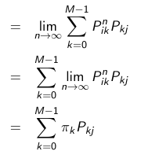

- Next, we show that *any* solution to the **stationary equations** *must* be equal to the **limiting distribution**

  Suppose that **$\pi'$** is a **stationary distribution** and we start with **initial state** having distribution $\pi'$:

  ​	$\pi_j' = P\{X_n = j\}, \forall n$

  $= \displaystyle\sum_{i=0}^{M-1} P\{X_n=j | X_0 =i\} P\{X_o = i\}, \forall n$

  $= \displaystyle\sum_{i=0}^{M-1} P^n_{ij} \pi_i', \forall n$

  $= \displaystyle\lim_{n\rarr\infin} \pi_j'$

  $= \displaystyle\sum^{M-1}_{i=0} \displaystyle\lim_{n\rarr\infin} P^n_{ij}\pi_i'$

  $= \displaystyle\sum^{M-1}_{i=0} \pi_j \pi_i'$ 

  $= \pi_j \displaystyle\sum^{M-1}_{i=0} \pi_i'$

  $ =\pi_j$

## Lecture 7 | Further State Distributions - 2020-09-23

### Infinite State Discrete Time Markov Chains

- Same results hold relating **limiting distributions** and **stationary distributions** 
  - Proofs are much trickier: deal with interchanging limits and infinite sums 
  - **key issue:** must solve an *infinite* number of linear equations in an *infinite* number of unknowns

##### Example

Consider a system that operates as follows:

- At each time point, with *probability* 0.05, a job arrives, otherwise *no jobs arrive*

- At each time point, with probability 0.1, a job departs (*if at least one job is present*), otherwise no jobs depart

- Both an arrival and a departure can happen

- If one or more jobs in system, probability of an increase by one is $r = (0.05)(1 - 0.1) = 0.045$

- Probability of a decrease by one is $s = (0.1)(1 - 0.05) = 0.095$

- Probability of no change is $1 - r - s = 0.86$

  

  Assume that *if zero in the system*, probability of an **increase by one is *r***, *otherwise* *stays at zero*

###### Transition Matrix

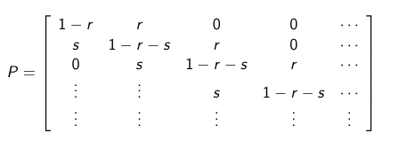

Solve the following system of equations

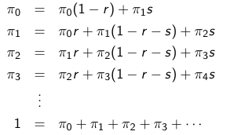

- First equation gives $\pi_1 = (r/s)\pi_0$
- Second equation rearranged combined with first equation gives $\pi_2 = (r/s)^2\pi_0$
- Third equation rearranged combined with second equation gives $\pi_3 = (r/s)^3\pi_0$
- ==$\pi_n = (\dfrac{r}{s})^n \pi_0$== --- *in general, for finding the value of the nth state*

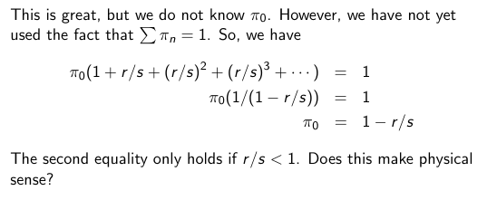

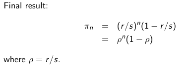

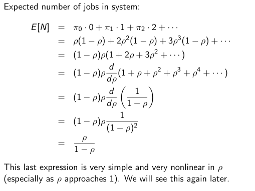

#### Example: Search Engine Goals

- Match search terms, but also rank pages
- Wish to rank pages based on popularity (assume matching is done)

##### Proposal 1

- Popularity of a page is determined by the number of backlinks to it
  - Not all links are equal - a link from a "popular" page should count more
- To get high rank, just create many pages pointing to the web page

##### Proposal 2

- Look at # of pages linked to backlinked pages
  - Fool it: just have all pages point to each other

##### Proposal 3

- Formalize idea - "a page has *high* **rank** if the *sum* of the **ranks** of its **backlinks** is *high*"
- Let $\pi_j$ be the **rank** of a **page**, then $\pi_j = \displaystyle\sum^n_{i=1}\pi_iP_{ij}$

### PageRank (Vanilla):

1. Determine all **pages** and all **links** *between* **pages**

2. Create a **DTMC** where the **states** *are* the **pages**, and there is a *transition* from **page i** to **page j**, if and only if, there is a **link** *between* **i** and **j**

3. If **page i** has $k_i > 0$ **links**, then the **probabilities** of the corresponding *transitions* from **i** to **j** are $\dfrac{1}{k_i}$

4. Solve the **DTMC**. Higher **limiting probability** means higher **rank**

   **i.e.** ==limiting probability $\propto$ rank==

## Lecture 8 | Caching and Operation Analysis - 2020-09-24

### Caching Example

- Compare strategies for **caching** virtual memory paging in OS

  - model the system as *ranked* sets of **pages*

  - Suppose that we have **eight** pages, currently ranked:

    $P_3,P_7,P_2,P_6,P_5,P_1,P_8,P_4$

    Assume next request is for $P_5$, what is the new ranking?

    - **LRU**: $P_5,P_3,P_7,P_2,P_6,P_1,P_8,P_4$

      *same but now $P_5$ is on top*

    - **Move-Ahead**: $P_3,P_7,P_2,P_5,P_6,P_1,P_8,P_4$

      *$P_5$ moves up one rank, ahead of $P_6$*

#### System State

- If $N$ is the number of **pages**, state is permutation of $\{1, ..., N\}$
  - State Space  = $N!$
  - Linux system: **page** size is 4kB, memory size 1GB, swap disk 1GB, so state space has size 500000!

#### Request Model

- Requests are *random*

- Requests follow an **i.i.d** (*independent* and *identically distributed*) sequences of values

  $P\{R_n = P_i\} = p_i$

- Suppose we want to consider performance when there is a "*more frequent page*", $P_A$

  **assume:**

  ​	$a = P\{R_n = P_A\}$

  ​	$b = P\{R_n = P_i\}, P_i \neq P_A$

  ​	$a > b$

  ​	$a + (N - 1)b = 1$

- Note that this allows that $a$ is *much* smaller than $(N-1 )b$

- Can we *reduce* the **state** **space**?

#### State Space Reduction

- **\{$X_N$\}** is the **position** of **page** $P_A$ after the *nth* **request**
  - **state space** is size $N$
  - *assume N = 8*

##### LRU: Transition Matrix

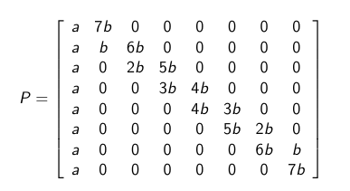

##### LRU: Stationary Distribution

With $a = $ 0. 3$, $ $b = 0.1$

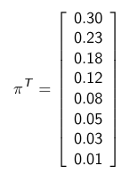

##### Move-Ahead: Transition Matrix

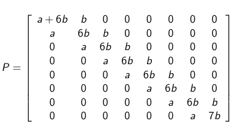

##### Move-Ahead: Stationary Distribution

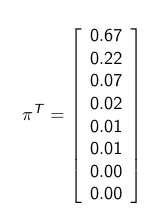

##### Conditional Cache Miss Probabilities (*for page A*)

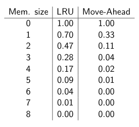

### Operational Analysis

#### Description of a Queueing System

- **Queue** : consists of a buffer where arriving jobs wait to be served by a server, and depart after processing
  - Must describe:
    1. **Arrivals** - time between arrivals is given by a **probability distribution**
    2. **Queue** - size (*infinite* or *finite*)
    3. **Server Operations**  - number of servers, oder of service (FIFO,LIFO), processing times (the probability distribution that determines them)

#### Performance Metrics

1. **Response Time**: time from arrival to departure
2. **Throughput**: number of jobs server *per unit time*

#### Queueing Networks

We may be interested in complicated systems, where **queues** are *connected together*

##### Analysis Directions

We are faced with two possibilities when doing analysis:

1. **Exact Analysis** - try to determine equations that yield the desired performance metric
2. **Simulation** - by generating samples from the underlying distributions, we can follow the logic of the system to estimate the performance measures of interest
   - ex. generate a large number of "real" response times, compute average

#### Operation Laws

- **$A_i(t)$** - number of **arrivals** to *device i* at *time t*
- $C_i(t)$ - number of **completions** (departures) from *device i* at *time t*
- $B_i(t)$ - **busy time** of *device i* at *time t*

##### Derived Quantities

- **Arrival rate** at device i:				 						$\lambda_i(t) = \dfrac{A_i(t)}{t}$
- **Throughput** at device i:                                        $\Chi_i(t) = \dfrac{C_i(t)}{t}$
- **Utilization** at device i:                                           $\rho_i(t) = \dfrac{B_i}{t}$
- **Average Processing Time** at device i:              $S_i(t) = \dfrac{B_i(t)}{C_i{t}}$

##### Ergocidity Assumptions

- Assume that the system is ***ergodic***

  - *time averages lead to actual underlying means*

    $\lambda_i(t) \longrightarrow \lambda_i$

    $\Chi_i(t) \longrightarrow \Chi_i$

    $\rho_i(t) \longrightarrow \rho_i$

    $S_i(t) \longrightarrow E[S_i] = \dfrac{1}{\mu_i}$

## Lecture 9 | Operation Analysis Continued | 2020-09-28

### Operational Analysis Continued

##### Utilization Law

$\dfrac{B_i}{t} = \dfrac{C_i(t)} {t} \dfrac{B_i(t)}{C_i(t)}$

$\rho_i(t) = \Chi_i(t)S_i(t)$

==$\rho_i = X_iE[S_i]$==

##### Forced Flow Law

Suppose that $A_i(t) = C_i(t)$: the system is then called ***job flow balanced***, meaning the number of arrivals is equal to the number of completions during an observation period.  This also means $\lambda_i(t) = X_i(t)$, or arrival rate equals throughput

- Let $E[V_i]$ be the expected number of visits to device i *per job*. 

  - Let $V_i$ number of visits to device i

  - This requires a reference device, which we will call device 0. 

  - By definition: $E[V_0] = 1$

    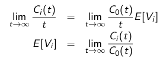

- **Define:** system throughput $\Chi$ measured through **node 0**, throughput of node i is:

  $\Chi_i(t) = \dfrac{C_i(t)}{t} =  \dfrac{C_i(t)} {C_0(t)} \dfrac{C_0(t)}{t}$

  Taking limits as $t \rarr \infin$: ==$X_i = E[V_i]X$==

##### Device Demands

- **Utilization Law:** $\rho_i = X_i E[S_i]$
- **Forced Flow Law**: $X_i = E[V_i]X$

Combining these two:

​	$\rho_i = E[S_i]E[V_i]X$

and by defining the **average demand at device i** as : $E[D_i] = E[S_i]E[V_i]$

==$\therefore \rho_i = E[D_i]X$==

- **$E[D_i]$** = **expected processing time** on *device i* totalled over ***all*** visits of a **job**
  - *bottleneck* is the device with the highest $E[D_i]$

##### Little's Law

==$E[N_i] = \lambda_i E[T_i]$==

- $E_[N_i]$ -  number of **jobs** in a **queueing system**
- $\lambda_i$ - **arrival rate** to the **queueing system**
- $E[T_i]$ - **mean response time**

States that the **number of jobs queued** for device i is equal to the **arrival rate** at device i times the **mean response time**

###### Derivation

- **number of jobs ** -$N(t) = A(t) - C(t)$
  
  - **number of jobs in a system at time t**, N(t) 
  - Defined as **arrivals** minus **completions**
  
- **arrival rate**  - $\lambda(t) = \dfrac{A(t)}{t}$
  
  - **arrival rate** at time t is the **number of arrivals** at time t, divided by time t
  
- **Average response time**  - $T(t) = \displaystyle\int^t_0 \dfrac{ (A(u) - C(u))du}{A(t)}$

  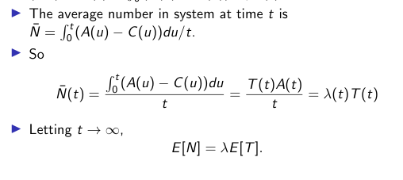

#### User / Clients

- We consider a model where there are *M* users (clients) who operate as follows:
  1. Each user thinks for a period of time that has mean $E[Z]$ time unites (the *think time*)
  2. At the end of a *think time*, the user submits the job/request to a subsystem
  3. Once processing is complete at the subsystem (and returned to the user), the user begins another *think time*

#### General Response Time Law

Consider a system with *M* users, connected to a subsystem that has *K* nodes. We are interested in the mean response time for the subsystem, $E[T]$. Inside the subsystem, the mean number of jobs, $E[N]$ satifies the previous laws and conditions

- **General Response Time Law** - 	$ E[T] = \displaystyle\sum^k_{i=1} E[V_i]E[T_i]$

#### Interactive Response Time Law

- Consider the same system 

- **total mean cycle time ** = $E[Z] + E[T]$

- **average requests at time t ** $\dfrac{t}{E[Z]+E[T]}$

- **throughput** = $X = \dfrac{M(\dfrac{t}{E[Z] + E[T]})}{t}$

  ​							$X = \dfrac{M}{E[Z] + E[T]}$

- **Interactive Response Time Law** = $E[T] = \dfrac{M}{X} - E[Z]$

#### Bottleneck Analysis

- Let $D = E[D_1] + E[D_2] + ...+ E[D_k]$ be the ***average total demand***

  ​	$X \leq \min (\dfrac{1}{D_{\max}}, \dfrac{M}{D + E[Z]})$

  ​	$E[T] \geq \max(D, MD_\max - E[Z])$

  - where $D_\max = \max _i E[D_i]$ is the ***maximum demand*** in the subsystem, aka ***bottleneck demand***, 
  - The device that achieves $D_\max$ is the ***bottleneck***

#### Bounds

If we take the $D_\max$ as the maximum demand, then we can bound our formulas as follows:

1. At the bottleneck:

   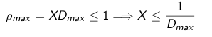

2. With one client:

   

   *this follows as **mean response time** is lowest with one client*

3. From Interactive Response Time Law:

   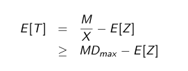

4. Also From IRTL:

   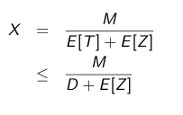

## Lecture 10 | OA Examples - Sep 30, 2020  

Recall

- Forced Flow Law

  

  limt→infCi(t)t=limt→infC0(t)tE[Ui]limt→infCi(t)t=limt→infC0(t)tE[Ui]

  

  Ci(t)=Ai(t)−Ni(t)Ci(t)=Ai(t)−Ni(t)

  - The first equation is ONLY true if:
    limt→infNi(t)t=0limt→infNi(t)t=0 -Little’s Law
    E[Ni]=XiE[Ti]E[Ni]=XiE[Ti]
  - Under the assumption that everything is stable ($\lim_{t \rightarrow \inf} \frac{N_i(t)}{t} = 0),),\lambda_i = X_i$

### Ex1

 A computer system has one CPU and two disks. After monitoring the system for 2hrs, the following observations were made:

- The utilization of the CPU was 43%
- The utilization of the first disk was 66% Each transaction to the system makes 5 I/O requests to the first disk and 6 to the second disk. The average processing time (per request) at the two disks were both 20ms
- a) What was the throughput of the system (in transactions per second)? SOLN:
  ρdisk1=0.66ρdisk1=0.66
  E[Ddisk1]=(0.02)(5)=0.1E[Ddisk1]=(0.02)(5)=0.1
  X=0.660.1=6.6/secX=0.660.1=6.6/sec
- b) What was the utilization of the second disk?
  SOLN:
  Pdisk2=XE[Ddisk2]Pdisk2=XE[Ddisk2]
  =(6.6)(0.02)(6)=(6.6)(0.02)(6)
  =0.792=0.792
- c) What was the total processing demand (in milliseconds per transaction) at the CPU?
  SOLN:
  E[DCPU]=PCPUXE[DCPU]=PCPUX
  =0.436.6=0.065sec=0.436.6=0.065sec

### Ex 2

Suppose we have *M* clients that submit requests to three single-server nodes in series (a client request needs to be processed by three servers in order). The mean demands at the three nodes are:
E[Da]=2,E[Db]=3,E[Dc]=1E[Da]=2,E[Db]=3,E[Dc]=1
The average thinking time of a client is E[Z]=30E[Z]=30

- The throughput is bounded above by:

  

  min(13)min(13)

  and the mean response time is bounded below by:

  

  max(6,3M−30)max(6,3M−30)

  - One can see that these bounds both have break points at M∗=12M∗=12. This value is often known as the number of clients that the system can support. Below this number, performance scales well, but above this number, performance degrades considerably

- Load Balancing

  - Suppose that were free to choose E[Da],E[Db],E[Dc]E[Da],E[Db],E[Dc] to be any (nonnegative) value. What would be a good choice?

  - A good choice would be 2, 2, 2, since this minimizes

     

    

    DmaxDmax

    , and max throughput is now up from 1/3 to 1/2

    - M∗M∗ also increases

### Ex 3

A database server receives requests from 50 clients. Each request to the DB server requires the five reads to be made on average from the server’s single disk. The average read time is 9ms of CPU time to be processed. Consider the following three proposed design changes:

1. The average number of disk reads per access can be reduced from 5 to 2.5

2. The disk is replaced by one 60% faster

3. The CPU speed is doubled If you were to do one of these, which would you do? If you were to do two of them?

   - Some ideas are:

   - Determine DmaxDmax
   - Decrease DmaxDmax as much as possible
   - Decreasing other E[D_i] “does not” help
     - Would help partially but not much, focus on the bottleneck
       - To start, we can calculate:
         E[DCPU]=15E[DCPU]=15
         E[Ddisk]=(5)(9)=45E[Ddisk]=(5)(9)=45
   - The disk is limiting the performance, so we should look at fixing that, ignore design change 3 and look @ 1/2 - If we did design 1:
     E[Ddisk]=(2.5)(9)=22.5E[Ddisk]=(2.5)(9)=22.5 - If we did design 2:
     45∗?=28.1

## Lecture 11 | Exponential Distribution and Poisson Process

### Exponential Distribution

Recall:

- **Memory-less Property** = $P\{X > s + t | X > s\} = P\{X > t\}$
  - The probability of a random variable being greater than s + t, given X > s, is the probability that X is greater than t
  - a given probability distribution is *independent* of its history!

#### Property 1

 Given $X_1 \sim \exp(\lambda_1), X_2 \sim \exp(\lambda_2), X_1 \perp X_2$:

- **1st Property** = $P\{X_1 < X_2 \} =	\dfrac{\lambda_1}{\lambda_1+\lambda_2}$

#### Property 2

Given $X_1 \sim \exp(\lambda_1), X_2 \sim \exp(\lambda_2), X_1 \perp X_2$, then:

​	$X = \min(X_1,X_2) \sim \exp(\lambda_1 + \lambda_2)$

- **2nd Property =** $P\{ X > t \} = e^{\displaystyle{-(\lambda_1+\lambda_2)t}}$

  

### Counting Process

- **Counting Process** = $N(t)$

  1. $N(t) -$ ***monotonically increasing***
  2. $N(t) = 0,1,2, ...$

  $N(t)$ counts *events* --- ***arrivals*** for ex.

### Independent Increments

- **Independent Increments ** - a **process** has ***independent increments***, if for *non-overlapping* time intervals $(t_0,t_1), (t_2,t_3),(t_4,t_5),...,(t_{2n},t_{2n+1})$ we have $P(N(t1)−N(t0)=k0,N(t3)−N(t2)=k1,...,N(t2n+1)−N(t2n)=kn)P(N(t1)−N(t0)=k0,N(t3)−N(t2)=k1,...,N(t2n+1)−N(t2n)=kn)\\= P(N(t1)−N(t0)=k0)P(N(t3)−N(t2)=k1)...=P(N(t1)−N(t0)=k0)P(N(t3)−N(t2)=k1)...\\P(N(t2n+1)−N(t2n)=kn)$

### Stationary Increments

- **Stationary Increments**  = **process** has stationary increments if $\forall s≥0$:

  ​	$P\{N(t+s)−N(s)=k)=P(N(t)=k\}$

## Lecture 12 - Further Poisson Process - 2020-10-5

### Poisson Process

- **Poisson Process** = ***counting process*** with rate $\lambda$ such that:

  1. $N(0) = 0$

  2. The **process** has ***independent increments***

  3. The number of **events** in any interval of length $t$ is Poisson distributed with mean $\lambda t$

     $\forall s,t \geq 0$

     $P\{N(t+s) - N(s) = k\} = \dfrac{e^{-\lambda t}(\lambda t)^k}{k!}, k \in \mathbb{N}_0$

  - A **Poisson Process** with *rate* $\lambda$ is a ***counting process*** such that the inter-arrival times are *independent and identically distributed* **Exponential random variables** with *rate* $\lambda$ and $N(0) = 0$

#### Merging Poisson Processes

- **Theorem**: Given two *independent* **Poisson processes**, where process 1 and 2 have rate $\lambda_1$, and rate $\lambda_2$, the merge is a single Poisson process with rate $(\lambda_1 + \lambda_2)$

  - **time** to the first event is the time to the *minimum* of the times to the first event from *each* **process**

    Let these times be $X_1, X_2$ respectively, then:

    $\min(X_1,X_2) \sim \exp(\lambda_1+\lambda_2)$

#### Splitting a Poisson Process

- **Theorem:** Given a **Poisson process** with rate $\lambda$, suppose that *each* event is classified as "A" with probability $p$, and "B" with $1-p$.  Type A and B events each form a Poisson process with rate $p\lambda$ and $(1-p)\lambda$ respectively.

  $P\{N_A(t) =n, N_B(t) = m\}   =  P\{N_A(t)=n\} P\{B_B(t) = m\}$

  ​													$= e^{\displaystyle -\lambda tp}\dfrac{(\lambda t p)^n}{n!}e^{\displaystyle -\lambda t(1-p)}\dfrac{(\lambda t (1 - p))^m}{m!}$

#### Other Properties

- **Theorem:** Given that *one* event of a Poisson process has occurred by time $t$, that event is *equally likely to have occurred* in $[0,t)$

  Let $T_1$ represent time of the *one* event	

  $P\{T_1 \leq s | N(t) = 1\}$ = $\dfrac{s}{t}$

### Continuous-Time Markov Chain

- **Continuous Time Markov Chain** = a *continuous-time* stochastic process $\{X(t), t \geq 0\} $ such that $\forall s,t \geq 0$ and $\forall i,j, x(u):$

  $P\{X(t+s) = j | X(s) =i, X(u) =x(u), 0 \leq u \leq s\}$

  $= P\{X(t+s) = j | X(s) = i\}$ *by the **Markov** **property***

  $= P\{X(t) = j | X(0) = i\} = P_{ij}(t)$ *by **stationarity***

#### Residence Times

- $\tau_i$ = time until CTMC leaves **state** $i$ , given CTMC is in **state** $i$
  - $\tau_i$ is ***exponentially distributed***
  - Follows: $P\{\tau_i > t + s | \tau_i > s\} = P\{\tau_i > t\}$

#### Limiting Probabilities 

- **Limiting Probability of Being in State $j$:  **$\pi_j = \displaystyle\lim_{t \rarr \infin} P_{ij}(t)$
  - If the number of transitions out of a stage grows large as $t \rarr \infin$, then the rate of transitions into a state is equal to the rate of transitions out of a state 

#### Global Balance Equations

- **Global Balance Equations** = set of equations defining the probabilities of being in each state relative to $\pi_0$ 

  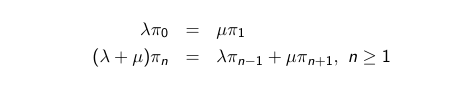

  *in general,*

  ​						

  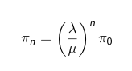

  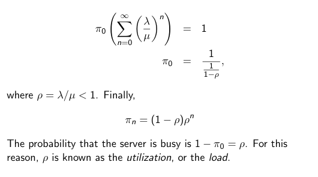

## Lecture 13/14 CTMC Continued

### CTMC Continued

#### M / M / 1 Queue

- Single Server system
  - arrivals follow a **Poisson process**, with rate $\lambda$
  - Processing/service times  $\sim \exp(\mu)$ (mean is $\dfrac{1}{\mu}$)
  - Infinite waiting room/buffer
  - The M stands for markovian/memoryless, and usually is presented as M/M/1, or Arrivals/Processing Times/# of Servers
  - Let X(t) be the # of jobs in the system at time *t*
  - The possible states (representing the number of jobs in the system) of are 0, 1, 2, …, n
    - We claim this to be a CTMC, and to do this, we need to make a transition diagram with given rates for each transition:
      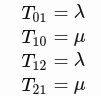
      This goes on for each state, since only one job can come in at a time
    - This is a description of a continuous time markov chain that captures the system behavior
  - Balance equations for this will be done tomorrow

#### Model as CTMC

- $X(t)$ - number of jobs in the system at time $t$

- Global balance equations

  $\lambda \pi_0 = \mu \pi_1$

  $(\lambda + \mu)\pi_n = \lambda \pi_{n-1} + \mu \pi_{n+1}, \forall n \geq 1$

- In general: ==$\pi_n = (\dfrac{\lambda}{\mu})^{\displaystyle n} \pi_0$==

  - Or $\pi_n = (1 - \rho) \rho^n$

- Probability server is busy is $1 - \pi_0 = \rho$

- $E[T] = \dfrac{1}{\mu-\lambda}$

#### PASTA Property / Arrival Theorem

- **Arrival Theorem: ** upon **arrival** at a station, a **job** *observes* the **system** as if in **steady state** at an arbitrary instant for the system without that job
  - states that the probability of the state as seen by an outside random observer is the same as the probability of the state seen by an arriving customer

## Lecture 15 - 2020-10-19

#### Birth-Death Process

- **Birth-Death Process** = $\lambda_n$ is the rate out of state $n$, to state $n+1$ and $\mu_n$ is the rate out of state $n$, to state $n-1$
  - $\lambda$ values are the ***birth rates*** and the $\mu$ values are the death rates

##### Local Balance Equations

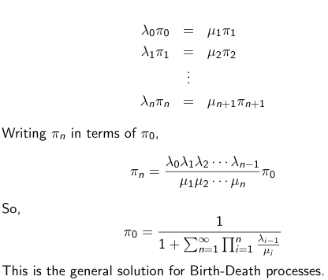

#### M / M / 1 / N - Finite Buffer System

- arriving jobs (beyond $N$ in system) "lost" or "blocked"

- Lost jobs *do not* return at a later time

- **transition rates:**

  $\lambda_n = \lambda$,	$n = 0,1,2, ... , N-1$

  $\mu_n = \mu$,	$n = 1,2,3, ..., N$

- **state probabilites:**

  $\pi_n = \displaystyle(\dfrac{\lambda}{\mu})^n\pi_0$

  $\pi_0 =	\dfrac{1}{\displaystyle\sum^N_{n=0}(\dfrac{\lambda}{\mu})^n}$

  *more simply*

  $\pi_0 = \dfrac{1-\dfrac{\lambda}{\mu}}{1-(\dfrac{\lambda}{\mu})^(N+1)}(\dfrac{\lambda}{\mu})^n$

  $\pi_n = \dfrac{1-\dfrac{\lambda}{\mu}}{1-(\dfrac{\lambda}{\mu})^(N+1)}$

  

##### Blocking Probabilities

- **Blocking Probabilities** = probability that the system is full

  - $\lambda\pi_N$ - **mean number of jobs** lost per unit time h

  - The actual arrival rate of a system with a blocking probability $π_N$ (which can also be seen as throughput) can be calculated as well as ==$λ′=λ(1−π_N)$==

  - ex. $N = 5$

    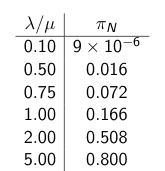

  - ex. *with* $\dfrac{\lambda}{\mu}=0.9$ *and vary buffer size*

    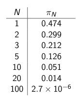

#### M/M/$\infin$ Queue

- Every job is ***immediately assigned*** its *own* processor 

  - Or each job is its own server

  $\pi_0 = \text{e}^{\dfrac{-\lambda}{\mu}}$

  $\pi_n = \dfrac{1}{n!}(\dfrac{\lambda}{\mu})^n \pi_n$

  - **final limiting distribution is thus:** $\pi_n = \dfrac{1}{n!}(\dfrac{\lambda}{\mu})^{n} e^{\dfrac{-\lambda}{\mu}}$

- Follows **Poisson Distribution** with mean $E[N]$

  - $E[N]=\dfrac{λ}{μ}$
  - $E[T]=\dfrac{1}{μ}$

- $E[N_Q] = E[T_Q] = 0$

#### M/M/$c$ Queue

- $c$ processors in parallel and a queue for a waiting jobs

  $\pi_n = \dfrac{1}{n!} (\dfrac{\lambda}{\mu})^n\pi_0$

  $π_0=[1+\displaystyle∑^{c−1}_{n=1}\dfrac{1}{n!}(\dfrac{λ}{μ})^n+\dfrac{1}{c!}(\dfrac{λ}{μ})^c(\dfrac{1}{1−ρ})]^−1$

  - Where $ρ=\dfrac{λ}{cμ}$
  - Further equations:
    $E[N_Q]=[\dfrac{(\dfrac{λ}{μ})^cλμ}{(c−1)!(cμ−λ)^2}]π_0$
    $E[T_Q]=[\dfrac{(\dfrac{λ}{μ})^c\mu}{(c−1)!(cμ−λ)^2}]π_0$
    $E[T]=\dfrac{1}{μ}+[(\dfrac{(\dfrac{λ}{μ})^cμ}{(c−1)!(cμ−λ)^2}]π_0$
    $E[N]=λE[T]$

#### Erlang-C Formula

$P\{queueing\} = \displaystyle\sum^\infin_{n=c} \pi_n = \dfrac{1}{c!}(\dfrac{\lambda}{\mu})^c(\frac{1}{1 - \rho})\pi_0$

## Lecture 16 - 2020-10-21

#### M/M/c/c Queue

- Loss system, *no waiting*

- If a job arrives that finds *all* server busy, it is **lost**

  for $n \leq c$

  ​	$\pi_n = (\displaystyle\prod^n_{i=1} \dfrac{\lambda}{i\mu})\pi_0 = \frac{1}{n!}(\dfrac{\lambda}{\mu})^n\pi_0$

  ​	$\pi_0 = \dfrac{1}{1 + \displaystyle\sum^c_{n=1} \dfrac{1}{n!}(\dfrac{\lambda}{\mu})^n}$

  ​	$\pi_c = \dfrac{\dfrac{1}{c!}(\dfrac{\lambda}{\mu})^c}{1+\displaystyle\sum^c_{n=1} \dfrac{1}{n!}(\dfrac{\lambda}{\mu})^n}$

#### Client/Server Model

- Let the **state** be the *number of jobs* at the server
- **think time** of clients exponentially distributed with rate $\lambda$
- **processing times** exponentially distributed with rate $\mu$
- *no need to keep track of individual jobs*, so does not matter what scheduling policy at CPU is

​	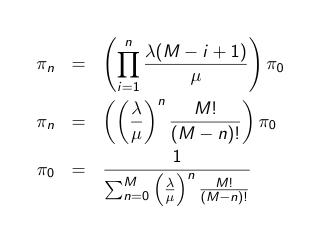

### Lecture 17 | Multi-server Systems - 2020-10-22

### *k* M/M/1 versus M/M/1

- M/M/1 system and one of the k slow M/M/1 