# 4E03 | Performance Analysis of Computer Systems

**Instructor**: Douglas Down : ` downd@mcmaster.ca`

**Office Hours**:  (instructor) Wednesday 9:30-11:30 will be “open” office hour

**Grading**:

- Midterm 25% (take home midterm) 
- Assignments (weekly)	15% (11, but mark is best of 6)
- Peer-review activities      15%
- Final Exam (2.5 hours)    45%

**Text**: *Performance Modeling and Design of Computer Systems,* **Mor Harchol-Balter** (optional)

**Course Coverage:**

1. Probability Introduction
2. Discrete-Time Markov Chains
3. Introduction to Queuing
4. Operational Laws
5. Simulation 
6. The Exponential Distribution and the Poisson Process
7. Continuous-time Markov Chains
8. Simple queues
9. Multi-server systems
10. Networks of queues
11. Reliability
12. Impact of variance on scheduling 
13. Load Balancing 
14. Applications

## Lecture 2 | A Crash Course in Probability  2020-09-10

- If you do the weekly assignments, the midterms and finals will be simple
  - best 6 of 11; 5 will drop
- Kritik is a tool to enable peer-review actives 
  - Open ended work that is marked by peers

#### Samples and Sample Space

- Suppose we have a data centre that has three servers (A, B, C)
- At any (randomly ) point in time, we look to see which servers are up and which servers are down ( failed) 
- *Experiment*: which servers are up, which are down?
- *Sample Space( $\Omega$*) : set of all possible sample / outcomes 
  - $\Omega$  $=$   \{ \( *w, w, w*),(*w, w, f*), (*w, f, w*), ( *w, f, f*), ( *w, f, f*), (*f,w,w*), (*f, w, f*), (*f, f, w*), (*f, f, f*)}

Where the components indicate if A, B, C, are working ( *w* ) or failed ( *f* )

#### Events 

- An event, $E$ m is any subset of the *sample space* $\Omega$ 
- $E_1$ corresponds to Server A failed:
  - $E_1$ $=$ $\{ ( f, w, w ), (f, w, f), (f, f, w), (f, f, f) \}$
- $E_2$ corresponds to at least two servers failed 
  - *Reminder*: Unions and intersections of events are also events:
  - $E_1 \cap E_2 = \{ (f, w, f), (f, f, w), (f, f, f)\}$  
  - Set of events where Server A and another server failed
- Complement of an event is also an event:
  - $E_{2}^{c} = \{(w, w, w), (w, w, f), (w, f, w), (f, w, w)\}$
  - Set of events where two servers are working

#### Probabilities

- $0 \leq P \{E\} \leq 1$: probability of event $E$ occurring

  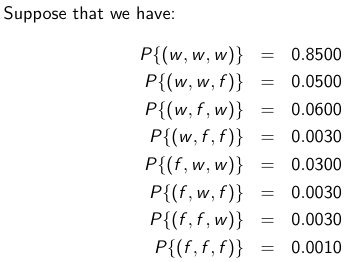

- The probability of an event, is the sum of its events
  
- $P\{E\} = \sum \{ P\{x\} \| x \in E \}$
  
- Probability of the Union of 2 sets sum of the two sets minus the probability of their intersection

  - If $S_1 \cap S_2 \neq \empty $ , then if we do not subtract the set of intersection from the sum, we will count the events probability twice. Therefore:
  - $P\{E\ \cup F\} = P\{E\} + P\{F\} - P\{E \cap F\}$ 

  ##### Theorem: 

  ##### 	$P\{E \cup F\} \leq P\{E\} + P\{F\}$

  - The Probability of the *union* of 2 events will only be the same when they are *mutually exclusive*, meaning their intersection is $\empty$ , the *empty set* 

#### Conditional Probabilities

- ==**Conditional Probability**== $:=$ The conditional probability of $E$ given $F$ is $P\{E | F\}$
  
  - $P\{E | F\} := \dfrac{ P\{E \cap F\}}{P\{F\}}$
  
    -  $\dfrac{ P\{E \cap F\}}{P\{F\}}$ is also called the ***Conditional Probability Test***
  
  - Note: the denominator (*probability of $F$* ) renormalizes over the new sample space ($F$) and the numerator (*probability of the intersection of E and F*) restricts to samples are are in $E$ *and* the new sample space
  
  - ex. we wish to compute the probability that *A* is failed given that exactly one server is failed
  
    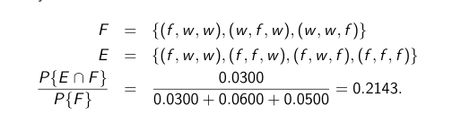

#### Independent Events

- **==Independent Event==** : an event is independent if its probability is not affected by whether or not some other event happens

  - Events *E* and *F* are **independent** if:  $P\{E\cap F \} = P\{E\}P\{F\}$

  - $P\{E\}$ does not depend on $F$:

    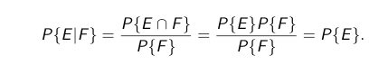
    
    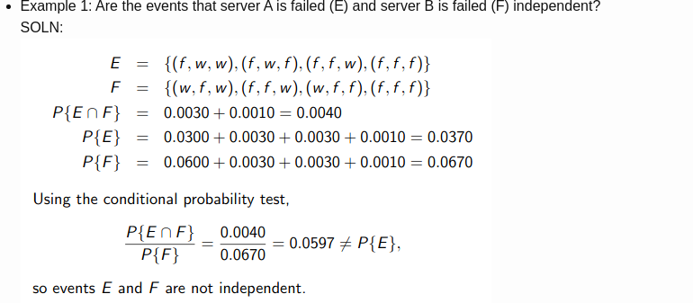

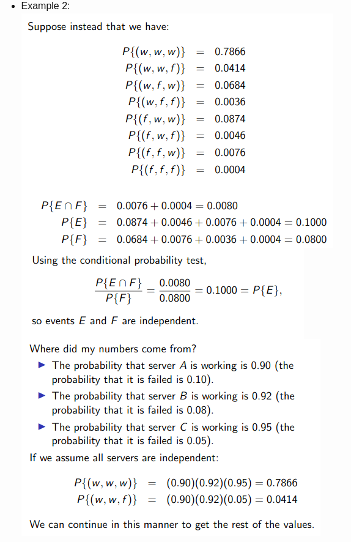

## Lecture 3 | 2020-09-14

#### 

#### Bayes Law

- ==**Bayes Law**== $:=$ $P\{F | E\} = \dfrac{P\{E|F\}P\{F\}}{P\{E\}}$
  - Suppose that we now the probability of $F$ given $E$,  what is the probability of $E$ given $F$?

Ex. 1

Someone is tested for a rare disease. Suppose that the testing methods for the disease are correct **99% of the time** (if one has the disease, the test is positive 99% of the time, if one does not, the test is negative 99% of the time). Suppose that disease occurs in the general population at the rate of one every 10,000 people. 

What are the chances that someone testing positive ***actually has the disease?***

- Event *A*: one has the disease
- Event *B*: one tests positive

$P\{A|B\} = \dfrac{P\{A|B\}}{P\{B\}}$

What have $P\{A\} = 0.0001$ and $P\{B|A\} = 0.99$, but do not have $P\{B\}$. To calculate this probablity, use the *Law of Total Probablity*

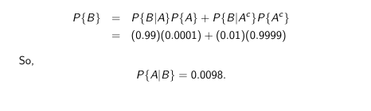

#### Random Variables

- **==Random Variable==** $:=$ a real-valued function of the outcome of an experiment. 
  - Usually denoted $X$
  - Examples
    1. The sum of the rolls of two dice
    2. Number of arrivals to a website by some time *t*
    3. The time until the next arrival to a website
    4. The CPU requirement of an HTTP request
  - 1 & 2 are *discrete*, 3 &4 are *continuous*
  - 2: if *N* is the associated random variable, the we can define events such as *the number of arrivals is less than or equal to five* and *the number of arrivals is between 1 and 3*

#### Distributions

- **==Distribution==** $:=$ $F_{X}(x) = P\{X \leq x\}$
  - Compact way of defining the probablities of events

#### Continuous Random Variables

- For quantities that take on values on a continuum - time is an important one for us

- **Density function** = $f_X(x) = \dfrac{d F_{x}(x)}{dx}$

  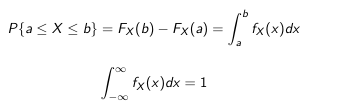

#### Discrete Random Variables

- ==Probablity mass function== (**p.m.f**) gives the probabilities that the random variables equals values in a discrete set (its range of possible values)

  $p_x(i) = P\{X = i\}$

  

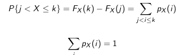

#### Summary Statistics - Mean

- **==Expected Value (mean)==** $:=$ a predicted value of a variable, calculated as the sum of all possible values each multiplied by the probability of its occurrence.
  	-  **Discrete:** $\sum_i i p_x(i)$
  	-  **Continuous:** $\int^\infin_{-\infin}x f_X(x)dx$ 
- 

#### Variance and Standard Deviation

- **==Variance==** $:= $ $Var(x) = \sigma^2_X = E[ (X - E[X])^2]$

  An important summary statistic is the *variance* which measure the expected deviation from the mean, *how spread out the distribution is*

  - puts more weight on values that are further away from the mean

- **==Standard Deviation==** $:= \sigma = E[X^2] - (E[X])^2$

  - The square root of the variance

### Some Useful Distributions:

#### Geometric Distribution

- **==Geometric Distribtuion==** $:=$ $p_x(k) = q(1 -1)^{k-1}, k \in \mathbb{Z}^+$

  where *q* is the *probablity of success* for an experiment. *1-q* is the *probability of failure*, and $p_x(k)$ is the probability that success first happens on the kth trial. 

  - Arises in applications like testing: if we do **independent tests**, how many tests must be performed before success?
  - $E[X] = \dfrac{1}{q}$
  - $Var(X) = \dfrac{1-q}{q^2}$

#### Poisson Distrubtion

- **==Poisson Distribution==** $:=$ o	

  - a discrete probability distribution that expresses the **probability of a given number of events** occurring in a *fixed interval of time or space* if these events occur with a known *constant mean rate* and *independently* of the time since the last event

    $p_x{k} = \dfrac{e^{-\lambda}\lambda^k}{k!}, k \in \mathbb{Z^{0+}}$

  - Sums to one: $\sum_{k=0}^{\infin}e^{-\lambda}\dfrac{\lambda^k}{k!}$

## Lecture 4 | 2020-09-16

### Further Distributions

#### Uniform Distribution 

- **==Uniform Distribution==** := $U(a,b)$ and has density:

  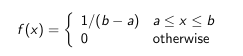

  - The **random variable** is *equally likely* to take values anywhere between *a* and *b*. This **does not** mean that $P\{X=i\} = P\{X=j\}$ although this is trivially true. It does mean, for examples $P\{0.1 \leq X \leq 0.2\} = P\{0.3 \leq X \leq 0.4 \}$ (assuming $a \leq 0.1 \land b \geq 0.4$)
  - **Special case**: $U(0,1)$ as many built in random number generators produce samples from this distribution

  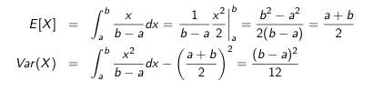

#### Exponential Distribution

- **==Exponential Distribution==** : X = $Exp(\lambda)$

  - One parameter, ***rate*** $:= \lambda$ 

  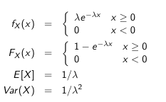

We can see why the term "***rate***" is used for **$\lambda$** ; think of $X$ as measuring some length of time

##### Examples

- Jobs arriving to a server have CPU time that is *exponentially* distrbuted with mean **140 msec**. The CPU scheduling discipline is quantum-oriented, so that a job not completing within **100 msec** will be routed back to the tail of the queue of waiting jobs. Find the probability that a job has to wait for a ***second quantum***.

1. Want to find: **probability a second quantum is needed**

   Let X be CPU time : \lambda = \frac{1}{140}

   $X \sim  Exp(\dfrac{1}{140})$ 

   $P(X > 100) = 1 - P(X \leq 100)$

   = $1 - (F_x(100) - F_x(-\infin))$

   = $1 - ( 1 - e ^{-\lambda x } - 0)$ 

   = 1 - ( 1 - $e^{\dfrac{-100}{140}}$)

   = $e^{\dfrac{-100}{140}}$

   = 0.4895

- Suppose that **800 jobs** arrive in a particular time interval, how many are **expected to finish** within the ***first quantum***?

  $P\{X \leq 100\} = 1 - P\{X > 100\}$

  $ = 1 - 0.4895$

  $= 0.5105$

  Probability for one job to finish in first quantum, to get for 800 jobs, 

  800 * 0.5105 = 408.4 jobs should finish in the first quantum

#### Memoryless Property of the Exponential Distribution

- Suppose that $X \sim Exp(\lambda)$
- Suppose that we know X > b; What is the *probablitity* that $X > a + b$ (only makes sense if $a \geq 0$)

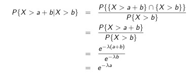

which is *exactly the same* as $P\{X > a\}$

- The future is ***independent*** of the past, given the present. 
  - Knowing that time *b* has elapsed gives no information about the future
- **Exponential distribution** is the *only* ***continuous*** distribution with the **memoryless** property
- Often used to model phenomena with this property: if we assume memoryless, then the underlying distribution is exponential

#### In-Lecture Demo

- Given a data centre with 8 servers, which server should we send any arriving data to? What if we want to turn off servers or one of them fails? What is the performance of all this and how can we show it?

  - Performance can be given by:

    - Low latency
    - Response time
    - Failure rate
    - Energy efficiency
    - Server usage
    - Throughput
    - Load balancing

  - What to do if we want to evaluate any of the above performance metrics?

    - One method is the **workload model**, look at the frequency of arrivals, processing time

  - Note for measuring response times, each job has a different response time, how to still show this?

    - Low mean (E[R])

    - Low 95% percentile

      

      P(R≤T)≥0.95P(R≤T)≥0.95

      - Could be 99%, or any percentage

- Lets look at an example with different schemes for handling requests

  - Scheme 1:
    E[R1]=1E[R1]=1
    Var(R1)=2Var(R1)=2

  - Scheme 2:

    

    E[R1]=1.1E[R1]=1.1

    

    Var(R1)=0Var(R1)=0

    - 2 has no randomness, always returns in 1.1, whereas 1 has a large amount of randomness, sometimes returning very low or very high response times

- This can also be seen on some of the slides

### Stochastic Models

- May want to capture how a system evolves using *dependent* random variables, described by some dynamics. A very simple model that’s widely applicable is a **Discrete Time Markov Chain**, which has been used for web page navigation, speech recognition, ML, etc.

## Lecture 5 | 2020-09-17

### Intro Example

- Consider the following scenarios

  - 3 web pages that link to each other, **A,B,C**
  - ***A*** has links to ***B*** and ***C***
  - ***B*** has a link to ***C***
  - ***C*** has links to ***A*** and ***B***
  - When a user leave ***A***, **1/3** of the time a link to ***B*** is made, otherwise the link ***C***
  - ***B*** always links to ***C***
  - ***C*** links to ***A*** or ***B*** with **equal probability**

  Q: what *proportion of visits are made to each of the pages*?

### Discrete-Time Systems

- **==Discrete-Time Systems==** : the *nth* time point corresponds to the *nth* event
  - Natural for some settings - a ***continuous-time*** framework may be more suitable

#### Discrete-Time Markov Chains

- **==Discrete-Time Markov Chains==** = **stochastic process** (${X_n, n =0,1,2, ...}$), where $X_n$ denotes the state at (***discrete***) time step *n* and such that $\forall n \geq 0, \forall i_0, ... , i_{n-1}$:

$P\{X_{n+1} = j | X_{n-1} = i_{n-1}, ..., X_0 = i_0\} = P\{X_{n+1} = j + X_n = i\} = P_{ij}$

- **Stationarity =** statistics of process independt of time - $P_{ij}$ is independent of the time step and of history
  - The previous time step is a perfect representation of all the states previously`
- **Last Equality** = stationarity 

- **==Markovian Property==** = the *conditional distribution* of any future state $X_n+1$ , given past states $X_0,X_1,..,X_{n-1}$ and the present state $X_n$, is ***independent of past states and depends only on the present state $X_n$*** 
  - **$P$** = ***transition probablity matrix***
  - $P_{i j}$ is the probablity of state of moving to **state j** *from* **state i** ($P\{x_j| x_i \}$)
  - $P$ may have **infinite dimensions**
  - $P$ is square
  - Rows of $P$ sum to one 
    - *the system much be at some state at each step!*
  - $P_{ii} > 0 $ *is **possible*** 

#### Umbrella Problem

- Ab absent-minded professor has **two umbrellas** that are used making trips from home to work and back. If it *rains* and an **umbrella** is at the *current location* an **umbrella is taken**. If it is **not raining**, **no umbrella is taken**. It **rains** with probability *p* when each trip is made, independent of prior trips.

   **Question**: determine the fraction of trips during which the professor gets wet

###### Solution

**state-space:** track the **number** of umbrellas at *current location*

**state transition diagram on board**

**transition probability matrix:**

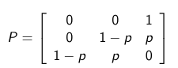

Could model this with six states, where the state is the ordered pair that conissts of the number of umbrellas at home and the current location

### *n-step* Transition Probabilities

- Let $P^n = \displaystyle\prod^n p$ 

- $P_{i j}^{n} := (i,j)$ entry of $P^n$

  In general, if we know that the $(n-1)$ step transition probabilities are given by $P_{ik}^{n-1}$, then by exhaustive enumeration of all possibilities:

  $P_{i j}^{n} = \displaystyle\sum^{M-1}_{k=0} P_{i k}^{n-1}P_{k j}$

  This allows an inductive argument that the *n-step* transition probability of going from state *i* to state *j* is given by the (i,j) entry of $P^n$

### Limiting Probabilities

- **==Limiting Probabilities== ** - Let $\pi_j = \displaystyle\lim_{n \rarr \infin} P^n_{ij}$

  - $\pi_j$ represents the *limiting probability* that the **DTMC** is in **stage *j***. 

    For an ***M-state DTMC*** with states $\{0,1,...,M-1\}$

    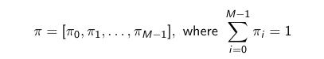

    is a *vector* of the **limiting probabilities** of being in *each* state

  - not obvious that limit always exists

  - not obvious that limiting probabilities form a distribution

    - We will assume these for the purposes of this course

#### Stationary Probability

##  Lecture 6 | 2020-09-17

