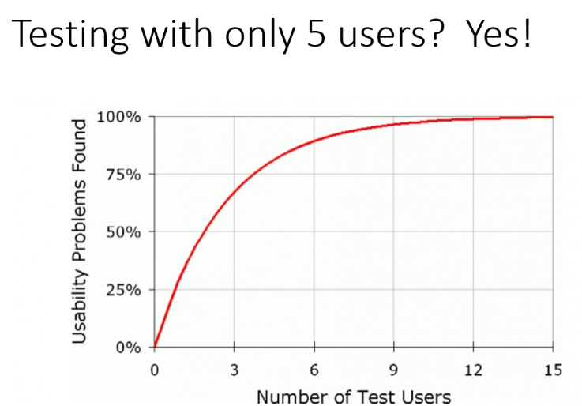
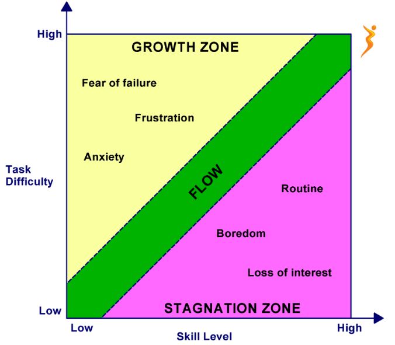

# 4HC3 | Human Computer Interactions


## Lecture 1 : Meta Lecture / Syllabus - 2020-09-10

**Instructor**: Kevin Browne `brownek@mcmaster.ca`

- PhD in HCI
- Master done @ IBM
- Software Hamilton, Hamilton Code Clubs, The Forge

==**Human Computer Interfaces**== = space where interations between humans and computers occurs

- Intersections of: *Computer Science, Pyschology, Graphic Design, Business, Ergonomics*

**Course Coverage:**

- UI Design Goals
- Mockups, wireframing, prototyping
- Users, tasks
- User Research
- Accessible Design
- Design heuristics, principles, theories
- Design thinking
- User interface design processes
- Testing user interfaces
  - Usability testing
- Implementing user interfaces
  - Technologies, related architectures when relevant
- User help (videos, manuals, etc)
- HCI research & case studies

**Technologies:**

- HTML and CSS
- JavaScript
- ReactJS
- No back-end code required

Coverage of game engines, mobile app dev, and other technologies will occur --- popular interfaces will be discussed in class

**Breadth** not **depth** course


**Mark Breakdown**:

- Assignments 				35%
  - 7 assignments x 5% each
- Projects                          35%
  - Milestones with different weights over term
  - Individual or group
- Final Exam                     30%

## Lecture 2 | UI Design Goals - 2020-09-10

### Real World Example

Why do you think the design for this telephone performed better than a rotary phone?


**Smaller learning curve**, easier to use, don't need to use rotary dial

### UI Design Goals

- There are ***many*** potential goals for user interfaces, together they make up usability

  - usability is more than "easy to use"

- We can organize these goals in different taxonomies, i.e. categorizations

  

  We'll use a taxonomy of **8** **goal categories** largely dervied from the taxonomy use by *Ben Schneiderman*

#### 8 Design Goal Categories

- **==Learnability==** - How easy is it for users to accomplish *basic tasks* the **first** time 

- **==Retention==** - When users *return* to the design after a period of time, how easily can they **re-establish proficiency**
  - Can call this goal ***memorability***

- **==Performance==**s - Once users have learned the design, **how quickly** can they perform tasks?
- **==Error Rates==** - **How many** errors do users make? **How severe** are these errors? **How easily** can they *recover* from the errors?
- **==Subjective Satisfaction==** - **How pleasant** is it to use the design?
- **==Accessibility==** - **How accessible** is the interface to users with different disabilities?
- **==Functionality==** - **What range of operations** does the user interface support
  - *How much is can do* **not** how well it can do its functions
- **==Trustability==** - How much **do users trust** the interface?

#### UI Design Goals vs Requirements

- **Functional requirements** $:=$ the required behaviours of a system (i.e. what it can *do*)

- **Non-Functional requirements** $:=$ criteria by which to judge operation of a system

- UI design goals are closely related to the idea of **non-functional requirements** (aka **quality** **attributes**)
  - UI Design goals are a subset of non-functional requirements
  - Though functionality (range of operations)
  - Specific goals might be captured with tangible requirements

#### UI Design Goal Taxonomies

- Another common taxonomy comes from "*Ergonomics of human-system interaction*"(ISO 9241-11:2018)
  - **Effectiveness**
  - **Efficiency**
  - **Satisfaction**
- Usability is defined as "the extent to which a system, product or service can be used by specified users to achieve specified goals with **effectiveness, efficiency and satisfaction**"

We can specify other categories of goals, for example:

- **Safety** : how safe is the system for users
- **Understandability**: How easy is it to understand the system?
- **Responsiveness**:  how long does it take to complete tasks?

Most categories can fall under one of our existing categories:

- **Safety** is a category of **error rate**
- **Responsiveness** is a form of **performance**
- **Understandability** is tied to **learnability** 

### Trade-Offs

- **Trade-offs** occur when we sacrifice quality in one goal to improve quality for another goal
- For virtually all user interfaces of enough sophistication, trade-offs become necessary
  - The trade-offs may not be though about consciously, they may occur implicitly, but they exist
- Making the "right" trade-off decisions is critically important to the success of a system


ex. Wifi Hotspot menu in iOS or Android

- Less options; more decisions made for you

  | UI Design Goal | Android                                 | iOS                                     |
  | -------------- | --------------------------------------- | --------------------------------------- |
  | Functionality  | more options, more ability to customize | fewer options, decisions made for users |
  | Performance    | Need to                                 |                                         |
  | Error Rates    |                                         | won't allow you to mis-configure        |

  

### Measuring Goals

- Important for us to be able to measure goals
  - To know if we are improving an interface or not 
  - To compare interfaces with one another objectively 
  - To write requirements that can be verified 
- Not straight forward though...
  - What performance measures and error rates matter from one system to the next?
  - How do we measure subjective satisfaction, learnability, trustability, and less objective goals?

#### Performance 

- How **long** it takes a user to perform a task
- Number of clicks/taps required to perform a task
- How many tasks can a user accomplish in a time period?


#### Error Rates

- **Errors per task**, **errors per time period**
- *Success rate* at completing task

#### Subjective satisfaction, trustibility

- Surveys can help make it objective
  - "I liked using this interface" with Yes/ No responses
  - Likert scale questions
    Pick from different options (Strongly disagree, agree, etc. 1-N for N categories)

#### Learnibility & Retention

- Perform an experiment 
  - Ask users who have never seen interface before to perform a task
  - Measure how long it takes 
  - Compute an average 
  - Repeat same process a month later

Measuring goals is very related to testing user interfaces, a toopic we'll dive into more later

- A host of techniques exist to test interfaces, which ***themselves*** have trade-offs in terms of their performance, ease of use, etc.

- Suffice to say it is possible to measure goals, even realtively subjective ones

## Lecture 3 | User Interfaces Prototyping - 2020-09-11

### User Interface Prototyping

- **==User Interface Prototyping==** = iterative development technique in which interface **sketches**, **wireframes**, **mockups** and **prototypes** are created
  - Users themselves are typically active in the process of *creating* and *evaluating* these design artifacts

**What's the difference?**

- Often, the above terms are used interchangeably. For the purpose of the course, they will be defined as follows:

#### Sketches 


- **==Sketches==** $=$ are hand-drawn representations of user interface designs
  - Sketches have ***virtually zero barrier to entry***
    - Even a non-technical customer/user can sketch
    - Anybody can sketch
  - Sketches are very **low fidelity** 
    - Prototyping methods often ranked from low fidelity to high fidelity
    - Lower fidelity means low lovel of detail 

#### Wireframes


- Wireframes accurately represent interface page layout and organisation of content
  - But lack colour, typography, images and graphics
  - i.e. ***blueprints***
- Increased *precision* over sketches and use of software makes wireframes less accessible than sketches
- More time consuming to create than sketches, but relatively ***higher fidelity***

**Wireframe** = structure + functions + content 

#### Mockup


**Mockup** = static but accurate representations of the application interface

- Colour, typography, and graphics *should* be included
- Mockups are not interactive, cannot click and perform actions
- Equivalent to screen captures

Much more time consuming than wireframes, but very high fidelity

#### Prototypes

- Prototypes are an accurate ***and*** iteractive representation of the application interface
  - We can perform actions in a prototype and the result should be the same in the full working application
- Difference between prototype and completed application?
  - Not connected to a back-end and the logic is hardcoded
- Highest fidelity, and most time intensive to create
- Created with the same tools as the completed application
  - HTML, CSS, JavaScript, etc.
- They may also be created with purpose built tools that allow for code-free experiences
- **Fully functional in terms of UI**


#### Tools

- Sketches:
  - Pen, paper, whiteboard
- Wireframes
  - wireframe.cc
  - draw.io
- Mockups
  - GIMP
  - HTML,CSS
- Prototypes
  - Sketch, Proto.io, Moqups
  - HTML,CSS,JavaScripts

#### Cost vs. Fidelity


### Where Do CS/SE Experts Fit?

**Professor's opinion:**

- CS & SE grads work in the *prototyping stage* 
- **Freelancer or startup**: Maybe every stage!
- Specialized roles
  - Business/client focused roles  - **sketches** with client
  - UX experts, graphic designers creating **wireframes** & **mockups**
  - CS/SE experts doing **interactive prototype** -- *focusing on the interactivity!*
- Traditional wireframe is the *most likely* to be skipped

### Course Focus:

- *Some* **wireframes** and **mockups**
  - Importance in understanding how they work / how to build one
- Focus will be on ***interactive* prototypes**
  - Connects naturally with testing of user interfaces which is another common area for CS/SE experts

## Lecture 4 | User Analysis - 2020-09-15

### User Analysis

- **==User Analysis==** = determining *what* **characteristics** of our users may incluce the design of an interface

  - Closely related to, *but distince from* **task analysis**
  - **Task analysis** = analysis of how user tasks are performed to influence the design of our interface

  **User analysis** and **Tasks analysis** are often done together to *inform* and *guide* **user interface design**

  - Both take place *before* design takes place
  - **Users** and their **tasks** can vary in many different ways

### User Diversity

#### Physical Abilities

- ***Antrhopometry*** studies human body measurements
- **Perception** abilities
  - Vision-related: *low vs. bright* light, colours, response times, depth perception, visual aids
  - Similar concerns to hearining abilities

#### Cognitive Abilities

- Classifications by the *journal of Ergonomics Abstracts*
  - **Short term** and **working memory**
  - **Long term** and **semantic memory**
  - problem solving and reasoning
  - decision making and risk assement
  - language communication and comprehension
  - search, imagery, and sensory memory
  - learning, skill development, knowledge acquisition and concept attainment
- Most adults can hold 7 $\pm$  2 in their shortterm memory (Miller, 1956)
  - Makes a range of 5-9 menu items ideal

#### Personalities

- Different taxnomies and ways to measure exist with lively debates
  - eg. Myers-Briggs: contreversial as psedueo-science 

- Some interfaces allow users mulitple way to organize information
  - Designing for different *types* of users

#### Cultural 

- Beyond language translation, there are many other concerns when presenting information:
  - Titles like Mr. , Mrs, etc.

#### Users with Disabilities

- Vision Impairments
  - Screen readers
- Hearing impairments

##### Accessibilitiy Guidelines

- Web Content Accessibility Guidelines (WCAG)
- Accessibility for Ontarians with Disabilities Act (AODA)


#### Age

- **Seniors**
  - Physical, cognitive abilities generally declining
- Accommodating Seniors
  - Larger font-sizes
  - Larger buttons
  - Text description underneath icons
    - Icons meaningful to 20-40 year old people may not be meaningful to 90-year olds
    - May not be meaningful for younger individuals as well, **e.g.** Floppy disk save icon
  - Touchscreens over mouse interface
  - Autocomplete word/search suggestions
    - This was originally inspired by accommodating seniors
  - Lower congitive loads
    - Present less options, less information, simplified layouts

- **Children**
  - Age-limited abilities, e.g. reading, comprehension
- Accommodating Children
  - Fostering curiosity, intrinsic motivation
  - Safety concerns
  - Dexterity and other abilities
    - Can they be expected to drag, double-click, etc.
    - Attention span

#### Devices

- High speed vs low speed internet access
  - Are users with lower speeds accommodated?
  - Techniques exist to allow web server to send *smaller* images to certain users
- Display size & resolution
  - Smartphones with 3.5" screens vs. desktops with 27" screens
  - Resolutions from 640x480 to 4k
  - **Responsive design** is key
- Inputs: *touchscreen* vs. *mouse & keyboard*

### Universal Design

- **==Universal Design==** =  *design of products and environments to be usable by all people, to the greatest extent possible*
  - Can you really design for everyone? YES: wheel chair ramp, push to open doors
- Removing mouse-only interactions such as "hover to see information"
  - Helps users with vision or motor impairment, but now you can use the webapp on the phone
- High contrast information display
  - Helps users with vision impairment, *but* also helps other users when they are in sunlight
- Alt text on images
  - Helps users who use screen readers, but also helps you when bandwidth speed is too slow to send image

#### Users and Design

- Universal design as a general philosphy is virtually always good to practice, and to keep "top of mind"
- However, you **cannot** design for everyone all the time
  - Eg. when you have a *target user* 
    - Will our decisions about design be optimal if we're always considering every possible user equally?
- **User analysis** allows us to better understand our uses to influence our design for them

#### User Research

- **==User Research==** = focuses on understanding user behaviours, needs, and motiviations through observation techniques, task analysis, and other feedback methodologies
  - Technically done before design exists


##### User Research Techniques

-  Individual interviews with users

  - Use a script, be informal, both

- Focus groups

  - Feedback from small, diverse groups
  - Often informal but moderated discussions

- Personas

  - Creation of a representative user based on available data and user interviews
  - Fictional person, age, personality type, goals, what they're frustrated about
  - Person that you are specifically designing for that are representative of your average user-base
  - e.g. teams would have student persona, professor persona

- Use cases

  - Wirtten descriptions of how users will perform tasks
  - Include user's goal(s) steps or subtasks, how the UI can work
  - UML diagrams

- Card Sorting

  - Card sorting helps us to answer the question: 

    What information is, or ***should*** be associated with what other information

  - Helps us to arrange website menus, workflows, navigations

  - Process

    1. A person representative of the audience receives a set of index cards with terms written on them
    2. This person groups the terms in whatever way they think is logical, and gives each group a category name, either from an existing card or by writing a name on a blank card
    3. Testers repeat this process across a group of test subjects
    4. The testers later analyze the results to discover patterns

##### Interviews vs. Surverys

- Interviews and focus group
  - high cost/time commitment per user
  - Far less anonymitity

## Lecture 5 | Task Analysis / Divergent & Convergent Thinking -  2020-09-17

### Task Analysis

- **==Task Analysis==** = the analysis of how **user tasks** are performed in order to influence the design of our interface
  - **User analysis** and **task analysis** are often done together to infrom and guide user interface design

### User Domain Knowledge

- How much **expertise** does the user have that is *relevant* to the interface's **problem domain**? 

Common breakdown: **beginner v. expert**:

- **Beginners** sometimes called "novice users"
- **Experts** sometimes called "power users"
- Beginners are new to a task, experts have comprehensive knowledge

In reality, its ***very much a spectrum***

- **Intermediate users** are more advanced, but not experts and make the majority of most user bases

How can we accomodate both types of users?

ex. *Additional / Advanced Settings*


### User Roles

- The same system can have *groups* of **users** with defined roles
  - **user** vs. **admin**


### Ethnographic Research

- **==Ethnographic research==** = Qualitative user research method based on observing users in their real-life environment
  - Embedding yourself on the factory floor and *observing all roles*; what they involve
  - We can user **interview**, **surverys**, and other **user research methods** to inform **task analysis** too
  - **Ethnographic research** can be especially effective for discovering **user roles**, **workflows**, and **tasks**

### Tasks

- **==Task==** = **goal** directed *behaviours* or series of *behaviours* involving the user interface
  - often **hierarchical** and represented in a ***tree structure***
  - Often made up of **subtasks** which themselves can have subtasks
  - Sometimes the terms **goals**, **activities**, and **process** are used instead of "***tasks***"
    - top level **task** may be referred to as a **goal**

**Note:** whenever possible, try ***not*** to refer to the interface, especially specifics about the interface, when creating tasks

- ex. "Finding directions from Hamilton Ontario to Ottawa, Ontario"
- Goal directed activity, but no reference to *how* the task is accomplished in the UI
- ***Informs*** design **does not** define it

#### Task and Subtask example

- Search the store for products
  1. Filter search results by category
  2. Filter search results for sales
  3. Sort search results from lowest to highest price
  4. Sort search results from highest to lowest price
- In the above, we have a task and 4 subtasks
  - Notice that we don't make reference to the UI or how they are achieved

#### Conducting Task Analysis

- Question to think about:
  - **What** makes users *begin* a task?
  - **How** do users *complete* a task?
  - **What** information do users need to *complete* the task?
  - What **tools** do users need to *complete* the task?
  - Do the subtasks have an **order**?
  - **How** do users know **when** a task is *complete*?

Try to limit a task's subtasks to **4-8*** subtasks

- If there is more, it suggests that the hierarchy may require more layers

#### Hierarchical Task Analysis

- **==Hierarchical Task Analysis==** = form of task analysis
  - In addition to a **task hierarchy**, adds concepts of ***operations*** and ***plans***
- **==Operations==** = actions performed by the user. They are the subtasks which cannot be broken down further
  - Basic unit of task
  - Action does not mean "click X", its still at a higher level of abstraction
  - "sort by X", etc
  - **All** bottom-level tasks should be ***operations***
- **==Plans==** = How tasks are to be carried out; defined ordering of operations
  - First x, then y, then z

**Process:**

1. **Define task being analysed:** as well as the purpose of the **task analysis**

2. **Conduct data collection**: Pay particular attention to areas such as *technology*, *machine* and *team member* iteration, decision making, and *task constraints* to better understand the **process*

3. **Determine the overall goal of the task**: This should be in place at the top of the **task hierarchy**

4. **Determine Task Sub-Goals**: Decompose the overall goal into *corresponding* **sub-goals**. Together, these subgoals should comprise the tasks necessary to accomplish the overall goal

5. **Perform Sub-Goal decomposition**: Subgoals should be further broken down into *additional* **subgoals** and **operations**.  Continue this process until you reach an appropriate operation, which specifies the action that actually needs to be done to accomplish the goal. There should always be an operation at the bottom level of *any* branch in a **HTA**

6. **Develop Plan Analysis**: After describing all the subgoals and operations, add the plans. Plans explain how a goal should be accomplished. These may be in the format "do A, do B, do C"

   

### Divergent & Convergent Thinking

- **==Divergent Thinking==** = Thought process or method used to *generate* creative ideas by exploring many possible solutions

  - Quantity over quality
  - Novel ideas
  - Creating choices

  Similar to **brain storming**

  - "Right-Brain"
    - Creative, Artistic, Solution generating

- **==Convergent Thinking==** = Though process or method to make a *deliberate* and *conscious* choice. We purposefully apply criteria as we screen, select, evaluate, and refine options

  - Analyse and filter
  - Useful ideas
  - Make decisions

  Similar to **analysis and judging**

  - "Left-Brain"
    - Logical, Analytical, solution reducing


#### Design Thinking

Convergent thinking and divergent thinking are often used as part of **design thinking**

- **==Design Thinking==** = design process and set of related tools for creative problem solving
  - We'll talk more about design processes for user interface design later.. there are others


#### Thinking Divergently

- **Brainstorming**
  - Classic un-directed brainstorming, just write down whatever you think
- **Journal**
  - Keep a journal of ideas to write them as they occur
- **Freewriting**
  - Write freely without structure or stopping 

- **Mindset**
  - Research shows we think divergently best when we are *happy, feel less pressure, less anxiety, well-rested*

- **Oxymoron**
  - Explore what happens when you remove what's most essential about a product or concept to generate new ideas
- **Arbitrary Constraints**
  - Set constraints and create designs within them
  - Forces more creative thinking
- **Brainwriting**
  - Have everyone write down their own brainstorm, then share together afterwards
  - Helps negate groupthink or going down a sub-optimal path
- **Lateral Thinking** - solving illogically
  - Random entry idea generating tool
  - Provocation
    - Say something provocative to motivate ideas
  - Disproving
    - Take a popular idea and try to disprove it
- **Scamper**
  - **Substitute**: come up with another topic that is equivalent to present the topics
  - **Combine**: adds information to the original topic
  - **Adjust**: identifies ways to construct the topic in a more flexible and adjusted material
  - **Modify**: Magnify,magnify, creatively changes the topic or makes a feature/idea bigger or smaller
  - **Put**: to other uses uses identifies the possible scenarios and situations where this topic can be used/implemented
  - **Eliminate**: removes ideas or elements from the topic that are not valuable
  - **Reverse**: rearrange, evolves a new concept from the original concept

#### Inspiration

- Search for solutions similar to the problem you are solving
- Note and categorise the different design features that the solutions are using
- Attempt to combine these design features in new ways relevant to your problem

## Lecture 6 | UI Design: Guidelines - 2020-09-22

### UI Design Recap

- *Sketches/wireframes/mockups/prototypes* **represent** our design
- **User analysis** and **Task analysis** *inform* and *influence* our design
- **Divergent thinking** helps us *create* and *explore* design space
  - **Convergent thinking** is where we *make* **design decisions**

Begs the question: ***how*** and ***why***? 


### Design Decisions

- **==Design Decisions==** = decisions we make during the design of an interface
  - ex.
    - Font / Font size
    - Layout
    - Colour
    - Input

##### *Making* Design Decisions

**Strategies:**

- **Intuition**: How do you know its a *good* design decision though?
- **Experience:** How do you know there isn't a *better* way?
- **Reference:** Is what *others* are doing the *best* way?
- **Consensus:** Is the *crowd always right*? How to account for *group think?*

**Consider:** how would you feel about using a **bridge** built on *intuition*? What about major        **surgery** based on *consensus*?

- UI design *guidelines,principles,* and *theories* can also help us to guide **design decisions*
  - Many are based on *empirical evidence*, though some are based on industry-wide experience, or other reasoning
- Guidelines, principles, and theories can offer a more solid basis for many of other design decisions
  - But they *can't* make **all** of our decisions for us

### Guidelines, Principles, and Theories

#### Guidelines

- **==Guidelines==** = provide **low-level** advice about good practices and cautions against dangers
  - **Do's and don't's**
  - Tend to be specific to *application, device, or part of UI*

##### Examples

- **Standardise task sequences:** allow users to perform tasks in the *same sequence* and manner across similar conditions
- **Ensure that links are descriptive:** When using links, the link text should accurately describe the link's destination
- **Use unique and descriptive headings:** Use headings that are distinct from one another and conceptually related to the content they describe
- **Use radio buttons for *mutually exclusive choices:*** When you need to choice one option
- **Develop Pages that will print properly:** If users are likely to print one or more pages, develop pages with dimensions that print well
- **Use thumbnail images to preview larger images:** When viewing full-size images is not critical, first provide a *thumbnail* of the image
- **Increase Web Site Credibility:** Provide a ***FAQ***. Show the author's credentials. Provide citations. Ensure the site is frequently linked by other credible sites.
- **Reduce the user's workload:** Allocate functions to take advantage of the *inherent respective strengths*

- **==Principles==** = are **middle-level** strategies or rules to *analyse* and *compare* **design alternatives**

- **==Theories==** = are **high-level** , *widely applicable* frameworks to draw on during design and *evaluation*. 

  - Useful to support communication and teaching
  - Can also be *predictive*, such as those pointing times by individuals or posting rates for community discussions

  

## Lecture 7| UI Design: Principles & Error Message Guidelines - 2020-09-24

### Principles

- ==**Principles**== = **middle-level** strategies or rules to analyse and compare design alternatives
  - more *abstract* and require more interpretation than guidelines
  - more *enduring* than guidelines: (**not** specific to OS, or device)

##### 8 Golden Rules of Interface Design - (Ben Scheindermen)

1.  ==**Strive for Consistency**==

   - Similar sequences of actions for similar situations
   - Use identical terminology across the application
   - Limit the number of exceptions to consistency, ensure they are comprehensible 

2. ==**Seek Universal Usability**==

   - Account for user characteristics (*age, language, culture*)

   - Account for **beginner** to **expert** users

     - explanations, shortcuts or performance enhancements

   - Design for transformation of content (text represents all media)

     

3. ==**Offer Informative Feedback**==

   - Interface should provide feedback for user actions

     - How do users know their action has been registered?

       

   - Feedback should be *inline* with the **frequency** and **importance** of the action 

     - Minor, frequent actions can provide modest responses
     - Major, infrequent actions can provide more extensive responses

4. ==**Design Dialogues To Yield Closure**==

   - After a series of actions, give users a sense of **closure** with information feedback

   - Sequences of actions should have an organization from beginning, middle, to an end with closure

     1. Select report type
     2. Enter in details regarding report 
     3. Produce report and present to user

     

5. ==**Prevent Errors**==

   - Where ever possible, design the interface such that users ***cannot*** make mistakes
   - If user make an error, interface should provide clear and constructive instructions ***to fix it***
   - Preventing errors
     - Disable or "grey out" options that aren't relevant
     - Don't allow airplane engines to go in reverse unless the landing gear is down
   - Force complete sequences of actions
     - Either automate a series of actions after a user action
     - OR make sure user *finishes* a sequences of actions
       - If left half complete, have an alert to user to finish it

6. ==**Permit Easy Reversal of Actions**==

   - Wherever possible, **make actions reversible**
   - Allow users to feel confident trying things
   - Allow reversal of single actions but also groups of actions

7. ==**Keep users in Control**==

   - Users should always have sense that they are in control ***especially*** more experienced users
   - Users **lose** control if:
     - Cannot produce a desired result or obtain required information
     - Are forced to go through a lengthy data entry process
     - Interface behaviour change unpredictably
   - Let users *skip* over content, move back and forward through a process, etc.

8. ==**Reduce Short-Term memory load**==

   - Users shouldn't need to remember information on one page and then use it on another
   - Don't exceed the 7 $\pm$ 2 rule of short-term memory
   - Break up lengthy forms and processes into logical subforms and processes

#### Another Principle...

- 8 Golden rules aren't the only principles
- Another principle: **Ensure human control while increasing automation**
- Increase automation of tasks as much as possible, and in the ways that **machines perform better**, but ensure **human control** is maintained, especially in the ways *humans* perform better

| Human                                                      | Machine                                       |
| ---------------------------------------------------------- | --------------------------------------------- |
| Draws on strengths and experiences and adapt to situations | Rapid consistent response for expected events |
| Select alternatives when first approach fails              | Process data with anticipated patterns        |
| Make subjective value based judgements                     | Perform repetitive actions reliably           |
| Develop new solutions                                      | Perform several actions simulataneously       |
| Request help other humans                                  |                                               |


#### Ensure Human Control While Increasing Automation

- *Routine*, *predictable* tasks are generally better given to machines when possible
  - Humans will get tired, make mistakes, etc.
- Unpredictable and novel tasks are generally better given to humans when possible
- The curve is always shifting on this trade-off
- Air traffic control
  - Much of the system of air traffic control is automated and for good reason
  - What about a plane needing an emergency landing?
  - What about a closed runway?
- Air plane disasters sometimes occur from *too much automation* and not enough human control

### Error Message Guidelines

#### What are the characteristics of *good* error messages?

- Make errors **explicit** and **clear** that it is an error that has taken place
- Make them visible
- **Don't** change application state too much in response
- Place error message close to where the error has taken place
- Text should target the *user* **not** the *programmer*
- **Don't** blame the user, if anything, **blame the app**
- ***tell the user how to fix the error!***
- user "warmer" language, colour, and iconographpy
- Does the error ***really*** need a big red X or stop sign? Do you even need the *word* error?
- User humour! Humour can ease anxiety, and a delightful surprise instead of a pain point
  - Don't go too far this can quickly cross over into being patronising to your user

## Lecture 8 | UI Design: Component-based Front-end Architecture 

### Why Component-Based?

- Basic computing and software principle: 

  - To build programs *that will scale*, we need to **separate** our code into different **modules** with *different concerns*
  - **separation of concerns!**

- We **sort of** get this with HTML, CSS, and JS

  - HTML - structure
  - CSS - style
  - JavaScript -behaviour
  - And we ***can*** further subdivide into different CSS files, include external libraries, etc.

- But in practice, this approach only scales so far .... 

- More **interactivity** means more **DOM** manipulation

  - Querying tags based on IDs and classes and writing code that's all about sticking data inside them
  - As opposed to code focused on layout, or structure, or solving our problem ... this type of code is some of the worst to write
  - This isn't what HTML DOM was built for originall either, JS does this because it's needed, but its a bit hacky

- DOM manipulation is ***expensive***:

  - Causes browser to re-render
  - Modern apps have ***VERY*** complex DOM trees ... hundreds of thousands of nodes, higher than ever tree depth, etc.
  - Making many small DOM changes is ***not*** ideal

- Let's say we make a "news feed" for Facebook profiles with HTML, CSS, JavaScript

  - because we need the same news feed for groups, how do re-use that functionaility
  - Not as easy as you would hope...
    - We can use a technique called "HTML templating" on our server to help with this, constructing pages made up of HTML templates glued together and sending them
    - Doesnt **scale** in terms of maintainability, we can end up with spaghetti code very easily

- **Single Page Applications (SPA)** are a type of web app that only do one initial page load of HTML, CSS, and JavaScript

  - Subsequent data or content that is needed is fetched by having JavaScript communicate with the server using:
    - AJAX - http requests done in the backend
    - WebSockets - bi-directional communication tech
  - From the user's perspective, the ***entire page never refreshes***

- **SPAs** provide a superior user experience

  - Entire page doesn't reload in-response to actions
  - Imagine if our phone and desktop apps did this 
  - Leads to higher subjective satisfaction for users

  **Trade off:** SPAs more technically difficult to build

  **component** **based** *is more suited towards SPA*

- For more on "why" we use them...

  - Does your web app need a front-end?

- Component-based frameworks developed in response to these problems

  - Tread DOM manipulation completely differently
  - Completely different separation of concerns
  - ***allow for creation of reusable components of functionality***

### Traditional Multipage Applications


### Single Page Application


### Big 3 Component Based Frameworks

1. Vue
   - Easiest to learn, super elegant code, instructor's favourite
2. Angular
   - Widely used, but has a "split ecosystem" between incompatible older and newer Angular version, documentation and learnabililty relatively harder 
3. React
   - Only slightly harder than Vue to learn, widely used in industry and we get React Native as a bonus

#### React

- Front end JS framework for interactive UI
  - Developed in 2011 at Facebook
  - Opensourced in 2013

##### Virtual DOM

- **Virtual DOM:**

  - lightweight abstraction of the DOM
  - essentially keeps a local and simplified copy of the DOM as part of its operation

- **Change in App State:**

  - does a *diff* between the last virtual DOM render
  - Handles any required DOM updates efficiently

- **Rendered** onto DOM at a specific element

  - From there, React controls the DOM at this element

  - In below example, `<h1>Hello,world!</h1>` is being **rendered by React** *into the div with id root*

  - `<h1>Hello, world!</h1>` may *look* like HTML, but its actually **JSX** code

    ```react
    <div id="root"></div>
    <script type ="text/babel">
    	ReactDOM.render(
        <h1>Hellow, world!</h1>,
        document.getElementByID('root');
        )
    </script>
    ```

    

#### React Components

- We can create **components** like this:

  ```react
  class MyComponent extends React.Component{
      render() {return <h1>Hello world</h1>}
  };
  ```

  

## Lecture 9 | Theories - 2020-09-29

### Theories

- **==Theories==** = **high-level**, widely applicable frameworks to draw on during **design** and **evaluation** as well as to support **communication** and **teaching**
  - can be *predictive*
  - more *abstract* than **principles** and **guidelines** and require *the most* interpretation

### Fitts' Law

- ==**Fitts' Law**== = Predicts that the time for a user to point to a target area is a ***function of the width of the target*** and ***the distance to the target***
  - Scientific Law discovered by *Paul Fitts* through experimentation in 1954
  - Targets that are **bigger** and **closer** to where the user is currently pointing will be *faster* for a user to interact with
  - Targets that are **smaller** and **further** will be *slower* for a user to interact with
- One of the most **objective** and **concrete** concepts in design
  - Tested over decades
  - Reproduced many time
  - Holds for "pointing device", whether its controlled with finger, mouse, joystick, eyes, tongue, etc.

##### Example

Which button will the user reach first with their cursor in this position? Why?


#### Formalisation

​	==$ID = log_2(\dfrac{2D}{W})$==

​	$ID - $ index of difficulty

​	$D - $ distance from the starting point to the target centre

​	$W - $ width of the target 

##### Computing Mean Pointing Time

**Variables:**

- $MT - $ mean time

- $a,b - $ constants dependent on input device

- $ID - $index of difficulty

- $D -$ distance from the starting point to target centre

- $W -$ width of the target

$MT = a + b * ID = a + b * log_2(\dfrac{2D}{W})  $

#### In Practice

- Designers generally aren't computing values with these equations
  - Instead, the core idea behind Fitt's law is used to inform design decisions
  - Ex. OS X Common Menu Bar
- Group buttons that are likely to be used together
  - Think: rewind, play, pause, fast forward
  - Sometimes play even turns into pause and vice versa
- Have an option that's ***bad*** or ***dangerous*** for the user?
  - Keep it *far away* from the main group of buttons
- Corners of the screen will always be fast to reach
  - Start button, OS X apple icon
- Position near the corners of the screen, but not the corners, will take the longest to reach
  - ***least valuable screen space***

### Norman's 7 Stages of Actions

- Users undergo these stages while interacting with an interface
  - ***cyclical pattern***

1. ***Forming* the Goal**
2. **Forming the Intention**
3. **Specifying the Action**
4. **Executing the Action**
5. **Perceiving the System State**
6. **Interpreting the System State**
7. **Evaluating the Outcome**

#### Norman's Definitions

- **mapping** = relationship between the elements of two sets of things
  - mapping between light switches and lights
- **conceptual model** = an explanation, usually highly simplified, of how something works
  - eg. folder and file icons
- **feedback** = communication about the results of an action
  - when you hit a button and button lights up / vibrates
- **system image** = is the combined information available to the user
  - ***complete picture***
  - What the interface looks like
  - How similar interfaces work
  - Instruction manual
  - Sales and marketing videos and images

##### Examples

Excellent conceptual model usage


vs. how it was handled during the pandemic: conceptual model broke down!


#### Four Principles of Good Design

Principles suggested by Norman based on **7 Stages of Action**

1. The **state** and the **action** alternatives should be *visible*
2. There should be a *good* **conceptual model** with a *consistent* **system image**
3. The **interface** should include *good* **mappings** that reveal the relationships between stages
4. **Users** should receive *continuous* **feedback**

#### Gulf of Evaluation

- **==Gulf of Evaluation==** - degree to which the interface provides representation that can be directly perceived and interpreted in terms of the expectations and intentions of the user
  - ie. the **gulf of evaluation** is the *difficulty* of assessing the **state of the system** and *how well* the interface supports the discovery and interpretation *of* that **state**
- "The gulf is small when the system provides information about its state in a form that is easy to get, is easy to interpret, and matches the way the person thinks of the system"

#### Examples

- What if your OS ***did nothing at all*** when transferring files between folders?

  - Poor gulf of evaluation, you won't know what to expect

- What if instead your operating system showed a spinner or hourglass

  - You would at least know ***something*** is happening, ***some*** system state is reflected, but you wouldn't know ***what*** is happening

  

### Gulf of Execution

- ==**Gulf of Execution**== - degree to which the **interaction possibilities** of an interface *correspond* to the **intentions *of the person*** and *what* the person perceives is **possible** to do with the interface
  - ie. the difference between the **intentions of the user** and ***what the system allows them to do*** OR *how well* the **system** *supports* those actions
  - Not clear to the user on how to do what they want to do 

### Affordances

- **==Affordances==** - are the action possibilities that are readily perceivable by an actor 
  - (Norman, 1988)
  - Eg. handle on a kettle makes it readily perceivable to the user that they can hold the kettle by the handle
- ==**Affordances**== - are a relationship between the properties of an object and the capabilities of the agent that determine just how the object could possibly be used
  - (Norman, 2013)
  - ie, given the object properties and capabilities of the actor (user), what does the object allow for?
    - An actor can sit on a small wooden chair
      - Object property: space for user to sit, provides support
      - Actor capability: small enough to fit on chair without breaking
  - Users have capabilities, Objects have properties, relationships between them are affordances

### Signifiers

- **==Signifier==** - communicate where the **action** should take place 

  - (Norman, 2013)
  - refers to any mark or sound, or any perceivable indicator, that communicates appropriate behaviour to a person
  - **affordances** determine *what* **actions** are possible, **signifiers** indicate *where* they take place

  Allow us to communicate to a user through design how something is used without explaining it to them directly


*clues in the interface to signify what can be done*

## Lecture 10 - Live Demo of React - 2020-10-01

See recording:

## Lecture 11 - Live Demo of React

See recording: 

## Lecture 12 - Usability Testing - 2020-10-06

### Usability Testing

- ==**Usability Testing**== = technique to evaluate the usability of an interface by testing it on users

  - users actually ***use*** the interface during a **usability test**
    - users are typically asked to carry out tasks that the interface performs
    - Testers will observe the user using the interface, while listening and taking notes
  - **usability testing** is a form of *research*
    - another way to learn user's needs, behaviours, motivations
    - Actually about learning as much, or even more than, get a "pass" or "fail"

  


- importantly, **usability testing** does not correspond 1-1 with *Verification* or *Testing* in Waterfall (or even Agile)
  - in these models, testing is usually referring to unit testing, integration testing, acceptance testing
  - answers: does the software we've built satisfy requirements ***not the users***

#### Why Conduct Usability Testing

- Identify **usability issues**
  - Identifies required changes
- Learn if participants can successfully complete tasks and how well they can complete them
  - How long will it take them to complete tasks?
  - We can record metrics for performance 
- Find out how participants think and feel about the interface
  - How satisfied are participants with it?

#### How to Conduct Usability Tests?

- Formal Usability testing labs are **not required**
- Fundamentally: if you're asking a user to perform tasks, your application accomplishes while observing their behaviour, you're usability testing

- **Test Plan**:
  - Good usbaility tests document all details for how testing will occur
  - Not one-size-fits-all; tune to the interface, users, and goals
- Participants need to be **recruited**
  - How many? From where? What demographics?

#### Sketch, Wireframe, Mockup Usability Tests

- User is asked to interact with sketches and other non-interactive early-stage prototypes
- Tester flips pieces of paper or manually changes the screen in response to user actions
- Fascinatingly, users have been shown to provide more open feedback to low-fidelity prototypes!
  - Why? Low fidelity implies low effort thus far, compared to telling the test the full-blown application is no good

#### Discount Usability Testing

- More focus on qualitative observations, earlier stage prototypes, use of the think-aloud method, and testing with about 5 participants
- Qualitative observations require less time to prepare
  - Compared to more quantitative methods like surveys and collecting other day
- **Think-aloud techniques** involve asking participants what they are thinking as they use the interface



##### Testing with Only 5 Users

- Research has shown its actually enough to find a majority of usability issues
  - A lot of time spent with additional users is simply identifying the same issues over and over
- Critics do exist and are correct to point out that this will leave usability issues unidentified
- However, low number of test participants repeated testing:
  - 25 participants worth of testing to spend: is it better to use 25 on one iteration, or 5 for several iterations of testing?

#### Competitive Usability Testing 

- Participants test competing interfaces
  - One version v. another version 
  - Interface v older version
  - Interface v a competitor
-  **within-subject test designs**  =  same participants test both interfaces
  - more typical; allows participants to make direct comparisons
- **Between subject designs** = different participants test the interfaces

##### A/B Testing

- Two groups of users are randomly assigned to either a control group (no change) or the treatment group (with the change) and a dependent measure is tested to see if there is a difference between groups
  - The change in A/B testing is some difference in the design of the interface
  - We can use stats on the results "with a 99% confidence, we can say that...."
- Widely use in industry

#### Remote Usability Testing

- Usability testing done online instead of in person
- **Synchronously:**
  - Tester observing users *as* they perform the tasks
  - Sometimes called **moderated** or **monitored**
- **Asynchronously:**
  - users performing tasks and testers observing results later
    - Tests may be able to watch a recording
    - Sometimes called **unmonitored** or **unmoderated**
- Can actually be more cost effective
- Can open up test populations
- Can be more realistic: not in a lab environment

#### Other Types of Usability Tests

- **Field Testing** = focused on testing the interface in realistic or natural environments
  - Testing an interface for a hospital in the hospital
- **Universal Usability Testing** = focused on testing  with diverse users, hardware, software, networks
- **Can-you-break-this Testing** = when users are challenged to find fatal flaws in the interface
  - Used frequently with video games
- **Lab Testing** = done in a **usability lab** with equipmentu' such as two-way mirrors and recording devices
  - High-fidelity observations, potentially less realism
  - Sometimes lab resemble a living room or office to add realism to the setting
- **Guerilla Testing** = done in a public place with randomly chosen participants
  - coffee shop

### Usability Testing Observations Techniques, Tools, and Metrics

#### Note-Taking

- As the users perform tasks with the interface, we can take notes to analyze and summarize later
- Notes can be more formal with categories, checklists, and/or questions
- Free form written observations of the participants experience
  - "Appeared confused when trying to find the pay button"
  - "Smiled at the pop sound effect after clicking delete"

#### Usability metrics

- **Metrics** = what is measured quantitatively by **usability tests**
  - Time to perform a tasks (performance)
  - Ability to complete tasks successfully
  - Error rates associated with a task
  - Subjective satisfaction of the user
- **Measures** = *how* we measure metrics
  - Metrics can be measured in different ways
- **Logging** = application programmatically recording metrics 
  - works well with *performance* and *error rates*
  - We can add code to our interface to record user actions and track time, etc
  - High accuracy, great data

#### Task Performance

- Tasks we ask the users to perform could be any tasks or subtasks in our task hierarchy we wish to test
- But typically the tasks that are tested are the most **high level** tasks (goals), that take more time to perform and are made up of subtasks themselves
- If users are failing to perform tasks, we need to account for this in our data presentation and analysis
  - look at performance individually instead, also present a table of percentage failed to perform tasks

#### Surveys

- Surveys can be done before and or after the user uses the interface to collect data as part of a usability test
  - Inexpensive in time and money, modern tools
  - Survey data can be anonymous
- Surveys done before testing can be used to collect demographic data and user characteristics
- After testing can be used to collect data about how users think about feel about the UI
- We can use statistical analysis on survey data
- We can use survey data to provide a metric for subjective satisfaction, trust ability and other user feelings

##### Likert Scale 

- ==**Likert Scale**== = Scale that maps numerical values to agreement level
  - Strongly disagree - 0 
  - Strongly agree - 4
  - ***agreement level***
  - 

##### Semantic Differential (SEQ)

- ==**Semantic Differential**== = Quantify any discrete amount of responses between two semantically different ideas
  - 

##### System Usability Scale (SUS)

- **==System Usability Scale==** = Likert but with 10 options
  - Results can compute score from 0-100
  - https://www.usability.gov/how-to-and-tools/methods/system-usability-scale.html

#### Interviews

- Conduct ***before*** and ***after*** Usability Testing
  - *almost always* done at the end of **usability testing**
  - More expensive in time than **surverys**
  - Tend to receive *less **honest** feedback* than **surveys**
  - Can ask more *probing* / *targeted* questions
- **Interview** questions can be scripted in advance
  - But interviews can also be done more free form
  - Blend of both is usually best
- Can be good to have **two interviewers**
  - Take questions
  - Take notes

##### Conducting Interviews

- Decide on **goals** in advance
- Explain the **purpose** to the **user**
  - Helps them understand *how* they can be helpful
- Make the **user** feel *comfortable*
  - They will likely share *more openly* if they're comfortable
  - Give visual / audibly feedback cues
    - Nod and actively listen
  - Begin with easy questions, less judgemental
  - Be authentic
- Prepare questions in advance
  - Create a list
  - Get feedback on the list from peers
  - Ensure that question ***aren't leading questions***
  - Write questions that **promote dialogue**
  - Anticipate responses and create **follow-up questions**

#### Think-Alouds

- ==**Concurrent Think Aloud (CTA)**== = **Tester** asks **participant** to think aloud ***while using the interface***
  - Understand participant's **stream of thoughts**
  - Can't extract accurate usability metrics like performance time
- **==Retrospective Think Aloud (RTA)==** = Is when tester asks participant to **retrace** their thought process *after* having used the interface
  - Less reliable for understanding participant thoughts
  - Doesn't interfere with usability metrics
  - Increases total test time
  - Can show participants video of themselves using the interface to help with **RTA**

#### Probing

- **==Concurrent Probing==** = Tester asks the participant probing questions about their thoughts *as they use the interface*
  - Participant becomes confused / excited, tester can ask why in the middle of the test
  - Issue is that this ***interferes with the testing itself***
- **==Retrospective Probing==** = Tester asks probing questions about their thoughts *after using the interface*
  - **Doesn't** interfere with testing, but ***reliability issues***
  - Can be done as part of a post-test interview

#### Eye-Tracking

- Software can be used to determine where users look within an interface
- Heat map can be generated from this data

#### First Click Testing

- Where we ask the user where they would first click for starting a task

#### 5 Second Testing

- Give a user a question, and then show them the app for 5 seconds to answer it
- Can user quickly identify something?

## Lecture 13 | Usability Test Plans, Recruitment, and Reporting

### Usability Test Plans

- ==**Usability Test Plan**== = Documentation that covers all aspects of how tests will occur
  - Includes:
    - Scope
    - Purpose
    - Schedule/Location
    - Format
    - Participants
    - Equipment
    - Roles
    - Sessions
    - Tasks / Scenarios
    - Observations 
    - Metrics
    - Instruments (**Surveys**, **Interviews**)
    - Participant Instructions (in the case of **asynchronous testing**)

#### Scope

- *What* application is being tested?
- *What* **features** of the **application** are being tested?
- *When* is the **testing** occurring? 
- *What* **version** of the product or interface?
  - Version 10.5?
  - Sketches? Interactive prototype?

#### Purpose

- What are you concerned with? What questions do you want to answer through **usability test**
- What are your goals in conducting the testing?
  - Goals can very general or very specific

- **General Goals**:
  - Do users easily learn how to use the application? 
  - Do users commit many errors when using the app?
- **Specific Goals**:
  - Can users use the shopping cart successfully?
  - How long will it take users to find the advanced settings?

#### Goals

- You only have *so much time* with each user
  - How many goals can you realistically achieve?
  - **don't have too many goals**
- Goals should *drive* decisions about the design of the rest of the test plan
- Goals should be carefully thought out, tied to goals for your application and concerns about its design

#### Schedule and Location

- When and where will your tests take place?
- Will it be done remotely or in-person?
- Specific about how many sessions you will hold

#### Format

- Will it be **moderated** or **un-moderated**

#### Participants

- **Who** are the participants in your **usability test**?
  - Do you know who they are?
  - Do you know any demographic information?
- How were the participants recruited, or how are they going to be recruited?
- How well do the recruited participants match your target demographics?

#### Equipment

- What equipment will be used during the test?
  - Hardware
  - Software?
  - Recording devices?
- What will be recording with equipment?

#### Roles

- Who will conduct the usability tests, and what role will they play?
- A usability specialist might conduct the test, and a note-taker might take primary responsibility for taking notes

#### Sessions

- What is the order of activities for a test session with a participant?
  - Ex
    1. Pre-study survey
    2. Ask participant to perform task x
    3. ....
    4. Post Study Survey
    5. Post study interview
- How long will a session take?
  - 60-90 mins is typical in large application
  - Can be done in 10-20 minutes for smaller apps or more focused scopes

#### Tasks and Scenarios

- What **Tasks** wil you ask users to carry out?
  - Tasks can come from our task hierarchy, at different depths
- Tasks are generally better written in the form of a **scenarios** with specifc information
  - instead of "use the app to buy a book" say "use the app to find and buy the book 1984"
    - remove unnecessary freedoms in the problem space
- **Exploratory Tasks** = open-minded and may not have a specific correct answer
  - Useful for learning how people discover information, not for quantitative results
  - "You are interested in booking a vacation for your family. See if the site offers anything that you might suit your needs"
- **Specific Tasks** = more focused and have a definitive end point
  - Find the saturday opening hours for the Sunnyvale Public Library 

#### Observations

- How will you be making observations?
- Metrics and instruments:
  - Will you be recording metrics?
  - Will you be conducting any interviews?
  - Will you be conducting any surverys?

#### Metrics

- What quantitative metrics will you measure?
  - How will you measure them?
- Will you produce metrics for users feelings and thoughts that don't have straightforward quantification?
  - How will you measure these?

#### Surveys

- Will participants complete a survey?
  - What survey will participants complete?
  - What questions are on the surveys?
  - When will participants complete the surveys?

#### Interviews

- Will interviews be conducted?
  - Is there a script of preset questions?
  - Are there follow up questions?
  - Will it be unscripted, or scripted?

#### Instructions

- If the test in asynchronous, then the steps required are clearly laid out
  - How to access the application
  - How to access surveys
  - What tasks are requested to be completed
- Tester can be expected to carry out instructions 

### Recruiting Participants

- The most important thing is to ensure **participants** are *similar* to your **target user**
- ***avoid conflicts of interest***
- Screen:
  - demographics
  - Personality
  - Work experience
  - Background knowledge
- Nice applications, screening becomes more important
- Compensating participants can help ensure they take the test more seriously

### Usability Test Report

- Results might be reported verbally in a meeting, with slides or in a formal written report
- Usability test reports should include:
  - Background summary
  - Methodology
  - Test results
  - Analysis of Results
  - Recommendations
- We can create sections with these headings but like usability test plans, we don't have to use these exactly
  - We may have additional sections

#### Background Summary

- Summary and methodology are both made up of essentially the same information as the test plan
  - But the audience is potentially different... testers vs. managers for example
  - Information is generally best summarised 
  - Usability test report should be more universally accessible
- Made up of these portions of the test plan, summarised:
  - Scope
  - Purpose
  - Schedule / location

#### Methodology

- Made up of these portions, summarised:
  - Format
  - Participants
  - Equipment
  - Roles
  - Sessions
  - Tasks
  - Observations
  - Metrics
  - Instruments
  - Participants instructions

#### Results

- Present the data that was collected:
  - Survey Data
  - Metrics recorded by the application
  - interview data
  - Note-taking observations
- Utilise tables, graphs, screen captures, wherever illustrative or helpful to present the data and results
  - Test of performance times
  - where in the app an issue is discussed

#### Analysis

- Analyse the results should answer: what was learned? What is evident or likely from the results?

  - We can call what was learned **findings**

- How does the data support the **findings**

- What usability issues were identified?

  - Can organise them by priority, for example;

    - Low- most cosmetic issues
    - Medium - can be frustrating for users
    - High - must be fixed as soon as possible
    - Critical - app cannot be released without fixing them

  - Frequency of occurrence of the issue may be reported, and may be a factor in the issue's severity level

    

- Findings can be reported per-scenario, aggregate across scenarios, or both

- Analysis should not be exclusively negative 

- **findings should be as specific as possible**

#### Recommendations

- Changes recommended as a result of the findings of the usability test
- Recommendations should be associated with findings
- What is the reasoning for the recommendation?
  - This is not the same as the findings
  - The reasoning is why you believe the recommendation will address the finding
  - eg. "we should move the search bar to the top right, because that's where users were moving their focus to look for it"

##  Lecture 14 | Websockets and Bootstrap with React - 2020-10-09

### Websockets with React

- There are several Websocket libraries we can use with React

- We can use the same socket io library we discussed in tutorial, as an npm package exists for it

  - `npm install socket.io`

- If using `create-react-app`, import the package, and create the socket:

  ```react
  import io from 'socket.io-client';
  const socket = io('http://localhost:3001');
  ```

- Because the React app itself already runs on port `3000`, we'll connect to a server with websockets using `3001`

### Incoming Messages

- From there, we can setup the handling of **incoming messages**

```react
constructor(props){
    super(props);
    
    socket.on('connect', function(){
        socket.on('chat message',
                 function(data){...
                               })
    })
}
```

- We can **send/emit messages** wherever we like, for example, in **event handlers**:

  ```react
  submit()
  {
      socket.emit('chat message', this.state.input);
      this.setState({input: ""})
  }
  ```

### Bootstrap With React

- A version of **Bootstrap** purpose-built for **React** has been created
- It uses **Bootstrap React Components** rather than CSS classes, and it drops dependencies
- Install with bootstrap package:
  - `npm install react-bootstrap boostrap`
- Import bootstrap in App.js and import the ***specific components you need***
  - `import 'boostrap/dist/css/bootstrap.min.css';`
  - `import {Button, FormControl, ListGroup} from 'react-bootstrap'`
- We can then use <Button /> and the other components in our JSX expressions... that it!

## Lecture 15 | Example Usability Test

Missed for 4AA4 Midterm

## Usability Evaluation

- **Usability testing** is one common way of evaluating a user interface
  - Potential problems:
    - What if we don't have access to users?
    - What if we don't have the time or resources?
    - Does a short 15-90 minute test capture how users will experience the UI over longer periods of time?
- **Usability Inspections** = evaluations of user interfaces through *inspection*, generally performed by **non-users** such as **usability experts**
  - **Types:**
    - Heuristic evaluation
    - Cognitive walkthrough
    - Pluralistic walkthrough
  - Jacob Nielson's <u>*Usability Inspection Methods"*</u> formalized and popularized inspection techniques in the 1990s

### Heuristic Evaluation

- **Heuristic Evaluation** = when an **evaluator**, ideally a **usability expert**, evaluates an interface with respect to a set of guidelines (*principles, theories, etc*)
  - Developed by usability consultants Rolf Molich and Jakob Nielsen
  - Primary goal is to identify **usability issues** and UI problems
  - Can be done on a per-task basis, but is more often interface-wide
- One set of guidelines / principles may be used, or mutiple may be used
  - Guidelines should be *relevant to the interface*
  - Use *niche* guidelines for your specific type of UI
    - Mobile learning applications heurisitcs
    - Touch-screen based mobile device heuristics
    - Heuristics for video games, 
    - etc...
- **Evaluator** = ideally an expert that is familiar with the familiarity guidelines and principles
  - *knows how to interpret them properly*
  - Offers informative feedback 
    - which is a bit subjective, we need to make it quantifiable 

- Example Sheet:

  

#### Pros

- Fast and inexpensive
- Can be done early in dev process and *without users*
- Can be done with internal resources

#### Cons

- Results are influenced by the knowledge and biases of the reviewer
- Only one reviewer means they will miss things!

### Cognitive Walkthrough

- **Cognitive Walkthrough** = **usability inspection** method where the evaluator step through tasks the users will perform

  - At *each step*, evaluator simulate a user's though process
  - Goal: uncover **usability issues** *with respect to **learnability**
  - Performed in **optimal action sequence**
    - assumes optimal path & no fumbling around
    - Identify where user would get confused while following optimal sequence

- Example Walkthrough:

  

#### 4 Common Questions:

1. Will the user try to achieve the effect that the subtask has?

2. Will the **user** notice that the correct action is available?
   - Signifier? Affordances? Gulf of Execution?*

3. Will the user understand that the wanted subtask can be achieved by the action?

4. Does the **user** get *appropriate* **feedback**

- The first three questions are related to *gulf of execution*, and the last is related to *gulf of evaluation*

#### Pros

- Similar to **heurisitc evaluation**
  - Cost
  - Time
  - Don't need users
  - Can be done internally

#### Cons

- Evaluators ***do*** fumble around confused with the interface *in practice*
- Evaluation is then influenced *by this confusion*, rather than judging the **optimal path** as its laid out

**==Note==: Professors Opinion:** it can be ***very*** time consuming in practice

- Professor spent 4 hours to evaluate 40% of a basic SaaS web application

### Pluralistic Walk-through

- **Pluralistic Walk-through** = A ***group*** stepping through tasks an interface supports and discussing **usability issues** *at each step*
  - Group: multidisciplinary approach (made of *developers, usability experts, and users*)
  - Walk-through is done with **hard-copy panels**
    - either **prototype** or **screen captures**
    - uses **optimal action sequence**
- **Facilitator** leads group through walk-through step-by-step
  - each step is a user action
  - participants play the role of the user individually each step
  - Participants write on the panel the next action they would take to conduct the task
  - Hold a group discussion until asking the group to move on

#### Pros

- Developers gain appreciation for user frustrations
- Re-design ideas incorporate thoughts *of all stakeholders*
- Can produce good usability data early in development

#### Cons

- Very time consuming in practice
  - More so than cognitive walk-throughs
  - Slowest group member determines pace
- Difficult to schedule 
- Nature of the walk-through (optimal path) doesn't allow for learning about browsing and exploring behaviours

### Usability Inspections

- Like usability tests, results from usability inspections can be reported in different formats
  - Formal report, presentations
  - Informal presentations, reports, summaries, etc
- Heuristic evaluations:
  - results might get reported as *per-heuristic* **checklist** with an associated result
- Walk-throughs:
  - results might get reported as a *per-task* checklist with an associated result

### Evaluation During Active Use

- Usability testing and inspection methods 
  - Both still very important and relevant

## Lecture 16 | Geolocation and Geocoding - 2020-10-27

### Geolocation

- **HTML5 Geolocation API** allows us to determine a user's location and use it in our application
  - It's a privacy concern, so all applications which use geolocation will request the user's permissioin before the location information is available
- **Geolocation** information can be determined by the browser / device in a few ways
  - GPS (very accurate, within meters)
  - IP address
  - Wifi signals
- When using the **Geolocation API** all this work is done for us:
  - But we do sometimes care about *how* the user was geolocated
    - GPS more accurate than Wifi
  - Returns lat & long


```javascript
navigator.geolocation.getCurrentPosition(
	showPositionCallbackFunc
);
```

- getCurrentPosition

### Geocoding 

- **Geocoding** - allows us to take mailing addresses and convert them into latitude and longitude positions
  - Expensive: requires tables of data and other methods

## Lecture 17 - User Interface Types - 2020-10-29

### User Interface Types

- So far we've covered graphical user interfaces operated by keyboard and mouse
  - Point & click
  - Mobile applications are an extension of point & click
- HCI is broader!

### Command Line Interfaces

- **Command Line Interfaces = ** process commands represented as strings
  - **command-line interpreter** = program that implements a commandline interface, i.e. ***the shell***
- Still used when ***user is an expert***
  - Software development
  - Provides continuation of context when SSHing to other systems
- Short term learnability cost is worth it for longer term performance

#### CLI Advantages

- Superior **performance** if the user has memorized the commands they need to perform
- **Scripting** of commands is more straightforward than in GUIs
- Less compute and resources required than GUIs

#### CLI Disadvantages

- ***slower*** performance if the user has not memorized commands
- If commands are typed even slightly inaccurately, they will not function

### Graphical User Interfaces

- **GUI** = allow user to interact with visual graphical elements such as windows, icons, and buttons
  - Leverage real-world analogies / metaphors

#### GUI Advantages

- Learnability - key for beginners
- Visually more appealing
- Allows for input from mice and other devices

#### GUI Disadvantages

- Requires more resources
- Performance can be slower for experts

### Direct Manipulation

- **Direct Manipulations** = an interaction style defined by the follow 3 principles

  1. Continuouse representations of objects and actions of interest with meaningful visual metaphors
  2. Physical actions or presses of labeled interface objects (buttons) instead of complex syntax
  3. Rapid, incremental, reversible actions whose effects on objects of interest are visible immediately

  ***over lap with 4 Norman Principles***

- Metaphor feature of direct manipulation is key to what makes GUI's **intuitive**

- Popularized by Ben Schneiderman in early 1980s

  - response to the **desktop metaphor**

- Goes beyond GUIs

#### Advantages

- Rapid learnability
- Errors are avoided, error messages rarely needed
- Users experiences less anxiety
- Users feel in control

### Disadvantages

- Accessibility may suffer
  - ex. visually impaired users
- If we need to represent objects to act on them, won't that limit the number of objects we can act on at one time?
- Performance: slower, repetitive actions generally not well supported
- Without a good metaphor, rapid learnability may not occur *in practice*

#### Motion Tracking Interfaces

- **Motion Tracking Interfaces** = work by tracking the movement of subjects / objects
  - ex. Xbox Kinect, Nintento Wii
  - Can use Computer Vision or Accelerometer tracking

#### Advantages

- May be even more intuitive than metaphors
  - replicates "Natural" movement
- Movement can be enjoyable 
  - *subjective satisfaction*

#### Disadvantages

- Accessibility may be an issue
- Movement is restricted
- Is accuracy high enough to simulate real situations

### Gesture Interfaces

- Motion tracking interfaces may incorporate gesture recognition
- **Gestures** = visible body actions that communicate messages **non**-**vocally**
- **Gesture Interfaces** = interfaces based on gesture recognition
- A mouse can actually be a form of gesture interface!
  - Tap, doubletap, hold tap, and drag
- Specific gestures can be performed with a mouse to communicate a message
- Smartphone and tablet **multi-touch screens** are capable of recognising multiple screen touches are gestures

#### Advantages

- Intuitive
- Subjective satisfactions
- Help remove need for buttons 

#### Disadvantages

- Fatigue
- Accessibility  - case dependent
- Learnability
- Accuracy

### Touch Interfaces

- **Touch Interfaces** = work based on the sense of touch
  - Touch interfaces generally work by a user touching a touch-sensitive screen
- Touch screens *do not* need to recognize multiple touch

#### Accessibilty

- ex. Braille display
- Accessibility has been cited as a concern with these interfaces
  - when purpose-built for accessiblity, touch interfaces can actually **support** accessibility

## Lecture 18 | Voice User Interfaces - 2020-10-30

### Voice User Interfaces

- **Voice User Interfaces (VUIs)** = Interface that use ***speech*** for interaction and communication

- **Speech Recognition** = process used to translate speech into text

  - Long & interesting history

    - Original hypothesis was that *understanding* would be critical

  - Modern speech recognition done with Markov models, & machine learning (NLP)

  - *modern speech recognition reached parity with human translators in 2017*

    https://www.microsoft.com/en-us/research/blog/microsoft-researchers-achieve-new-conversational-speech-recognition-milestone/

#### Advantages

- Hands-free *and* eye-free operation, at a distance
  - VUIs may be operate *while also doing something else*
  - VUIs can listen for commands across a room
  - form of **ambient computing**
- Performance improvements in some cases
  - Stanford study shows dictation is **3x faster** than typing
- Learnability can be excellent
  - Speech is intuitive 

#### Disadvantages

- Privacy
  - VUI input can be heard by anyone 
- Noise
  - If everyone in a space used a VUI at once, it would be quite loud
- Discomfort
  - Some people are uncomfortable using VUIs, especially in public (privacy aside, people do not want to look awkward / draw undue attention to themselves)
- Error rates
  - Errors in speech recognition can impede usefulness
- Discoverability
  - Difficult for users to discover the full range of commands and capabilities
  - Potential for large ***Gulf of Execution***

#### Designing Voice User Interfaces

- In contrast to GUIs, best practices in terms of design **guidelines**, **principles**, and **theories** are not as well established
  - Newer areas of HCI research
  - https://dlnext.acm.org/doi/abs/10.1145/3236112.3236149
- General guidelines, principles and theories may be applied to VUIs, but will require extra interpretation

- VUI overlaps with the concept of a conversational interface, but are not the same

#### Challenges

- Discoverability is likely the biggest challenge

  - **Lyndon Cerejo**: "Onboard the user and help them get started"
    - https://www.smashingmagazine.com/2017/05/designing-voice-experiences/
    - Thesis on VUI onboarding: https://www.diva-portal.org/smash/get/diva2:1222939/FULLTEXT01.pdf

- Siri example:

  - 
  - Explicitly show / inform the user the most commonly used features

  

#### Onboarding

- One simple and effective method: *provide example utterances for different functionalities*
  - teaches the user how the app works
  - Users will also get a sense of how to command the interface
    - eg. *verb subject* formats : "Call Alan", "Launch Netflex" "Text Susan"
- **Utterance** = spoken statements

#### Discovery

- Siri will display the above screenshot after some specific **utterances**:
  - "Help", "What can you do Siri?"
- We can have a VUI *respond* to a request for help, or similar with guidance
- **Help and other universals**: design guideline by *Cathy Pearl*
  - Include a set of **universals** at every state
    - *repeat, main menu, help, operator, goodbye*

#### Error Prevention

- We can *prevent errors* in a VUI by expecting and acommodating **utterance *variations*** 
  - recall **8 Golden Rules** statements regarding error prevention
  - in other words, if we want to let user launch applications, allow for it to accept variations of the command with the same underlying meaning
    - e.g. "launch Chrome", "run Chrome", "execute Chrome", "start Chrome", etc. 

- NLP-based VUI APIs allow us to *train* the app to recognize **intents** based on a set of sample data for each intent
  - Each intent will have a **response** action
  - An intent is essentially a command, and a response is the action that occurs after the **intent** is recognised
- Several VUI Guidelines recommend similar **prevent error** rules, just as the 8 Golden Rules:
  - Google's Conversational Design Guidance
    - "Prevent errors by expecting variations"
  - Google's Conversation Design Best Practices
    - "Prevent errors by providing help in the moment"
    - "Make the success path more robust to 'disguise' errors"

#### Error Handling and Messages

- **Offer informative feedback**
  - 8 Golden Rules
  - Including for utterances for which no command or response can be provided 
- Let user know the **utterance** was heard by the VUI
  - Otherwise they don't even know the error and may repeat
- Can ask the user to repeat what was said
  - Perhaps the speech wasn't recognized correctly,
  - Perhaps the user will re-phrase the utterance 
- In a conversational UI, ***don't treat the "error" like an error*** given the nature of the interaction
  - Breaks the concept of a conversational VUI
  - Don't tell the user they've committed an error, don't blame the user for the error
- If the VUI is used as a part of customer service, after a threshold # of errors, redirect to a human
  - VUIs might be able to handle 98% of your clients
  - Still need to accommodate the other 2%

### Designing Voice UI Principles

- **Conversation Design**
  - Humans rarely have conversations that only last one turn
  - Design beyond one sentence; *preempt what users might want to do next*
- **Set User Expectations**
  - Don't ask a question if you won't be able to understand the answer
- **Confirmations**
  - Make sure that users *feel* understood, and let them know when they aren't
- **Conversational Markers**
  - Let the user know *where* they're at in the conversation
- **Error Handling**
  - Design for when thing go wrong, because *something will always go wrong*
- **Don't Blame the User**
- **Novice and Expert Users**
  - Adapt to the experience and expertise of the users
- **Keep Track of Context**
  - People don't repeat terms in conversation, they use pronouns like "she" after the subject has been established
  - Make sure your system understands the *context of user input*
- **Help and Other Universals**
  - Include a set of universals at every state
  - Commands that work in *any* scenario
- **Latency**
  - Use audible or visual cues to communicate unavoidable system delays to the user
- **Disambiguation**
  - If a user gives ambiguous information, use contextual clues to make a smart guess or ask for clarity
- **Accessibility**
  - Design experiences for everyone, *no matter their abilities*
  - Make interactions: *time efficient*, *provide context*, *prioritise personaliztion over personality*

#### Interaction Design Foundation's Guidelines for Designing VUIs

1. Provide users with information about *what* they can do
2. Help users understand *where* they are in the system
3. Express intentions *in examples*
4. Limit the amount of information
5. Use visual feedback

#### Designing Voice Experiences: Guiding Principles

1. Onboard the user and help them get started
2. Keep conversational exchanges brief to reduce cognitive load
3. Examples work better than instructions
4. Delight *without* interfering with the task
5. Use explicit confirmations for important actions, and implicit for less risky
6. Design *for failure*
7. Respect the user's privacy and security

#### Basic Guidelines for Successful Voice Design

- **Reincorporation is key**
  - When the customer has given you **data** in their utterance, reincorporate it to confirm recognition
- **GUI parity is *not* the goal**
  - Speech interfaces are good at certain things: 
    - search, frequently repeated actions, sets of unique values
  - Speech interfaces are bad at:
    - Screen-by-screen navigation and data-heavy interactions
- **Brevity is the soul of voice UI**
  - Every word of your response will increase the time your customer must spend listening
  - Be particularly strong-handed with edits on frequent responses
- **Use questions to guide multi-turn interactions**
  - Don't just open up the mic and hope for the best
  - If you don't have enough information to act, give the customer a starting point in the form of a question to set them up for success
- **Choose personality moments wisely**
  - Only inset personality if you believe your customer has time to spare
  - Avoid in repetitive task
  - Best use in response to open-ended questions, i.e, "How are you?"
- **Test drive your sample dialogs in audio form**
  - Your system may mispronounce common words or generate odd intonations
  - Your utterances may be awkward when spoken
  - If possible, generate audio comps with both side of the conversation recorded
- **Consider earcons, but use sparingly**
  - **earcon** = audio icons; beeps and other audio indicators (think RD2D)
  - Can lead to more streamlined interactions, especially for repeated tasks
  - Additional considerations: 
    - Speaker quality
    - cohesion
    - acoustics

### VUI Guidelines & Principles

- Comprehensive list of guidelines and principles:
  - https://www.voiceprinciples.com/
- Active area of research and development

### Conversational VUIs

- Beyond implementation via NLP, there are other more general design issues
  - Mostly related to branding as much as conducting interaction
- Do you give the VUI a name and identity?
  - Does it have a personality
    - ***why*** does it have this personality?
  - Does it have a sense of humour?
    - Is it compatible with the brand? Is it appropriate? Is timing ok?
  - Does it have a gender?
    - Users apply gender stereotypes to VUIs
    - ***Designers*** also apply gender stereotypes when creating VUIs

## Lecture 19 | User Experience Design - 2020-11-05

### User Experience

- **User Experience (UX)** = encompasses all aspects of the end-user's interactions with the company, its services, and its products [src](https://www.nngroup.com/articles/definition-user-experience/)

  - **UX** is *broader* than **usability** and **HCI**. It can include aspects like *sales and marketing*

    - can be applied to anything that is experienced

  - **UX** is focused on the user's attitudes and emotions regarding products and services

    > **Ux is focused on the user's journey to solve a problem**; UI is focused on how a product's surfaces look and function - Ken Norton, Partner at Google Ventures

- There is much disagreement about what is **UX** and the boundaries between **UX** and **UI** design

  - Designers have an incentive to market themeselves as offering differentiated and improved services - leads to a bit of a service naming arms race
  - [***What is UX design? 15 expert user experience experts weigh in***](https://www.usertesting.com/blog/what-is-ux-design-15-user-experience-experts-weigh-in)

- It can even become difficult to tell what companies ***really do*** by reading their about pages and headlines

  - Nobody wants to say "we make good websites"

#### User Experience Design

- **User Experience Design** = involve designing products and services with a focus on **user experience**
  - **User Interface Design** : as we have learned it, is a *subset* of User Experience Design
  - UX Design can allow us to design for other features not typicalled included in UI design

#### User Experience Design Goals (may include)

- **Habit (or even addiction)**:

  - We may attempt to design habit-forming experiences
  - This necessarily involves a broader view than the UI

- **Engagement:**

  - We may attempt to design for ***engagement***, i.e. emotional involvement and commitment

- **Emotions**:

  - We may attempt to design for specific emotions
  - e.g. if you're designing a haunted house, you would want people to be afraid or scared

  

### UX Design "4 Quadrants"

- **Experience Strategy (ExS):**
  - About developing a holistic business strategy
- **Interaction Design (ID)**
  - How users interact with the system
  - Effectively its UI design as we learned it in this course, but typically in this breakdown UI is thought of as "*just the surface design of the app*"
- **Information Architecture (IA)**
  - Organization of information in a meaningful and accessible way
- **User Research (UR)**
  - Also known as user experience research

#### User Experience Research

- **User Experience Research** = the systematic study of target users and their requirements, to add realistic contexts and insights to design processes
  - roughly speaking a synonym for user research 
    - User analysis, task analysis, usability testing
    - same techniques are used: interviews, surverys, etc.

#### Information Architecture 

- How is the information organized?
  - **Hierarchically:**
    - By order or by importance?
      - headline news vs. less important items
  - **Sequentially:**
    - in a path for the user to follow?
      - Select pizza size, then select pizza toppings, then select pizza side orders (dipping sauce)
  - **Geographically**:
    - By location?
  - **Matrix:**
    - Allows users to view data by topic, by date, and other options?
  - **Chronologically:**
    - By date or order of publishing?
  - **Alphabetically:**
    - By date or order of publishing?
  - **Organization by Topic or by Audience Type?**
- IA also includes information labeling, searching, and navigation systems
- Navigation systems is where we might use **card sorting** to determine how users "group" and label information
  - e.g. user would think of "movies and video games" as being one category, so we merge them
  - But users would also think of Blu-ray players as being underneath electronics, so we list them there

#### Experience Strategy

- **Experience Strategy** = setting guiding principles and a vision for the customer experience
  - may include (from *[UX Collective](https://uxdesign.cc/the-product-designer-role-and-good-qualities-to-become-one-cc62b57f895f)*):
    - Customer segments
    - Key partners
    - The company value propositions
    - Channels (online/offline, different platforms, etc.)
    - Key resources (content, patents, users traffic, etc.)
- Includes *"touchpoints"* and channels that are outside of the UI but influence UX
  - e.g. hosting an informational event to sell and inform users about your product and get them excited
  - e.g. position how users should feel about th eporduct or service before they even use it
- There is even some research providing evidence that this isn't all meaningless... exposure to a brand might ***actually*** change your behaviour
  - Study showing that brief exposure to Apple logo would make people more creative [src](https://today.duke.edu/2008/03/apple_ibm.html)

#### Content Strategy

- **Content Strategy** = focuses on the planning , creation, delivery, and governance of content
  - very import for User Experience
    - Usability can be excellent, but if the right content isn't there at the right time, UX will suffer immensely
  - Involves processes and best practices not unlike those we've used in UI design, User Help, etc.

#### Content Lifecycle

- Erin Scime's content lifecycle stages
  - **Audit and Analysis:** content stakeholder interviews, competitive analysis, objective analysis, and evaluation of the content evnrionment (site, partner content, sister, parent sites)
  - **Strategy:** Determine topical ownership areas, taxnomy, process/workflow for content production, souring plan, voice and brand definition
  - **Plan:** Staffing recommendations, content management system customization, metadata plan, communications plan, migration plan
  - **Create:** Writing content, asset production, governance model, search engine optimization, quality assurance
  - **Maintain:** Plan for periodic auditing, advise the client, determine targets for success measures

##### Content Strategy Best Practices

- **Reflect your organization's goals and user's needs:**
  - You can discover your user's needs through conducting market research, user research, and analyzing web metrics
- **Understand how user's think and speak about a subject:**
  - Content should be created and structured based on that. 
  - Doing this will also help oyu with search engine optimization (SEO)
- **Communicate to people in a way that they understand:**
  - Embracing plain writing principles helps with this
- **Be Useful**
  - By being purposeful in the content that you include, omit the needless
- **Stay up-to-date and remain factual**:
  - When new information becomes available, update your content or archive it
- **Be accessible to all people:**
  - You have a responsibility to make sure that all people can access and benefit from your information
- **Be consistent**
  - Following style guides, both for language and design, helps people understand and learn what you are trying to communicate
- **Be able to be found**
  - Make sure that users can find your content both internally through naviagation and also externally through search engines
- **Help define the requirements for the overall site**
  - Content should drive design, structure, etc.
- 

## Lecture 20 | Gamification - 2020-11-06

### Gamification

- **Gamification** = the use of game design elements in non-game contexts
  - using a game for purposes *besides* entertainment is strictly speaking ***not*** gamification
  - a **serious game** is a game that is designed primarily for a purpose other than entertainment
  - Modern definition by **Sebastian Deterding** [*From Game Design Elements to Gamefullness: Defining "Gamification"*](https://d1wqtxts1xzle7.cloudfront.net/30609294/MindTrek_Gamification_PrinterReady_110806_SDE_accepted_LEN_changes_1.pdf?1361181229=&response-content-disposition=inline%3B+filename%3DFrom_game_design_elements_to_gamefulness.pdf&Expires=1604614814&Signature=Z7yM~-~Ppf2I3Zu4ExFdGCqfgYa6~qd2GPXlCeQ9a3mlYo-gQdaqbjPFjjkNPTqZt2gIKNU0l41Z8Ol4~iTnXUDdUA1UJZzR2Rp8BdB7iqYBa7usTBDA-TOXRcOM9xEMI0TIEJhqz7t6-lFe54Bbd4jAru9LFKaeVQJ8Ie-Z3cO9JyXKrWec5IzNcozfU8ZqmmFKI0WVLJllXvJ33nZW4-7pv~AKYw-NOioKtBsOE0cRbV2S3PFL5zGh8vL2zgn2WJwqZK8~8V7DYAGUJOSSItXFaaPHmh58DK-xkj1eq6wDx5nSFv2jv5Zsak4A1oST8rg-O99cKq0eyizFWyfUvw__&Key-Pair-Id=APKAJLOHF5GGSLRBV4ZA)
- Goes beyond software applications
  - **Reward** points for credit cards
  - Leaderboards for classroom participation

#### Why use gamification?

- **Gamification** can be used to improve:
  - Motivation
  - Engagement
  - Productivity
  - Learning
  - Knowledge retention
  - Usability
- Many of these are attitudes, habits, and feelings more associated with **UX** **goals** than **UI goals**
- Key value of gamification is ability to ***modify behaviour***

#### Successful Examples

- **Starbucks Rewards app**: credited for $2.65 billion in sales
- **Duolingo**

#### How can we use gamification?

- We need to become aware of the possible game design elements we could integrate
- We need to understand how game design elements can influence user behaviour
  - Longer lasting way
- Can't treat it like magic
  - Early 2010s treated gamification like modern startups treat ML

### Game Design Elements

- **Game Design Elements** = elements that are typically found in games 
  - e.g. a score
  - We interpret this boradly to include elements that are not only found in games (time limits)
  - need to be used *thoughtfull* to **motivate behaviour**
    - leverage research into their effectiveness
    - we can use **game design elements** *in conjuction* with one another

- Gamification vs. Game

  - **Classic game** :

    > A **game** is a rule-based formal system with a variable and quantifiable outcome, where different outcomes are assigned different values, the player exerts effort in order to influence the outcome, the player feels attached to the outcome, and the consequences of the activity are optional and negotiable" - Jesper Jule

  - Gamification usually lacks win/lose states

#### Badges

- **Badges** = visual represenations of achievements by the player
  - eg. *completing X number of activities*
  - Form of **feedback** and **reward** that provides motiviation
  - If badges are visible to other players, they can provide motivation for the other players
- Can make up part of a *layered reward system*
  - Improved badges for higher achievements
  - Green checkmark for getting one answer right, but a *gold* checkmark for getting 5 out of 5

#### Points

- **Points** = numerical representation of the user's progress
  - We might call points a **score**
  - We might visually represent points with **performance graphs** 
    - meters, progress bars, etc.
  - Can be real world (Calories) or fictional world (stars, gems, etc)
- **Points** are ***feedback*** that allow users to measure their progress
  - **motivates behaviour** towards goal achievement
- **Rewards** or **badges** may be offered to recognize specific levels of points achieved

#### Leaderboards

- **Leaderboards** = ranking of individuals relative to one another according to some criteria, usually some points
  - **Motivates** users to perform through competition
  - Social pressure increases the player's engagement
  - We might provide badges for leaders
- Can actually be ***demotivational*** for individuals who are very far behind
- Leaderboards work most effectively when participants are similar in ability or skill level

#### Time Limits

- **Time limits** = particular point in time in which something must be accomplished
  - Can motivate a user to focus on the task at hand; forces users to be in the moment
  - Can be *demotivational* for users that perform slower
    - Will experience frustration at failure to make accomplishment
  - Users can't space out / disengage

#### Teams

- **Teams** = groups of users in competition against other groups or otherwise competing together
  - can foster motivation through competition, but *also through **co-operation***
    - **Co-operation** = prosocial behaviour that promotes other pro-social behaviours such as sharing and helping
    - Individuals on teams are incentivized to help other team members perform better
- Competion may not be ideal, shy, or introvered individuals may perfer solitary participation

#### Avatars

- **Avatars** = visual representation of the user
  - User can often create and customize their avatar
  - Allows users to create an identity within the application
    - Gives user control over their identity
  - Avatars allow users to participate in a **community**
    - Interact with one another in ways relevant to the identities that have been created

#### Meanginful Stories

- **Meaningful Stories** = are narratives that are *meaningful* to the user

  - Can provide powerful motivation *beyond* **badges** or **points**

    - Provide a sense of progress to the user, without requiring points
    - Motivational in a different kind of way; user desire to see the end of the story

  - Stories do not need to have linear narratives -- **choice** might be acommodated

    - i.e. mutliple alternative endings and "side quests" might be accomodated in this way
    - Non-linear narratives can be described in a graph of end states for the user

    

#### Dynamic Difficulty Adjustment

- **Dynamic Difficulty Adjustment (DDA)** = method of automatically modifying a game's features, behaviours, and scenarios in real-time depending on the player's skill - [Mohammad Zohaib](https://www.hindawi.com/journals/ahci/2018/5681652/)
  - Prevents players from being bored by a game that is too easy, or frustrated from a game that is too difficult
  - Use Dynamic Difficulty Adjustment as part of gamification
    - e.g. Increasing time limits for players that are struggling
  - If not transparent, users may discover the feature, and use it as a reward or point or a level system

### Designing with Gamification

- Designing application with **gamification** must be done carefully and thoughtfully
  - Unwise gamification can have the ***opposite*** effect on motivation, engagement
- **Design for your audience**:
  - Choose appropriate **game design elements**
  - Make **gamification** *meaningful* to the audience
  - Design for intrinsic motivation as much as extrinsic

### Using Game Design Elements

- We can use **game design elements** to ***motivate*** based on specific **psychological needs**
  - Allows us to choose DGEs depending on what is relevant for a specific audience
- Research into the effects of specific GDEs is still ongoing
  - [*How gamification motivates: An experimental study of the effects of specifc game design elements on psychological need satisfaction*](https://www.sciencedirect.com/science/article/pii/S074756321630855X)

### How Gamification Motivates

- Human's are social animals, and often have the need to demonstrate mastery


### Extrinsic vs. Instrinsic Motivation

- **Extrinsic Motivation** = when you engage in behaviour for external rewards
  - eg. grades, money, badges
- **Instrinsic motivation** = is when you engage in behaviour because you find it rewarding for its own sake
  - eg. reading a book you find interesting
- Studies have shown offering too many external awards can actually ***decrease*** intrinsic motivation
  - But external rewards can also be effective at interesting users in an activity that they were not previously interested in

### Meaningful Gamification

- **Meaningful Gamification** = aims to help users find meaningful connections with the underlying non-game activities and using rewards only when truly necessary
  - Developed by Scott Nicholson, Wilfred Laurier Brantford
    - "The problem with gamification, is when the rewards stop, so does the behaviour"

#### How to Achieve Meaningful Gamification

- Allow for choice, free form play
- Make rewards, narrative, and goals relevant to instrinsic player goals and interests
- Let users decide their own goals and rewards
  - in a fitness application, users could decide their weight loss goals and associated rewards

## Lecture 21 | Video Games - 2020-11-10

### Video Games

- **Video Games** are a part of *Human Computer Interfaces*
  - Remember: HCI is more than ***point and click*** interfaces
  - Inlcudes video games, simulations, etc.
- Video games are on of the most widespread HCI
  - **$160 billion** dollar industry as of 2020 [src](https://www.statista.com/statistics/292056/video-game-market-value-worldwide/)
  - **2.7 billion gamers** in the world as of 2020 [src](https://www.wepc.com/news/video-game-statistics/)

- Though video games have similarities with regular interfaces, some interesting properties set them apart

#### Similarities

- Video games are designed with **goals** related to the *user's **performance, satisfaction, feelings*** etc.
  - Subjective satisfaction translates as a UI goal to video games
- Video games are designed according to target audiences, using design heurisitcs, principles, and theories
- Tested with users, to identifiy usability (gameplay) issues and analyze how game meets goals

#### Differences

- Regular interfaces have the purpose of allowing users to complete tasks they already have
  - Outside of serious games, video games have *no* external purpose
    - played for their own sake
- The taks are actually assigned ***by the interface*** for the user to accomplish
  - Find all the power moons - Mario Oddysey 
  - Complete reversal from typical interfaces
- **Regular Interfaces** are expected to be as unobtrusive and usable as possible
  - with **video games** the interface *is* the game itself
- **Regular Interfaces** are ideally error free for the user
  - **video games** have the user expected to make errors and face constraints *as part of the design*
    - A game with *no errors* would probably be boring
    - *good* errors and *bad* errors
- **Video games** represent a *fundamentally different* design challenge than producing UIs that allow users to accomplish tasks efficiently

- Many video games are centred on **real-time** computer graphic simulations made using the rendering API of a game engine
  - Involve fundamentally different technologies than documents rednered from markup languages
  - Real-time simulations use similar technologies
- Even more than regular interfaces, video games blend aspects of the arts, humanities to produce good UX
  - Art, character design, music, narrative, story, etc.
  - Video games don't just use are, they are a form of art themselves

### Video Game UI Goals

- We can make a distinction between traditional usability and play within video games

  - Play is where traditional usability doesn't totally apply

- Traditional usability goals do apply to video games in many respects

  - **Visibility of system status** - health bar, ammo count, etc

    

  - **Error prevention** - menu confirmation dialogues

    

  - **Consistency** - using similar buttons for similar actions across games ("A" for jump)

### Why do People Play Video Games?

- The motivations to play video games are central to *why* traditional UI analysis doesn't always apply
  - **Play**: is a range of intrinsically motivated activities done for **enjoyment** and **recreation** *rather than* a **serious** or **practical** purpose

### Intrinsic Motivations

- Research by **Scott Rigby** et al. shows gaming fufills *three* psychological needs in particular
- Based on rigorous analysis of studies conducted at video game studios themselves, surveying gamers
- Video games in this sense are about *improving psychological wellness*
  - at least in the shorter term

#### Psychological Needs

- How good does it feel when you finally get the "Master Sword" in a Zelda game?

  

1. **Need For Competency**
   - Progression through a game (eg. levels)
   - Learning new abilities (e.g. new in-game attacks)
   - Enhanced player chracteristics (e.g. hearts/health)
   - Recognizing progression with badges, player changes, social recognition

- Ever roam the streets in Grand Theft Auto without going on a mission?

2. **Need for Autonomy**
   - Autonomy in real-life is lacking for many people
   - High consequences for acting on the autonomy we do have .. quit your job, you can't pay your rent
   - Games allow for lots of consequence-free autonomy, in situations normally inaccessible to the player
   - e.g. building a city however you like in SimCity

- Is gaming as fun without the ability to trash talk ?!

3. **Need for Relatedness**
   - We want to *feel* like we matter, provide value in society, cooperate with others, and compete(get ahead)
   - Massively multiplayer games are an obvious example of this e.g. raids in WOW
   - But even interaction with non-playable characters can provide a sense of relatedness too

#### Is There a Risk to Fufilling Psychological Needs Through Video Games?

- Study with $n=2700$ individuals showed negative correlation between problematic video gaming and psychological functioning with regard to psychological symptoms, affectivity, coping, and self esteem
  - i.e. video games might be used as an escape
    - Poor competency, autonomy, and social relatedness in real-life?
    - VIdeo games make all of this easier. Maybe too easy
  - Key term is ***problematic gaming***, many things can be abused though .. there's benefits too!
    - Many studies find gamers generally happier and leathier than non-gamers

### Video Games Can be Beneficial

- Potential for improvement of cognitive skills
  - Spatial navigation, reasoning, memory, mulittasking, and perception
  - Many cognitive skills htat are important for STEM fields, mathematics
- Psychological Wellness
  - Imporved mood, relaxation instead of anxiety
- Social Benefits
  - Most gamers play with others, may involve cooperation

### Games as Art and Recreation

- In this sense video games have similar benefits to consumption of art in general
  - Watching *sad* movies has been shown to be therapeutic
- Video games act as a form of communication and spreading of cultural ideas
  - **Game studies** = acamdeic area that studies the intersection of games, players, and culture
  - Current research into **pro-social games** hat encourage helping behaviours, as well as representation in games

### How Can We Design Better Games?

- Much of what we've learned is applicable to the design of video games
  - Knowing your audience (user research)
  - Design guidelines (heuristics), principles, theories
  - Usability testing (play testing)
- Design heurisitics have been developed for video games, incorporating psychological needs
  - [Using Heurisitics to Evaluate the Playability of Games]([http://210.240.189.214/gamedesign/resources/02_class/02_class2/00_game_paper/BIT094101/BIT094101_Late%20breaking%20result%20papers_Using%20heuristics%20to%20evaluate%20the%20playability%20of%20games_%E4%BE%AF%E6%84%B7%E5%9D%87.pdf](http://210.240.189.214/gamedesign/resources/02_class/02_class2/00_game_paper/BIT094101/BIT094101_Late breaking result papers_Using heuristics to evaluate the playability of games_侯愷均.pdf))

#### Some Game Play Heuristics

- Provide clear goals, present overriding goal early as well as short-term goals throughout play.
- Game play should be balance with multiple ways to win
- Player is taught skills early that you expect the players to use later or right before the new skill is needed
  - Think *Zelda*, the first half of the dungeon is very difficult with enemies that have challenges, but once the player obtains a special item in the dungeon, the enemies are able to be defeater much easier.
- Player's should percieve a sense of control and implace onto the game world
  - The game world *reacts* to the player and *remembers* their passage through it
  - Changes the player makes in the game world are persistent and noticeable if they back-track to where they've been before
- The game should give rewards that immerse the player more deeply in the game by increasing their capabilities (power-up), and expanding their ability to customize
- Pace the game to apply pressure but not frustrate the player
  - Vary the difficulty level so that the player has greater challenge as they develop mastery
  - ***Easy to learn, hard to master***
    - Low skill floor, high skill ceiling
- Challenges are *positive game experiences* , rather than a negative experience
  - Results in wanting to play more, rather than quitting

#### Game Story Design Heuristics

1. Player understands the story line as a single consistent vision
2. Player is interested in the story line. The story experience relates to their real life and grabs their interest
3. The player spends time thinking about possible story outcomes
4. The player feels as though the worlds is going on whether their character is there or not
5. The player has a sense of control over their chracter and is able to use tactics and strategies
6. Player experiences fairness of outcomes
7. The game transports the player into a level of personal involvement emotionally (e.g. scare, threat, thrill, reward, punishment) and viscerally (e.g. sounds of environment)
8. Player is interested in the characters because (1) they are like me; (2) they are interesting to me, (3) the characters develop as action occurs

## Lecture 22 | Simulations, Game Loops, and Game Enginees - 2020-11-12

### Simulations

- **Computer Simulations** = use step-by-step methods to explore the behaviour of a mathematical model
  - Often the model is of some physical system
  - e.g. climate change simulations, 9/11 tower simulations
- **Interactive computer simulations** = involve human interaction 
  - sometimes *"human in the loop"*
  - e.g. flight simulators, surgery simulators, etc.
  - often used in ***education, healthcare, machinary training***
    - cost of mistakes too high (lives lost)
    - Simulations can provide opportunity to learn with no cost to making mistakes
- **Virtual simulations** = are the recreation of reality depicted on a computer screen that injects humans in a central role by exercising motor control skills, decision skills or communication skills
  - - This is distinct from the usage of **virtual reality headsets**
    - Virtual simulations can be point-and-click interfaces for examples and still "simulate reality"
- Simulations are closely related to **video games**
  - some video games market themselves ***as*** simulations
  - May use simular inputs, may be built with similar technologies

#### Virutal Simulations

- In attempting to recreate reality, virtual simulators may use unconventional HCI inputs/outputs
- Virtual simulation display *outputs:*
  - Head-mounted displays
    - considered a ***VR headset*** if an interial measure unit is included to track and respond to headmovement
  - Wrap-around displays
    - Can be used to immerse the user in a cockpit
  - CAVE displays
    - Visualizations projected onto 4 surrounding surfaces allowing user to enter a "cave"

##### Virtual Simulation I/O

- **Haptic Technologies** = create an experience of touch by applying forces, vibrations, or motions to the user
  - Useful for simulating situations such as the usage of surgical tools
    - Resistance can be felt, approximated to real resistance, creating a more immersive and realistic experience
  - The "rumble" feature found in modern video game controllers i an example of haptic technology
- **Omnidirectional Treadmills** = treadmill that allows a user to walk or run in any direction while capturing their motion
- **Motion Capture Suits** = suit that record body movements
  - May incorporate haptic feedback
- High fidelity controls and instrumentation
  - e.g. realistic truck controls or airplane cockpits

### Designing Simulations

- Everything we've talked about with regular interfaces applies to simulation interfaces
  - Design heuristics, principles, and theories, etc.
- Specialized design guidelines have been developed for virtual simulations and virtual reality
  - Though far less research in this area exists
  - Less users and applications, highly specialized, and more novel
- With virtual simulations that attempt to recreate real situations, an additional UI goal is to meaningfully recreate the situation for the users
  - As a result, many guidelines are focused on this goal either through increased sense of immersion, or increased recreation of reality

#### Heuristics for VR

- **Synchronous Body Movements**
  - The system and interface should stay in synchronicity with human head and body movements in real time to prevent lag
- **Physical Space Constraints**
  - System designers should try to account for the real-world physical space users will occupy when interacting with the system
- **Immersion**
  - The system should immerse the user in virtual reality, specific to visual realism
- **Glitchiness**
  - The system should promote a streamlined experience by keeping systematic glitches low
- **Minimize switching between actual and virtual world**
  - The system should be able to rely on itself for all usage
  - Keep all necessary user tasks and inofrmation within vr
    - don't create tasks that the user may only be able to execute when VR headset is off
    - i.e. *don't break immersion*
- **Cord Design**
  - The cord of the system should be designed such that VR usage requires minimal maintenance
  - e.g. providing adequate length and mobility to keep entanglement to a minimum
- **Headset comfort**
  - The headset of the system should be designed to be comfortable for prolonged wear
- **Mental Comfort**
  - The system should be designed to prevent sesnations of physicall illness during use, by preventing jarring movement lag, increasing realism of visuals, and so on
- **User Interface Design**
  - The system's interface and hardware controls should have an intuitive design and navigation adhering to usability conventions
  - Nielsen's Ten Usability Heurisitcs for user interface design can be referred to as a full guide for interface design 

#### More Research

- Research is very active in this area, new heuristics proposed
- **Natural Action-Control Mapping**:
  - To maximize plausibility
    - object manipulation and controls related to the user's task need to leverage natural **affordances** for any interaction metaphors
    - Actions are realized via a variety of devices (data gloves, etc.) mapped to VE elements (hands, arms, artifacts), combined with a choice of feedback modalities( audio, haptic, visual)

## Lecture 2x? | UX/UI Design Process: More Design Processes

### User Centred Design

- **User Centred Design** = an approach and process in which the user's needs, wants, limitations, characteristics, and goals are taken into account during each phase of the design process
  - Now prolific, at least in some part of design processes, if not in whole
  - What would be considered the opposite of user-centred design? 
    - Machine-centred design?
  - Most directly connects with all the concepts we've talked about in the course:
    - User analysis
    - Task analysis
    - Prototyping
    - Design Heuristics, principles, and theories
    - Usability testing
    - Heuristics reviews
- User centred design as a process can be split into 4 phases

#### Design Phases

- **Specify the context of use:**

  - Identify the people who will use the product, what they will use it for, and under what conditions they will use it
    - User analysis, tasks analysis

- **Specify requirements**:

  - Identify any business requirements or user goals that must be met for the product to be successful
    - Task hierarchy, traditional requirements

- **Create design solutions**:

  - Building from a rough concept to a complete design
    - Prototyping, implementation

- **Evaluate Designs**

  - Evaluation - ideally through usability testing with actual users --- is as integral as quality testing is to good software development
    - Usability testing, heuristic evaluations, etc.

  

#### Design Principles

- A User-centred design approach conforms to these principles:
  - Design is based upon an eexplicit understanding of users, tasks, and environments
  - Users are involved throughout design and development
  - Design is driven and refined by user-centred evaluation
  - Process is iterative
  - Design addresses the whole user experience
  - Design team includes multidisciplinary skills and perspectives

#### What's the Difference From *Design Thinking*?

- The 4 phases of user-centred design overlap with the 5 phases of design thinking
  - Specify the context of use -> emapthize
  - Specify requirements -> define 
  - Create design solutions -> ideate, prototype
  - Evaluation designs -> test
- The difference if really not well-defined, matter of opinion

- Can say for sure:
  - Design thinking emphasizes empathy, problem definition, ideation, and other approaches
    - These can be used as part of user-centred design too
  - Design thinking is more generally creative problem solving process, where as user-centred design is more greated towards traditional engineering of an interface (specifically "specifying requirements")
    - Again though, nothing stopping design thinking process from using formal requirements
- Bottom -line more in common than different

#### Alternatives

- **"Function Centred Design"**
  - Designs focused on implementing functions
  - The term is informal, and this isn't something people generally do purposefully
- We see this early-on in the development of new technologies, as economically design effort is spent on ***just making the thing do what it needs to do***
  - Early computing was like this
    - Design efforts were spent just making computers that could function in terms of carrying out tasks with sufficient performance
    - It wasn't until the 1980s when those problems were solved that efforts could turn to learnability
- **"Design by Default"**
  - The designer creates a system haphazardly based on their own intuition and preferences
    - i.e. ***not purposely designed***
    - This might actually work... but it might not
    - May actually work really well if the designer is also the user or representative of users
- Design by mimicry
  - Design based on what others have done

### Human-Centred Design

- **Human-Centred Design** = an appraoch to interactive systems development tha taims to make systems usable and useful by focusing on the users, their needs, and requirements, and by applying human factos/ergonomics, and usability knowledge and techniques. 
  - This approach enhances effectiveness, and efficiency
  - Improves human well-being, user satisfaction, accessibility, and sustainability
  - Counteracts possible adverse effects of use on human health, safety, and performance
  - ***i.e. using all the things we've learned in this course***

- Human centred design is also discussed as both an approach and a process depending on source
- Human-centred design is argued by some to be synomymous with user-centred design
  - Others argue that human-centred design is more general a process than designing interfaces 
- Again, the process phases largely overlap with design thinking (and user-centred design)

#### Design Process

- **Inspiration** = learning about and becoming empathetic with your users
- **Ideation** = is about generating possible solutions
- **Implementation** = about implementing and testing a solution

### Related Niche Design Appraoches

- **Use-centred design** = a more niche design appraoch that is more focused on the problem domain and related tasks and goals
- **Usage-centred design** = another niche design approach that is focused usage patterns, use cases, and tasks analysys
  - usage of UML diagrams

#### Participatory Design

- **Participatory design** = an approach to design that involves users and potentially other stakeholders in the design process
  - Users and others are "first-class citizens" in the sense that they participate actively in the same ways as designers
  - Sometimes participatory design is called **co-design** or **co-operative design**
  - Participatory design goes beyond interviewing a surveying users, it involves users helping to ideate and prototype solutions
- The fact that users are invested in the design may be the largest factor in increased user acceptance of the design
- Increase in time commitment
- Risk that unused designs and design suggestions from users and stakeholders may actually alienate users
- Participatory design can take the form of interviews and other data like user journals
- Approaches may also involve users in the ***design itself***:
  - e.g. having users generate paper prototypes as a divergent thinking exercise
  - e.g. having a group of stakeholders sketch designs together on whiteboards
  - e.g. having users help to make decisions about the design of high-fidelity prototypes

- Something to consider: *can all participants really be **first class citizens?***
  - Lack of knowledge, power dynamics
  - If I asked people what they wanted, they would have said faster horses - Henry Ford
- Stakeholders have ***interests***:
  - e.g. tech support will want a system that is less error prone first and foremost but will that come at a cost?
- Participants may be from vulnerable populations
  - e.g. working with children or those with cognitive impairments, it must be done with sensitivity to really be able to claim it was "participatory design"

### Lean Startup Methodology

- **Lean Startup Methodology** = aimed at rapidly discovering whether a business model is viable
  - Lean startup methodology inspired **lean UX**
- **Minimum Viable Product (MVP)** = "the version of a new product which allows a team to collect the maximum amount of validated learning about customers with the least effort" - Eric Ries

#### Lean Startup 

- Lean startup methodology involves forming testable hypothesis based on assumptions

- Lean startup methodology has 3 phase

  1. Build - an MVP to test hypothesis
  2. Measure - measure its effectiveness in the market
  3. Learn - learn from the experiment, create new hypotheses

  

  Repeat these phases to build *better and better* MVPs

  

- Be open to ***pivoting*** idea during iteration

- Borrows from the scientific method

  - Learning from testing a hypothesis

- Lean startup is the opposite of ***big design upfront***

  - Instead of doing an extensive **business plan** based on interviews and market research, using best practices and theories
    - build and you learn

- Can be very cost effective 

  - Quickly get to something that functions, and iterate while testing and learning to improve

#### UX Equivalent to Business Plan

- In UX / UI design the equivalent to a business plan would be "deliverables" like:
  - Surveys
  - Interviews
  - Personas
  - Empathy maps
  - Problem statements
  - Task hierarchies
  - Ideation prototypes
  - All the documentation "stuff" that isn't your solution to the problem
- Requires ***a lot of work*** and time/resources

#### Lean UX 

- Lean UX is essentially the "lean" approach applied to UX design
- Three Phases
  - **Think** - create hypothesis based on assumption
  - **Make** - create prototypes ("MVP") to test hypothesis
  - **Check** - check prototypes with users
- Again, these phases are done in short cycles to refine the MVP based on what is learned

#### Lean UX Principles

- Participatory design
  - Stakeholders should work together collaboratively
- Be willing to pivot
  - If a design doesn't work, it's quickly thrown out ("fail fast")
- Less "deliverables" and design upfront
  - Stages in other methods generate deliverables to guide the next stage
  - e.g. empathy stage in design thinking might generate interview data, surveys, empathy maps, etc.
  - Lean UX is about building the MVP and learning from testing it with users

### Can Processes Work Together

- Can different

## Lecture 2x? | Accessibility - 2020-11-24

### Accessibility

- **Accessible design** = design of interfaces such that they are usable by people with disabilities
  - **Disability** = any condition that makes it more difficult for a person to do certain activities or interact with the world around them

 ### Disability

- The definition of a disability is contentious
  - e.g. is someone disabled by their body, or by a world that does not accommodate their body?
  - This is ***really important*** way to view disability
- Disability is a form of identity for many people
  - **Ableism** is a discrimination in favour of people with disabilities
- As we age and our cognitive abilities decline to an extent many of us will have a disability at some point in our lives

#### Visual Impairments

- Emples
  - Blindness
  - Colour-blindness
  - near and far sightedness
- Colour blindness effects about 300 million people worldwide
  - Including 1 in 12 men, and 1 in 200 women

##### Designing for Colour-Blind Users

- Use symbols, lablels and or textures to communication information in addition to colours
  - Can be implemented by themes with deliberate colour choices


- Specific themes can be created tailored for colour blind users with colour choices designed for specific types of colour blindness

  

- Use underlined links

  - Makes it easier to distinguish links from text

- Don't use colours to guide users in text help 

  - e.g. "click on the red button"

- Avoid certain colour combinations:

  - *green-red*

  - *green-blue*

  - *green-brown*

  - *blue-gray*

  - *light-green-yellow*

  - *blue-purple*

    ​	

- Use alt text with images

- Use properly structured HTML to help screen readers

  - e.g. put your headings in header tags even if you're using CSS to style headings however you ike

- Use larger font sizes, clearly legible fonts, support magnification

- If refering users to figures for information, describe the information with text too

  - e.g. if you say "see figure 2.1" and figure 2.1 shows increased performance for X over Y, describe this in your text as well ... otherwise visually impaired users don't have this information

- **Refresh-able braille displays**

  - Can display braille characters by selectively pushing pins through holes

- **Screen reader**

  - Software can read characters and possibly images on screen and produce speech or braille output
    - e.g. Apple accessibility

#### Hearing Impairment

- **Hearing Loss** = partial or total inability to hear
  - Examples:
    - **Tinnitus** - hearing with noise or ringing sound
    - **Crackling Tinnitus** - tinnitus with a crackling sound
    - **Perceptive deafness** - sound is distorted
  - Hearing aids may be used to assist people with hearing loss and impairments

##### Designing for Hearing Impairments

- Allow for volume control
- Provide text transcriptions of audio content
  - Speech recognition is now available via several APIs and has reached human-parity milestones
- Sign language interpretations of audio content can be provided
  - Audio/text to sign language tools do exist [github](https://github.com/sahilkhoslaa/AudioToSignLanguageConverter)

#### Speech Impairments

- **Speech Impairments** = range from issues like stuttering to lacking the ability to speak at all
  - Examples:
    - **Dysarthria** - slurred, slowed speech due to muscle or nerve damage
    - **Spasmodic Dysphonia** - vocal cord spasms cause hoarse, jittery or shaky speech
  - Wee need to consider things like *accents* as well

##### What about VUIs?

- Provide alternative forms of input and output

  - Text output of audio
  - Selection of options for inputs

- Ultimately though, a VUI-only app is inherently a hard barrier to accessibility

  >  "Any application that uses VUI without also presenting a GUI on parity is inaccessible and is not in compliance with Section 508 or the W3C's WCAG 2.1 accessibility standards" [src](https://jimgriesemer.medium.com/once-again-a-discussion-regarding-vui-is-ignoring-the-critical-requirement-of-accessibility-5917c9335897)

#### Motor Impairments

- **Motor Impairments** = partial or total loss of function of a body part
  - Examples:
    - loss of limb
    - Paralysis
    - Cerebral Palsy
    - ALS
    - Arthritis
  - May prevent users from using conventional inputs such as keyboard, mouse, or touchscreens

##### Technologies for Motor Impairments

- Assistive technologies can help with motor impairments, for example

- **Head wands** - worn over the head or jaw and allow the user to manipulate interface
- **Sip-and-Puff Switch** - is operated by blowing into a mouthpiece
- **Vocal Joysticks** - Map vocal sounds to directions and movements

##### Designing for Users with Motor Impairments

- We can also design interfaces to better support those with motor impairments
- Add search functionality to your application
  - Search functionality can be used with speech recognition supports, which is easier to use than navigation
- Minimize number of actions to perform tasks
  - Can you allow users to skip ahead of groups of content rather than move through them individually
- Support navigation with keyboard
  - Mouse or trackpad use may not be possible for those with motor impairments
  - Supports access keys to allow users to directly access tasks

#### Learning Disabilities

- **Learning Disability** = an area of weakness or inefficiency in brain function that significantly hinders our ability to learn
  - Can effect an individual's ability to read, write, memorize, conduct maths, and other cognitive abilities
  - Strong user help support can be key to supporting learning disabilities in interface design

##### Designing for Learning Disabilities

- **Help users understand what things are and how to use them**
  - This often involves:
    - Using things that are familiar to the user
    - Using familiar symbols, terms, design patterns
- Ensure processes do not rely on memory
- W3C - MAking Content Usable for People with Cognitive and Learning Disabilities [src](https://www.w3.org/TR/coga-usable/)

#### Dyslexia

- **Dyslexia** = learning disorder that invovles difficulty reading due to problems identifying speech sounds and learning how they relate to letters and words (decoding)
  - Also called reading disability, dyslexia affects areas of the brain that process language
  - Not a vision or intelligence issue
  - effects 3-7% of people, but up to 20% have some symptoms

##### Designing for Dyslexia

- Avoid using high contrast levels, provide past backgrounds (themes!)
- Use font know to be better for those with dyslexia
  - Sans serif
  - open dyslexic
  - Comic sans
- Keep it to 45 characters or less in a line
  - Supported by studies
- Support text with icons
- Use illustrations, charts, pictograms wherever possible
- Support auto-fill on inputs when possible

### Assistive Technologies

- **Assistive Technology** = assistive, adaptive, and rehabilitative devices for people with disabilities or the elderly population
  - includes technologies like hearing aids
  - Also includes technologies that enable users to access interfaces, such as screen readers
    - We can also design our interfaces in support of them being accessed with these technologies

### Universal Design

- **Universal Design** = the "design of products and environments to be usable by all people, to the greatest extent possible, ***without the need for adaption or specialized design***"
  - Universal design ***includes accessibility***
  - Also a broader concept, including non-disabilities like age and language

### Special Accessible Interfaces

- The problem with designing a special alternative accessible version of an interface is that you now have *two interfaces* to maintain
  - Will you have the resources to keep this up?
  - Do you have a system for managing changes across both interfaces? Even small changes?
  - Maybe if you have access to enough resources, this is a viable approach, but generally is in-advisable
- Generally better to make *one interface* that is designed to be accessibile

### Principles of Ability based Design

1. **Ability** :

   > Designers will focus on user's abilities, not disabilities, striving to leverage all that users can do in a given situation, context, or evnrionment

2. **Accountability**:

   > Designers will respond to poor performance by changing systems, not users, leaving users as they are.

3. **Adaption**:

   > Interfaces may be adaptive or adaptable to provide the best possible match to users' abilities

4. **Transparency**

   > Interfaces may give users awareness of adaptive behaviours and what governs them, and the means to inspect, override, discard, revert, store, retrieve, preview, alter, or test those behaviours

5. **Performance**

   > Systems may monitor, measure, model, display, predict, or otherwise utilize users' performance to provide the best possible match between systems and users' abilities

6. **Context**

   > Systems may sense, measure, model, portray, or otherwise utilize context, situation, or environment to anticipate and accomodate effects on users' abilities

7. **Commodity**

   > Systems may comprise low-cost, inexpensive, readily available commodity software, hardware, or other materials that users have the ability to procure

#### Legal Requirements

- Making interfaces accessible isn't just morally correct, it's increasingly legally required
  - Accessibility for Ontarians with Disabilities Act (AODA)
    - "Beginning January 1, 2021: all public websites and web content posted after January 1, 2012 must meet WCAG 2.0 Level AA other than criteria 1.2.4 (live captions) and 1.2.5 (pre-recorded audio descriptions)"

## HCI Research | 2020-11-26

### HCI Research

- Peer-reviewed HCI research is done to improve our knowledge about HCI in general
- Papers are written and published in journals such as *Computers in Human Behavior*
- Results may be presented at conferences such as ACM CHI Conference on Human Factors in Computing Systems
- Work may originate from academia or industry
- Different from **research and development** which is focused on creating new products and services
- Of course, there is overlap!
  - New products and services may involve knowledge discovery
  - And we may produce new products and services as part of knowledge discovery

***Building to learn*** vs ***learning to build***


### HCI Research Types

- There are different types of HCI research which create different forms of new knowledge 
  - See:  [Research Contribution Types in HCI](http://www.cs.umd.edu/hcil/chi/ResearchContributionTypes.pdf)

#### Emprical Reseach

- **Empirical Research** = reports findings based from systematically observed data
  - The idea is to generate previously unknown insights based on newly obtained data
  - **Empirical research** methods include:
    - Formal experiments
    - Field studies
    - Usability tests,  etc.
  - Proper methods must be followed to generate evidence and insights that are trustworthy

#### Artifacts 

- **Artifacts** = new inventions, which could be anything from new software, prototypes, tools, technologies, or techniques
  - eg. a new algorithm for predictive text input
  - Artifacts are often formally evaluated as part of reporting the research done, though reporting is more holistic than in empirical research

#### Methodological Research

- **Methodological Research** = develops new or improved methodologies for research or designing new interfaces
  - Methods need to be validated, usually though some experimentation
  - Methods need to be described well enough to be duplicated

#### Theoretical Research

- **Theoretical Research** = creates new models, frameworks, and principles
  - *Theories* provide us with "ways of thinking" about problems
    - usually based on data and evidence
  - An example would be the paper: *Gamification: Using game design elements in non-gaming contexts* which provided a more rigorous definition of gamification
  - A theory's value comes from its ability to predict and/or explain future situations, and so for a theory to be embraced it must do so in longer term

#### Dataset Creattion

- A **dataset** may be provided to the research community as a research contribution
  - eg. a dataset for behaviour of undergraduate students with Snapchat across a year of study
  - Datasets can provide value to other researchers who can analyze the dataset

#### Survey Research

- **Survey research** = work done that sysnthesizes and summarizes existing research work
  - Surveys can identify common findings and gaps in the research where there may be new opportunities

#### Opinions

- **Opinions** = are a form of research intended to persuade the reader regarding a position
  - Evidence and data will be cited to support the position
  - Opinions tend to be much more rigorous than to say an "op-ed" in a newspaper 
  - Difference between opinion and other forms (survey, theoretical) is the attempt to persuade rather than inform

### Experiment Design

- HCI Research is highly dependent upon experiments conducted with human participants
  - See Chapter 5 of Human-Computer Interaction: An Empirical Research Perspective
- Signal to Noise analogy is one way of understanding the goals of these experiments 
  - We need to design experiments that allow us to observe the ***signal*** despite the ***noise***
  - The signal is something we wish to measure (how does a touchscreen compare to a physical keyboard?)
  - The noise is everything else that could interfere with the signal ( were the users sitting down or standing up?)


- **Methodology** = a way in which an experiment is designed and executed
  - Result from experiments without a methodology aren't very useful (*non-reproducible*)
  - Experiments without carefully designed methodologies cannot separate ***signal*** from ***noise***
- **Factorial Experiments** = expose participants to levels of factors and observe the results 
  - Factors are variables, and levels are values
  - e.g. A factor could be a type of interface, and the levels could be interface A and interface B

#### Experiments involving humans

- Experiments involving human participants have a long history in psychology & HCI borrows most from this area 

##### Ethics Approval

- Modern research requires **ethics approval** from the governing body overseeing the research
  - e.g. McMaster Research Ethics Board (MREB)
- If you want to conduct research with human participants, you need to have it approved by the MREB
  - This applies to things that can even be perceived as research by those outside McMaster
  - To those outside McMaster, it might as well be "McMaster research" that is being done otherwise
  - e.g. students conducting tests of their class work with participants outside the McMaster community
- Process can be lengthy and time consuming
  - But it's very rigorous and they do speed things up a bit if your research is unlikely to cause any harm
- Ethics approval may involve providing:
  - Experiment purpose
  - Plans for recruitment
  - Methodology
    - Including how and what data will be collected, anonymized
  - Artifacts (eg. a game being tested)
  - Any instruments (e.g. surveys)
  - Plans for obtaining informed consent from participants
    - Do participants know they can leave the experiment?
- All of this reviewed by a board which may provide feedback (usually revisions) before signing off on the experiment

#### Independent Variables

- **Independent Variables** =  circumstance or characteristic that is manipulated or systematically controlled to a change in a human response while the user is interacting with a computer
  - We could compare one interface to another, e.g. a touchscreen display vs. VR headset
  - We could compare one aspect of the environment to another, e.g. daylight vs. evening time
  - factors in a factorial experiment
    - We design experiments to compare levels within a factor

- We can have multiple independent variables in an experiment
  - We might do this because it's a lot of work to design and conduct an experiment
- Problem : by manipulating more than one variable, we can have ***interaction effects*** between the independent variables
  - If we're changing two things, there is a ***two way effect*** between the two independent variables
  - Its harder to measure the ***main effect*** that each change has individually

#### Dependent Variables

- **Dependent Variables** = measured human behaviours (*in an HCI context*)
  - examples:
    - Performance time to complete a task
    - Survey responses about which interface was preferred
  - We can collect dependent variable data by:
    - Observations of users
    - Data logging within the application
    - Instruments (such as ***surveys***)

#### Other Variables

- **Control Variables** = variables that could influence the experiment but are not under investigation
  - e.g. lighting in the room, the type of device
  - We can set control variables to specific values (unlikely to influence the experiment) and report those values
    - At least in this way, the experiment can be reproduced
- **Random Variables** = variables that are allowed to vary randomly as part of the experiment
  - e.g. the ages of participants
  - We can't really control these variables
- **Confounding Variables** = circumstances or conditions that change systemically with an independent variable
  - If we want to compare a VR headset to a conventional display, but a VR Headset uses a different input device than a conventional display, then the input device is a confounding variable
    - Can't isolate comparing VR headset to conventional display *without* also having the game controller vary at the same time
  - If we can't adjust (e.g. use the same game controller), we may need to acknowledge our independent variable is broader than headset vs. conventional display, and include the game controller

#### Validity of Results

- **Internal Validity** = the effects observed are due to the test conditions
  - i.e. the differences in means on a dependent variable follow from the test conditions
- **External Validity** = ability to generalize results to other people and other situations 
- Decisions we make as part of our experiment design often *trade-off* between ***internal validity*** and ***external validity***
  - ex. Reducing noise improves internal validity, comes at the cost of external validity

#### Random v. Controlled Variables


#### Tasks

- After we give participants the interface, we'll need to ask them to *do something* with it
  - In the context of research, we'll call these ***tasks***
  - Similar to usability testing in this regard
- **Tasks** should be ***representative*** of real-world usage
  - Improves external validity of the experiment
- **Tasks** should ***discriminate*** between test conditions
  - When we alter the **independent variables**, the tasks should be able to provide meaningful evidence
- When we make **tasks** more real-world, it can come at the cost of **internal validity**
  - Why? Involves the user pausing to think, or doing things outside the interface and then coming back to it later
  - This better reflects real-world usage, improving external validity
  - Exactly "what we are measuring" becomes less clear by the introduction of these additional variables
  - Usability testing suffers from the same problem

#### Participants

- For results to apply to a **population**, the **sample** needs to come from that **population** such that it ***reflects and is representative*** of that **population**
  - e.g. randomly selecting participants from a population
  - Otherwise, how can results be generalized?
  - Many, many, studies that reflect undergraduate student populations
- Ensuring **participants** are ***randomly*** selected from a **population** is important
  - Recruitment: word of mouth is less random than selecting undergraduate to participate
- We can apply statistical tests to results to determine if the results are ***statistically significant***
- **Statistical Significance** = property of a claim that states a result from data generated by testing or experimentation is not likely to occur randomly or by chance, but is instead likely to be attributable to a specific cause
  - In order to obtain we need to have "enough" **participants**
- Should we then test with large numbers of participants?
  - Limiting factor: expensive in terms of cost and time
- If we require a large amount of participants to find **statistical significance** then the difference is likely very small
  - And if the difference is very small, do we even care about it anyways? 
- **Rule of thumb:** use *similar* numbers of participants as in similar experiments
  - We can also compute from **statistical tests** what number of participants is likely to produce statistically significant results if they are to be found

#### Questionaires

- **Questionnaires** / survey = Data collection tool provided to users at any point during the experiment
  - Given before completing tasks typically collect demographic information and data about prior experiences
  - Given after typically collects data related to the **task**
    - Likert scales can be used to get quantitative data
    - Open-ended questions can be used to get qualitative data

#### Within-Subject v. Between Subject

- **Within Subjects Experiment Design** =   when every participant is tested on each **level** of a **factor** 
  - requires ***more time per participant***
    - Harder to get time commitment
  - More common in HCI
  - Doesn't have overhead of **randomly** assigning **participants** to **task**
  - 
- **Between Subjects Experiment Design** =  when a separate group of participants is used for each **level** of a **factor**
  - requires ***more participants***
    - non-trivial cost to recruit and run sessions
  - Depends on **randomly** assigning **participants** to **tasks**
  - 
- Sometimes we *don't* have a choice 
  - If we do a test and the **independent variable** is between right-handedness and left-handedness

#### Order Effects

- **Order Effects ** = occur in **within-subject design** when the ***order*** of the interfaces alters the ***performance*** of ***participants***
- **Learning Effect** =  where a **participant** does better on subsequent test conditions than prior test conditions due to ***learning*** that occurs during the prior test conditions 
- **Fatigue Effect** = when the **participant's** **performance** worsens across test conditions due to fatigue
- **Counterbalancing** = when we ***order*** test conditions to compensate for **order effects**
  - e.g. if testing interface A vs. interface B, can give half the participants A followed by B and half B followed by A
- **Latin Squares** = $n$ x $n$ tables where each of *n* symbols occurs only once in each column and each row
  - 
    - 2x2 - 5x5 Latin Squares
  - **Balanced Latin Squares** = each condition precedes and follows the other conditions an equal number of times (requires ***even number of conditions***)
    - 

#### Counterbalancing

- What if we have an off number of test levels?
- The 3x3 latin square doesn't ensure each test condition precedes and follows the other test conditions an equal number of times
- We can use all *n!* combinations instead