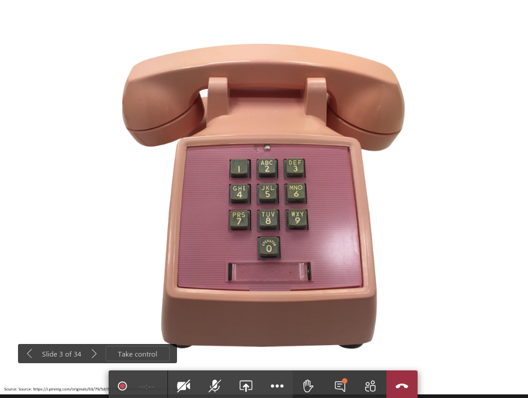
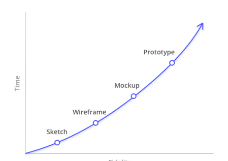

# 4HC3 | Human Computer Interactions

## Lecture 1 : Meta Lecture / Syllabus	2020-09-10

## Lecture 2: What is Usability	2020-09-10

Why do you think the design for this telephone performed better than a rotary phone?

Smaller learning curve, easier to use, don't need to use rotary dial

### UI Design Goals vs Requirements

- **Functional requirements** $:=$ the required behaviours of a system (i.e. what it can *do*)

- **Non-Functional requirements** $:=$ criteria by which to judge operation of a system

- UI design goals are closely related to the idea of **non-functional requirements** (aka **quality** **attributes**)
  - UI Design goals are a subset of non-functional requirements
  - Though functionality (range of operations)
- ==NOT-FINISHED==

### UI Design Goal Taxonomies

- Another common taxonomy comes from "*Ergonomics of human-system interaction*"(ISO 9241-11:2018)

- Usability is defined as "the extent to which a system, product or service can be used by specified users to achieve specified goals with **effectiveness, efficiency and satisfaction**"

### UI Design Goal

- We can specify other categories of goals, for example:
  - **Safety** : how safe is the system for users
  - **Understandability**: How easy is it to understand the system?
  - **Responsiveness**:  how long does it take to complete tasks?

### Trade-Offs

- **Trade-offs** occur when we sacrifice quality in one goal to improve quality for another goal
- For virtually all user interfaces of enough sophistication, trade-offs become necessary
  - The trade-offs may not be though about consciously, they may occur implicitly, but they exist
- Making the "right" trade-off decisions is critically important to the success of a system

ex. Wifi Hotspot menu in iOS or Android

- Less options; more decisions made for you

  | UI Design Goal | Android                                 | iOS                                     |
  | -------------- | --------------------------------------- | --------------------------------------- |
  | Functionality  | more options, more ability to customize | fewer options, decisions made for users |
  | Performance    | Need to                                 |                                         |
  | Error Rates    |                                         | won't allow you to mis-configure        |

  

### Measuring Goals

- Important for us to be able to measure goals
  - To know if we are improving an interface or not 
  - To compare interfaces with one another objectively 
  - To write requirements that can be verified 
- Not straight forward though...
  - What performance measures and error rates matter from one system to the next?
  - How do we measure subjective satisfaction, learnability, trustability, and less objective goals?

#### Performance 

- How **long** it takes a user to perform a task
- Number of clicks/taps required to perform a task
- How many tasks can a user accomplish in a time period?

#### Error Rates

- Errors per task, errors per time period
- ???

#### Subjective satisfaction, trustibility

- Surveys can help make it objective
  - "I liked using this interface" with Yes/ No responses
  - Likert scale questions
    Pick from different options (Strongly disagree, agree, etc. 1-N for N categories)

#### Learnibility & Retention

- Perform an experiment ??
- ???

Measuring goals is very related to testing user interfaces, a toopic we'll dive into more later

- A host of techniques exist to test interfaces, which ***themselves*** have trade-offs in terms of their performance, ease of use, etc.

- Suffice to say it is possible to measure goals, even realtively subjective ones

## Lecture 2 2020-09-11

#### Sketches 

- **==Sketches==** $=$ are hand-drawn representations of user interface designs
  - Sketches have ***virtually zero barrier to entry***
    - Even a non-technical customer/user can sketch
    - Anybody can sketch
  - Sketches are very **low fidelity** 
    - Prototyping methods often ranked from low fidelity to high fidelity
    - Lower fidelity means low lovel of detail 

#### Wireframes

- Wireframes accurately represent interface page layout and organization of content
  - But lack colour, typography, images and graphics
  - i.e. ***blueprints***
- Increased *precision* over sketeches and use of software makes wireframes less accessible than sketches
- More time consuming to create than sketches, but relatively ***higher fidelity***

**Wireframe** = structure + functions + content 

#### Mockup

Mockup = static but accurate representations of the application interface

- Colour, typography, and graphics *should* be included
- Mockups are not interactive, cannot click and perform actions
- Equivalent to screen captures

Much more time consuming than wireframes, but very high fidelity

#### Prototypes

- Prototypes are an accurate ***and*** iteractive representation of the application interface
  - We can perform actions in a prototype and the result should be the same in the full working application
- Difference between prototype and completed application?
  - Not connected to a back-end and the logic is hardcoded
- Highest fidelity, and most time intensive to create
- Created with the same tools as the completed application
  - HTML, CSS, JavaScript, etc.
- They may also be created with purpose built tools that allow for code-free experiences
- **Fully functional in terms of UI**

#### Tools

- Sketches:
  - Pen, paper, whiteboard
- Wireframes
  - wireframe.cc
  - draw.io
- Mockups
  - GIMP
  - HTML,CSS
- Prototypes
  - Sketch, Proto.io, Moqups
  - HTML,CSS,JavaScripts

