# 3Y03

$\text{let  } \mathbb{N^0} \equiv \{0\} \cup \mathbb{N}$

## Week 1 | Events and Manipulating Events

- Stats is the science of *collecting, analyzing, and inferring* from **data**
- **Probability** = mathematics of random events, intimately related to statistics
- **Experiment** = anything that produces **data**, while a ***random experiment*** is an experiement that can produce *different* outcomes from the same process
- **Sample Space** $:= S$ = the set of all outcomes of a **random experiment**

  - **Discrete** iff *finite* or *countably infinite*
  - **Continuous** iff *infinite*
- **Event** $:= E  \sube S$
- An *event* E, is a subset of the sample space *S* , where E is a set of outcomes
  - *E = {HHH, HHT, HTH, THH} ⊆⊆ {HHH, HHT, …} = S*
- Given some events, new events can be defined: 
- Given $E$, $E_1$, $E_2 \sube S$
  - **Union**: $E_1 \cup E_2 := \{ x \in S : x \in E_1 \lor x \in E_2\}$
- **Intersection**: $E_1 \cap E_2 := \{x \in S : x \in E_1 \land x \in E_2 \}$
  - **Complement:** $E' = \{x \in S : x \notin E\}$

If $E \sube S$ is any event, then $E \cup E' = S$ and $E \cap E'= \emptyset$

$S$ and $\empty$ are events, and $S' = \empty$ , given sample space $S$

- **Mutualy Exclusivity = ** Given $E_1, E_2, \sube S$ , two events are **mutually exclusive** if:
  - $E_1 \cap E_2 = \empty $
  - Inutition is that events cannot happen simultaneously, which using the coin exmaple with space $S = \{H, T\}$ would be the events $E_1 = \{H\}$ and $E_2 = \{T\}$
- Useful rules for **manipulating events** algebraically using events $A, B, C, \sube S$
- (A’)’ = A
- **Distributivity**:
  - (A ∪∪ B) ∩∩ C = (A ∩∩ C) ∪∪ (B ∩∩ C)
  - (A ∩∩ B) ∪∪ C = (A ∪∪ C) ∩∩ (B ∪∪ C)
- **DeMorgan’s Laws:**
  - (A ∪∪ B)’ = A’ ∩∩ B’
  - (A ∩∩ B)’ = A’ ∪∪ B’

### Counting Techniques

- **Basic Counting Principle**:

  - Suppose we have *r-many* experiments, and suppose the *ith* experiment has *n~i~* possible outcomes

  - The ***total number of outcomes*** from running all the experiments ***consecutively*** is

    $\displaystyle\prod_{i=1}^{r}{n_i =n_1*n_2 ... n_{r-1}n_r}$

  - **ex. coin flip:** if we toss a coin **3 times**, and each coin toss has **2 outcomes**, the the total number of outcomes if $\displaystyle\prod_{i=1}^{3}{2} = 2*2*2 = 2^3 = 8$

#### Permuatations

- ==**Permutations**: $n! = n ( n - 1 ) (n - 2) ... 3 * 2 * 1$==

  - Given *n* **distinct** objects, the number of ways to permute them is *n* **factorial**

  - In general,  the formula for a set of n distinct objects, the number of ways to permute $r \leq n$ of them is:

    $P^n_r = n Pr = n (n -1 ) .... ( n - r + 1) = \dfrac{n!}{(n-r)!}$

    - r = length of sequence, n = size of set to draw from. 

- Ex. number of 3 letter words with no repeats: $P_3^{26} = \frac{26!}{(26-3)!}$ = $26 * 25 *  24$

- Not all objects may be unique, ex. "**BANANA**"

- If all the letters were unique, there would be $6!$ perumtations, but since there are 3 As, and 2 Ns, some of the permutations leave the word unchanged

- There are 3! ways to permute the A's and 2! ways to permute the Ns. If we "cancel" the permuations that do nothing, we have $\frac{6!}{3!2!}$ = 60 many unique permutations

- Given $n = n_1 + n_2 + ... + n_r$ many objects with $n_i$ identical many objects of type i, there are

  $\dfrac{n!}{n_1!n_2!...n_r!}$

  ​    

#### Combinations

Given a group of n distinct objects, the number of ways to choose $r \leq n$ of them is

$C_r^n = n C r = (\dfrac{n}{r}) = \dfrac{n(n-1)..(n- r + 1)}{(n-r)!} = \dfrac{n!}{(n-r)! r!}$

n "choose" r

- **Binomial Coefficients** =  $(\dfrac{n}{r})$ 

  - Appear in many places, such as the binomial theorem

    $\forall x,y$ :  $(x + y)^n = \displaystyle\sum^{n}_{r=0}(\dfrac{n}{r})$

  - read as *n choose r*, or how many ways are there to choose r items from n elements

## Week 2 | Interpretations and Axioms of Probability

- Probabliity is used to quantify the likelihood, or chance that an outcome of a **random experiment** will occur
  - interpreted as the *limiting value* of the proportion of times the outcome occurs in *n* repetitions of the random experiment as n increases beyond all bounds

- **Equally Likely Outcomes** 
  - Whenever a **sample space** consists of $N$ possible outcomes that *are equally likely*, the probability of each outcome is $\dfrac{1}{N}$

- **Probability of an Event**
  - For a **discrete sample space**, the probability of an event **E**, denoted at P(E), equals the *sum* of the probabilities of the outcomes in **E**

### Axioms of Probability

Probability is a number that is assigned to each member of a collection of events from a random experiment, that satisfies the following:

- $P(S) = 1$, where $S$ is the **sample space**
- $0 \leq P(E) \leq 1$ *for any event*
- For two events, $E_1$ and $E_2$, with $E_1 \cap E_2 = \empty$ then $P(E_1 \cup E_2) = P(E_1) + P(E_2)$

The property that $0 \leq P(E) \leq 1$ is equivalent to the requirement that a relative frequency must be between 0 and 1

$P(\empty) = 0$

$P(E') = 1 - P(E)$

$P(E_1) \leq P(E_2) \iff E_1 \subseteq E_2$

#### Unions of Events and Addition Rules

Joint Events are generated by applying basic set operations at individual levels:

**Probability of a Union**

​	if A and B are **mutually exclusive**, then their intersection is ***zero***

- For 2 sets:

  $P(A \cup B ) = P(A) + P(B) - P(A \cap B)$

- For 3 or more sets:

#### Mutual Exclusion

- **Mutual Exclusive** - for all pairs $E_i \cap E_j = \empty$, for $E_i,E_j \subseteq S$
  - $P(E_i \cap E_j) = P(E_i) + P(E_j)$

#### Intersection of Events and Mulitplication Total Probability Rules

##### Total Probability Rule (2 Events)

*For any events, A and B*

$P(B) = P(B\cap A) + P(B \cap A' ) = P(B|A)P(A) + P(B|A')P(A')$

##### Total Probability Rule (Multiple Events)

*Assume $E_1, E_2, ... , E_k$* are *k* mutually exclusive 

$P(B) = P(B \cap E_1) + P(B \cap E_2) + ... + P(B \cap E_k)$

### Random Variables

-  **Random Variable  =** function that assigns a real number to each outcome in the sample space of a random experiement

  - denoted in capital, like $X$

  - After an experiment is conducted, the measured value of the random variable is denoted by a lowercase letter such as $x$

    **Discrete random variable** = random variable with finite (or countably infinite) range

    **Continuous Random Variable** = random variable with an interval (either finite or infinite) of real numbers for its range

### Probability Distributions and Probability Mass Functions

- **Probability Distribution** = description of the probabilities associated with the possible values of $X$.
  
  -  For a **discrete** random variable, the distribution is often specified by just a list of the possible values along with the probabilities of each
- **Probability Mass Function** = function that gives the probability that a discrete random variable is exactly equal to some value. Given:
  - $f(x_i) \geq 0$
  - $\displaystyle\sum^n_{i=1} f(x_i) = 1$
  - $f(x_i) = P(X = x_i)$
  
  

## Week 3

### Cumulative Distribution Functions

- **Cumulative Distribution Functions** = is the probability that $X$ will take a value less than or equal to $x$

  - $F:\mathbb{R} \rarr [0,1], \forall x \in \mathbb{R}$

  - $F(x) = P(X \leq x)$

  - Suppose that X is a DRV with range $\{x_1,x_2,...\}$. pmf $f(x)$ and cdf $F(x)$. Then $F(x)$ satisfies

    - $\forall x \in \mathbb{R}, F(x) = P(X \leq x) = \sum_{x_i \leq x} f(x_i)$
    - $\forall x \in \mathbb{R}, 0 \leq F(x) \leq 1$
    - $\forall x,y \in \mathbb{R}, \text{if } x \leq y, \text{then } F(x) \leq F(y)$

  - NOTE: if $f(x)$ and $F(X)$ are the ***pmf*** and ***cdf*** of $X$, they are "inter-defineable":

    ​	$F(x_n) = \displaystyle\sum^{n}_{i=0} f(x_i)$

    ​	$f(x_n) = F(x_n) - F(x_{n-1})$

### Mean and Variance of a Discrete Random Variable

- **Mean (Expected Value)** = is the average outcome. Weighted sum of all outcomes with their probabilities

  ​	$\mu = E[X] := \displaystyle\sum_{i=1}^n x_if(x_i)$

- **Variance** = Average distance from the mean 

  ​	$\sigma^2 = V[X] := E[(X - u)^2] = \displaystyle\sum_{i=1}^n(x_i -\mu)^2f(x_i)$

  - Other formula which may be useful:

    $V[X] = \displaystyle\sum_{i=1}^n x^2_i f(x_i) -\mu^2 $

    ​			$= E(X^2)-E(X)^2$

### Binomial Distribution

- **Bernouli Trial** = experiment with *two possible outcomes*; failure or success
  - $p$ - probability trial is successful
  - $(1 - p)$ - probability trial fails

- **Binomial Distribution** = written as $X \sim \text{Bin}(n,p)$, it is experiment where a **Bernouli Trial** is run ***n***-times with fixed probability $p$ of success

  - $n$ - number of trials run
  - $p$ - fixed probability of success
  - trials occur ***independently***
  - $X$ - the number of successful outcomes in the ***n***-many **independent** Bernouli trials

- **Probability Mass Function**:

  - When $X \sim \text{Bin}(n,p)$

    $f(x) = \displaystyle\binom{n}{x} p^x (1-p)^{n-x}$

    - $X$ - $x \in (1,n)$

- **Mean** = $E[X] = \mu= np$

- **Variance ** = $\text{Var}(X) = \sigma^2 = np(1-p)$

### Geometric Distribution

- **Geometric distribution** = The probability distribution of the number *X* of [Bernoulli trials](https://en.wikipedia.org/wiki/Bernoulli_trial) needed to get one success, supported on the set { 1, 2, 3, ... }
  - X $\sim \text{G}(p)$
  - X counts the number of succesful Bernoulli trials in a set of *n* independent trials 
  - $p$ - probability of Bernoulli trial success
  - ***memoryless property*** = $P\{ X > m + n | X \geq m \} = P\{X > n\}$
- **probability mass function:** $f(x) = (1 - p )^{(x-1)}p$
  - $f(n)$ is the *probability* that there are $n-1$ many failures(probability $(1-p)$) followed by a success (probability $p$)
- **Mean** $ = E[X] = \mu = \dfrac{1}{p}$
- **Variance ** $= \text{Var}(X) = \dfrac{1-p}{p^2}$
- The geometric distribution is an appropriate model if the following assumptions are true:
  - The phenomenon being modeled is a sequence of independent trials.
  - There are only two possible outcomes for each trial, often designated success or failure.
  - The probability of success, p, is the same for every trial.

### The Inverse (Negative) Binomial Distribution

- **Inverse Binomial Distribution** = Generalization of the geometric distribution
  - Suppose we have  bernoulli trial with probability $p$ of success, and let $r \geq 1$ be an integer
  - Let $X$ be the number of trails we need to run until we reach $r-\text{many}$ successful trials
  - $X \sim \text{Bin}^{-1}(p,r)$ 
    - Observe that a ***geometric random variable*** with parameter $p$ is precisely an inverse ***binomial random variable*** with parameters $p$ and $r=1$
    - In otherwords, $X \sim \text{Geo}(p) \equiv X \sim \text{Bin}^{-1}(p,1)$
    - If $X_i$ is the number of trials required to get the $i\text{th}$ success, then $X_i$ is **geometric** and $X = X_1 + X_2 + X_3 + ... + X_r$
- **Probability Mass Function(p.m.f)** $= f(x) = \displaystyle\binom{x-1}{r-1}(1-p)^{x-r}p^r$
- **Mean** $= E[X] = \mu = \dfrac{r}{p}$
- **Variance ** $= \text{Var}(X) = \sigma^2 = \dfrac{r(1-p)}{p^2}$

## Week 4

### Hypergeometric Distribution

- **Hypergeometric Distribution = ** the distribution of a random variable $X$ that represents the number of successes selecting a correct object from a sample of size $n$, given there are $K$ correct objects of the $N$ total objects.
  - $X \sim \text{Hypergeomeric}(N,K,n)$
  - $N$ - length of the set of objects 
  - $K$ - number of objects classified as success, conversely there are $(N-K)$ classified as failures
  - $n$ - size of sample drawn from the set of $N$ objects
  - $p $ $=\dfrac{K}{N}$ 
  - $K\leq N$ and $n \leq N$
- **Probability Mass Function (p.m.f)** $= f(x) = \dfrac{\displaystyle\binom{K} {x} \displaystyle\binom{N-K}{n-x}}{\displaystyle\binom{N}{n}}$
  - $x = \max\{0, n+ K-N\} \text{ to } \min\{K,n\}$
- **Mean** $= E[X] = \mu = np$
- **Variance** $= \text{Var}(X) = \sigma^2 = np (1-p)(\dfrac{N-n}{N-1})$

### Poisson Distribution

- **Poisson Distribution** = describes the probability of a given number of events occurring in a fixed interval of time or space if these events occur with a known ***constant mean rate*** ($\lambda$) and ***independently*** of the time since the last event.
  - $X \sim \text{Pois}(\lambda)$
  - $X $ - random variable that equals the number of events in a Poisson process 
  - $\lambda$ - average rate by which the independent events of the Poisson process occur 
    - $0 < \lambda$
  - $T$ - length of the interval $X$ spans
  - 
- **Probability Mass Function ( p.m.f )** = $f(x) = \dfrac{e^{-\lambda T}(\lambda T)^x}{x!}, x \in \mathbb{N^{0}}$ 
- **Mean** = $E[X] = \mu = \lambda T$
- **Variance = ** $= \text{Var}(X) = \sigma^2 = \lambda T \equiv E[X]$

## Continuous Random Variables

- **Continuous Random Variable** = a random variable with an interval (either *finite* or *infinite*) of real numbers for its range

### Probability Density Functions

- For a *continuous random variable* $X$, a ***probability density function* (p.m.f)** is a function such that:
  - $f(x) \geq 0 \text{ } \forall \text{ } x \in X$ - a continuous random variable has a probability at every step, there are no holes in the graph
  - $\displaystyle\int_{-\infin}^{\infin} f(x) dx = 1$  -  The sum of all the values of the probability density function is one. All the probabilities sum to unity
  - $P\{a \leq X \leq b\} = \displaystyle\int_a^b f(x) dx =$ area under $f(x)$ from $a$ to $b$ $\forall$ $a,b$
- Property of *continuous random variable*: boundary edges are all equivalent. 
  - $P\{a \leq X \leq b\} = P\{a < X \leq b\} = P\{a \leq X  < b\} = P\{a < X < b\} , \text{ } \forall \text{ } a,b \in X$
- **Histogram** = an *approximation* of a **probability density function**

### Cumulative Distribution Function

- **Cumulative Distribution Function** = function of a continuous random variable $X$, when evaluated at $x$, is the *probability* that $X$ will take a value ***less than or equal*** to $x$. 

  ​	$F(x) = P\{X \leq x\} = \displaystyle\int_{-\infin}^x f(u) \text{d}u \text{  ,  } \forall \text{ } x \in \mathbb{R}$

  - Sums the probability of $X$ taking each infinitesmal value $f(x) \text{ } \forall \text{ } x \in (-\infin,x)$, i.e. the probability $X$ takes a value less than or equal to $x$, or the sum of the area under $F(x)$ up until $x$
  - $f(x) = \dfrac{dF(x)}{dx}$ - consequently, the **p.d.f** can be determined from the **c.d.f** by differentiating it, so long as the derivative exists

### Mean and Variance 

- **Mean** = $E[X] = \mu = \displaystyle\int_{-\infin}^{\infin} x f(x) dx $ - the probability of an event occuring, times its value summed over the interval of the variable yeilds its average. Weighted sum of events
- **Variance** = $\text{Var}(X) = \sigma^2 = \displaystyle\int_{-\infin}^\infin (x - \mu)^2f(x) dx = \displaystyle\int_{-\infin}^\infin x^2 f(x) dx - \mu^2$

### Expected Value of  *Function* of  a Continuous Variable

- If $X$ is a continuous random variable with p.d.f $f(x)$:

  let $g(X)$ be a function of a continuouse random variable X

  $E[g(X)] = \displaystyle\int_{-\infin}^\infin g(x)f(x)dx $

  - Recall: the expected value or *mean* is the weighted sum of the value of $x \in X$,  times the probability of $X$ taking the value $x$ $f(x)$. Therefore, if $g(X)$ is a function of $X$, then its mean can be expressed as the weighted sum of the functions value for every value $x$ in $X$, $g(x)$, times the probability of $X$ taking that value $x$, which is $f(x)$. As its continuous, this sum is taken as the integral over the range of $X$ 

## Distributions of Continous Random Variables

### Continuous Uniform Distribution

- **Continuous Uniform Distribution** = distribution of a *continuous random variable $X$* with *p.m.f*

  $f(x) = \dfrac{1}{b-a}, \text{ } a \leq x \leq b  \text{, 0 otherwise} $

  - i.e. every value in $X$ has equal probability of occuring
  - $b - a$ = range of the interval of $X$
    - in essence, $f(x) = |X|^{-1}$

- **Mean** = $E[X]  = \mu = \displaystyle\int_a^b \dfrac{x}{b-a} dx = \dfrac{a+b}{2}$

  - in otherwords, $E[X] = \dfrac{\max(X)+\min(X)}{2}$

- **Variance** = $\text{Var}(X) = \sigma^2 = \displaystyle\int_{-\infin}^\infin \dfrac{(x - \dfrac{a+b}{2})^2}{b-a}dx = \dfrac{(b-a)^2}{12}$

- **Cumulative Distribution Function** = $F(x) = \begin{cases} 0 && x < 0 \\ \dfrac{x-a}{b-a} && a \leq x < b \\ 1 && x \geq b   \end{cases}$
  
  - Outside of the interval $(a,b)$ the **p.d.f** is 0, therefore 0 until $a$, and is 1 only once $b$ is reached, and remains 1 thereafter

### Normal Distribution

- **Normal (Gaussian) Distribution = ** a distribution that represents the distribution of many random variables as symmetric about its mean, with the distribution more frequent around the mean 
  - $X \sim \mathcal{N}(\mu, \sigma^2)$
  - Normal distribution is a function of ***variance*** and ***mean***
- **Probability density function (p.d.f) ** = $f(x) = \dfrac{1}{\sqrt{2\pi\sigma}}e^{\displaystyle{\dfrac{-(x-\mu)^2}{2\sigma^2}}}, \text{ } x \in (-\infin,\infin)$ , $\sigma > 0 $
- **Mean** $= E[X] = \mu $
- **Variance ** $ = \sigma^2$

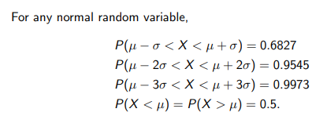

#### Standard Normal Distribution

- **Standard normal variable** = a *normal random variable* with $\mu = 0$, $\sigma^2 = 1$, and is denoted $Z$
  - **Cumulative Distribution Function (c.d.f)** = $\phi(z) = P(Z \leq z)$

#### Standardizing a Normal Random Variable

- If $X \sim \mathcal{N}(\mu,\sigma^2)$ , then $Z = \dfrac{X - \mu }{\sigma}$ is a ***normal random variable*** with $E[Z] = 0 $ and $\text{Var}(Z) = 1$
  - **Mean:** 0
  - **Variance:** 1
  - Subtracts mean from every possible value of X, then divides by the standard deviation. Centres the mean around 0, and normalizes by the standard deviation to set variance to 1.

#### Standardizing to Calculate Probability

- If $X \sim \mathcal{N}(\mu,\sigma^2)$, then the probability of an event in X can be expressed in terms of Z by:

  $P\{X \leq x\} = P\{\dfrac{X - \mu}{\sigma} \leq \dfrac{x - \mu}{\sigma} \} = P(Z \leq z)$

  - $Z $ - standard normal random variable
  - $z$ - $z =\dfrac{x - \mu}{\sigma}$ is the value obtained by standardizing X

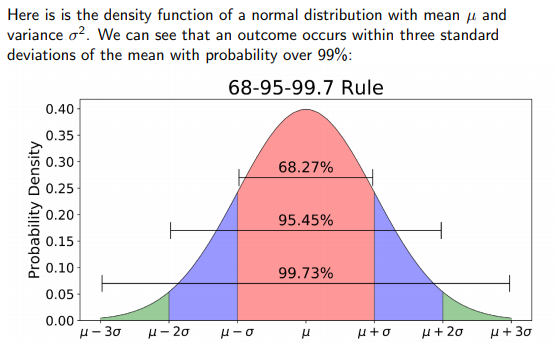

## Week 5

#### Normal Approximation to the Binomial Distribution

- Binomial distribution is roughly *bell-shaped*, and can be approximated with the normal distribution

  - binomial random variables are ***discrete***, and normal random variables are ***continuous*** but special circumstances allow for approximation
  - Binomial distribution can have expensive computations and modelling as a normal distribution can reduce this

- Suppose $X \sim \text{Bin}(n,p)$ is the binomial random

  - $\sigma^2 = np(1-p)$
  - $\mu= np$
  - if $n$ is "*large enough*", then $x \approx \mathcal{N}(\mu,\sigma^2) \approx\mathcal{N}(np, np(1-p))$
  - Approximation usually good when $np > 5$ ***and*** $n(1-p) > 5$
    - *this is what we mean by "n sufficiently large"*

- From above, if $n$ *sufficiently large* :

  $\dfrac{X - np}{\sqrt{np(1-p)}}\approx Z = \mathcal(0,1)$

##### Continuity Correction

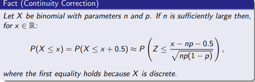

### Exponential Distribution

- **Exponential Distribution** = continuous probability distribution of the time between events in a Poission point process

  - ***memory-less*** = $P\{ X > t +s  | X > t \} = P\{X > s\}$
    - If $t$ time has elapsed, you can just examine $s$ 
    - Continuous analogue of ***geometric distribution***
    -  Rather than counting trials until the first "success", for example, we may be marking time until the arrival of the first job to a queue.
  - Events occur *continuously* and *independently* at a constant average rate $\lambda$ 

- Consider an interval $[0,x], x \in \mathbb{R}$

  - Suppose that on $[0,x]$ there is some event that occurs according to $\text{Pois}(\lambda)$  

  - $X$ is then defined to be the distance in $[0,x]$ from zero to the first event

    - $X$ is an ***exponential random variable***

  - Consider $P\{ X > x \}$, the probability that *no events* occur in interval $[0,x]$

    - Since we assumed the events are $\sim \text{Pois}(\lambda)$

      $P\{X > x\} = \dfrac{e^{- \lambda x}(\lambda x)^0}{0!} = e^{-\lambda x}$

      $P\{X \leq x \} = 1 - P\{X > x\} = 1 - e^{- \lambda x}$

      $\therefore X \sim \text{exp}(\lambda) \implies F(x) = 1 - e^{- \lambda x} $

        $f(x) = F'(x) \implies f(x) = \lambda e^{-\lambda x}$

- **Cumulative Distribution Function (c.d.f)** =  $F(x) = 1 - e^{- \lambda x} $

- **Probability Density Function (p.m.f)** = $f(x) = \lambda e^{-\lambda x}$

- **Mean** = $\mu = E[X] = \lambda^{-1} = \dfrac{1}{\lambda}$

- **Variance** = $\sigma^2 = \lambda^{-2} = \dfrac{1}{\lambda} = \mu^2$

- **Standard Deviation** = $\sigma = \dfrac{1}{\lambda} = \mu$

  - It is interesting to note that the standard deviation is equal to the mean

### Joint Probability Distributions

Let $X$ and $Y$ be ***continuous random variables***

- **Joint Probability Distribution** = is a probability distribution, that gives the probability of each $X,Y...$,  falls in any particular range specified for that variable

  - ***bi-variate or multi-variate distributions***

  - **(Bi-variate) Joint Probability Density function**: $f_{X,Y}(x,y)$ satisfies:

    * $f_{X,Y}(x,y) \geq 0 \text{ } \forall \text{ } x,y \in \mathbb{R}$

    * $\displaystyle{\int\int_\mathbb{R^2}} f_{X,Y} dxdy = 1$

    * Any region $A$ is a subset of $\mathbb{R^2}$, $A \sube \mathbb{R}^2$

      $P\{(X,Y) \in A\} = \displaystyle{\int\int_A}f_{X,Y}(x,y)dxdy$

### Marginal Probability Density Functions

Let $X$ and $Y$ be *continuous random variables* defined in a region $R \sube \mathbb{R^2}$

Assumed $f_{X,Y}(x,y)$ is 0 outside of $R$

- Suppose that we are given a ***joint pdf*** $f_{x,y}(x,y)$ such that 

  - $\displaystyle{\int\int_\mathbb{R^2}} f_{X,Y} dxdy = 1$

- **Marginal Probability Density Function** = seperation of a ***joint pdf*** to describe the distributions of its component random variables

  $\text{for } a,b \in \mathbb{R} $

  ​		$R_X(a) := \{y \in \mathbb{R} : (a,y) \in R\}$

  ​		$R_Y(b) := {x \in \mathbb{R}: (x,b) \in R}$

  then the ***marginal probability densities are***:

  ​	$f_X(x) = \displaystyle\int_{R_X(x)} f_{X,Y}(x,y)dy$

  ​	$f_Y(y) = \displaystyle\int_{R_Y(y)} f_{X,Y}(x,y)dy$

- **Mean** = 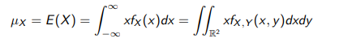

- **Variance** = 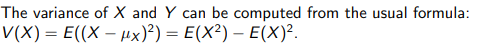

## Week 7

### Independent Random Variables

- **Independence:** $A$ and $B$ are independent events if $P(A \cap B) = P(A)P(B)$

- **Independence for Continuos Random Variables**: For CRVs $X$ and $Y$ with ***joint pdf*** $f_{X,Y}(x,y)$

  $X \perp \!\!\! \perp  Y \iff f_{X,Y}(x,y) = f_X(x)f_Y(y)$

  *where* $f_X(x)$ and $f_Y(y)$ are the ***marginal density functions*** of $X$ and $Y$ respectively

  - If $X$ and $Y$ are *independent* and *jointly distributed* on a region $R \sube \mathbb{R^2}$ *then $R$ must be **rectangular***
    - i.e. $R = l_1 * l_2$ for intervals $l_1$ and $l_2$ ( the converse is false!)
    - $1 = \displaystyle{\int\int_\mathbb{l_1 * l_2}}f_{X,Y}(x,y)dxdy = (\displaystyle\int_{l_1} f_X(x)dx)(\displaystyle\int_{l2}f_Y(y)dy)$
      - Since the sum of each respective marginal density function over its over interval should be 1 if they're independent, $1*1=1$

### Covariance

- **Covariance** = a measure of the joint variability of two random variables

  - Suppose $X$ and $Y$ are jointly distributed with joint pdf $f_{X,Y}(x,y)$

    for any *nice* function $h(x,y)$, $h(X,Y)$ is a random variable, and we have the expected value of $h(X,Y)$:

    ​	$E[ h(X,Y) ] = \displaystyle{\int\int_\mathbb{R^2}} h(x,y)f_{X,Y}(x,y)dxdy$

  - Measure of the ***linear relationship*** between $X$ and $Y

- **Covariance = **$\sigma_{XY} := E[XY] - E[X]E[Y] $

  - When $X \perp \! \! \! \perp Y$ :

    $E[XY] =\displaystyle{\int\int_\mathbb{R^2}} xyf_{X,Y}(x,y)dxdy \\ \hspace{55px} = (\displaystyle{\int_\mathbb{R}} xf_X(x)dx)(\displaystyle{\int_\mathbb{R}} yf_Y(y)dy) \\ \hspace{55px} = E[X]E[Y]$ 

    $X \perp \! \! \! \perp Y \implies \sigma_{XY} = 0$

- Note: $\sigma_{XY} = 0  \not \! \! \! \implies X \perp \! \! \! \perp Y$

### Correlation

- **Correlation = ** degree to which a pair of variables are linearly related
  - $\rho_{XY}=\dfrac{\text{cov(C,Y)}}{\sqrt{V(X)V(Y)}} = \dfrac{\sigma_{XY}}{\sigma_X\sigma_Y}$
  - $-1 \leq \rho_{XY} \leq 1$
    - If the points in the joint probability distribution of X and Y that recieve positive probability tend to fall along a line of positive (or negative) slope, $\rho_{XY}$ is near $+1$ or (1)
  - $\rho_{XY} \geq 0 \implies X$ and $Y$ are ***correlated***
  - $X \perp \! \! \! \perp  Y \implies \rho_{XY} = \sigma_{XY} = 0$ 

### Linear Functions of Random Variables

- **Linear Function**: given random Variables ${X_1, .. X_p}$ and constants $c_0, c_1, ..c_p$, a **linear function** of $X_1 ... X_p$ is defined:

  ​	$Y = c + 0 + c_1X_1 + ... + c_pX_p$

  - **Mean:** $E[Y] = c_0 + c_1 E[X_1] + ... + c_pE[X_p]$
  - **Variance:** $\text{Var[Y]} = c_1^2\text{Var}[X_1] + ... +  c_p^2\text{Var}(X_p) + 2 \sum\sum_{i<j}c_ic_j\text{cov}(X_i,X_j) $

#### Mean and Variance of an Average

- If $\bar{X} = \dfrac{(X_1 + ... + X_p)}{p}$ with $E[X_i] = \mu$ 
  - **Mean:** $E[\bar{X}] = \mu$
  - **Variance:** $V[\bar{X}] = \dfrac{\sigma^2}{p}$ 
    - if all $X \in \bar{X} $ are independent

#### Reproductive Property of the Normal Distribution

- If $X_1, X_2, ... X_p$ are independent, normal random variables with $E(X_i) = \mu_i$ and $V(X_i) = \sigma^2_i$ for $i = 1,2, .. , p$ then:

  ​	$Y = c + 0 + c_1X_1 + c_2X_2 + ... + c_pX_p$

  is a *normal random variable* with

  ​	$E(Y) = c_0 + c_1\mu_1 + c_2\mu_2 + ... + c_p\mu_p$

  and

  ​	$V(Y) = c_1^2\sigma^2_1 + ... + c_1^2\sigma_1^2$

- This is to say, if Y is a ***linear combination*** of other random variables, its **mean** and **variance** are related in the same way

### Numerical Summaries of Data

#### Sample Statistics

-  **Sample Mean** = $\bar{X} = \dfrac{\displaystyle\sum_{i=1}^n x_i}{n}$
  - The average of all the values in a sample of a random variable
  - ***average value of all oversations***
- **Sample Variances** = $s^2 = \dfrac{\displaystyle\sum_{i=1}^n (x_i - \bar{X})^2}{n}$
  - **Sample Standard Deviations** = $s$ , the positive square root of sample vairance
- **Sample Range** = $r = \max(\textbf{X}) - \min(\textbf{X}) $

### Stem and Leaf Diagrams

- **Steam and Leaf Diagram** = visual display of a data set where each $x_i$ consists of at least 2 digits
  - Steps:
    1.  Divide each number $x_i$ into two parts: a **stem** consisting of one or more leading digits, and a **leaf** consisting of the remaining digit
    2. List the **stem values** in a vertical column
    3. Record the **leaf** for each observation beside its stem
    4. Write the units for stems and leaves on the display

### Frequency Distributions and Histograms

- **Frequency Distribution** = compact summary of data , with the range divided into intervals called class intervals, cells, or bins

  - Choose the number of bins approximately equal to the square root of the number of observations 
  - \# bins = $\sqrt(N)$
  - Relative frequencies are found by dividing the observed frequency in each bin by the total number of observation
    - Provides the % of the population the class represents

- **Histogram** = visual display of the frequency distribution

  - Steps

    1. Label the bin boundaries on a horizontal scale
    2. Mark and label the vertical scale with the frequencies or the relative frequencies
    3. Above each bin, draw a rectangle where height is equal to the frequency corresponding to that bin

    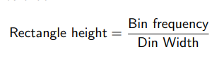

### Box Plots

- **Box Plot** = Graphical display that simultaneously describes several important features of a data set, such as **centre, spread, departure from symmetry, ** and **outliers**

  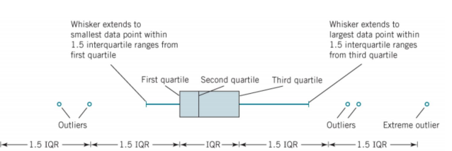

## Week 8

### Probability Plots

- **Probability Plots** = empirical way to determine if data fits a particular distribution

  - Suppose $S = \{x_1, ..., x_n\} \subset \mathbb{R}$ is some sample data
  - Imagine we have a random variable X, and we want to know if the distribution of X fits the observed data
  - Let $F(X)$ be the **cdf** of the function

  1. Arrange the data points in increasing order and rename them if necessary
  2. For each $1 \leq i \leq n$, choose a value $y_i \in \mathbb{R}$ such that 
     1. $F(y_i) = P(X \leq y_i) = \dfrac{i-0.5}{n}$
  3. Plot the pairs $(x_i,y_i)$
  4. Draw a line of best fit

  **Conclusion**: If all the points lay on or near the line, we can conclude that the distribution of X fits the data well, otherwise the fit is not so good

  ​	Most of the time we will be concerned of discovering if our data fits the **standard normal distribution** $F(z) = \phi(z)$

### Point Estimation of Parameters

- Make prediction based on limited data
- **Parameter Estimation** = a parameter, $\theta$ is any **numerical feature** of a **population**
  - ex. we may want to estimate the **mean** or the **variance**
  - Given a particular paramter, an estimator for $\theta$ is a **sample statistic** $\hat{\Theta} = h(X_1, ..., X_n)$ which we want to use to estimate $\theta$
  - If $\hat{\Theta} = h(X_1, ..., X_n)$ is an estimator for $\theta$ and $(x_1,x_2,..., x_n)$ is some data, then the number $\hat{\theta} = h(x_1,...,x_n)$ is called a **point estimate for $\theta$**

### Sample Distributions & the Central Limit Theorem

- If $Y = h(X_1, ..., X_n)$ is a ***statistic*** then $Y$ is also a random variable
- If the distribution associated to such a statistic is called a ***sampling distribution***:
  - ex. if X is a random variable and $X_1, ..., X_n$ are all independent, with the same distribution as $X$, then the distribution of $\bar{X} = \dfrac{X_1 + ... + X_n}{n} $
  - A **sampling distribution** depends on many factors, including the **sample size**, the **sample method**, the distribution of X, etc.

#### Central Limit Theorem

Suppose $X_1, ... X_{n+1}$ is a random sample (so *i.i.d*) taken from a distribtuion with **mean** $\mu$ and **variance** $\sigma^2$. IF:

​	$\bar{X_n} = \dfrac{X_1+...+X_n}{n}$

then

​	$\dfrac{\bar{X_n} - \mu}{\dfrac{\sigma}{\sqrt{n}}}$

converges in probability to $N(0,1)$, meaning

​	$\displaystyle\lim_{n \rarr \infin} P(\dfrac{\bar{X_n} - \mu}{\dfrac{\sigma}{\sqrt{n}}} \leq z ) = \phi(z) $

- For any sequence of *i.i.d* random variables $X_1, ... X_n$ (*discrete* or *continuous* ) if *n* is large enough we have 

  $\bar{X_n} = \dfrac{X_1 + ... + X_n }{n} $ ~= $N(\mu, \frac{\sigma^2}{n})$

  and so we may use the normal distributions in our calculations 

- In practice, taking $n \geq 30$ is often large enough to get a good approximation

- If the distribution of $X_i$ is nice enough (eg. symmetric, unimodal) then $\bar{X_n}$ is often approximately normal for $n \geq 5$

### Unbiased Estimators

- Let $\theta$ be a parameter for some population

- Let $\hat{\Theta}$ be an estimator for $\theta$ 

  -  ***bias of $\hat\Theta$*** = $E(\hat{\Theta}) - \theta $

  -  ***bias***  = measure of how far away an estimator is from being correct ***on average***
  - For any random sample, the average $\bar X$ is an ***unbiased estimator*** of the mean $\mu$ of $X = X_i$
    - sample viaraince is also an ***unbiased estimator*** of variance
  - However, sample standard deviation *is not* ***unbiased***\
    - $E(S) - \sigma$ gets small as the sample gets large, and so S is still a pretty good estimator

### Variance of Estimators

- For a given parameter, $\theta$ , there is not *necessarily* a unique unbiased estimator of $\theta$
  - ex. both **sample mean** and the **median** are unbiased estimators of the **mean**
  - How should we pick the "best" estimator of a given parameter?
- Given $\hat \Theta$ is *itself* a **random variable**, we can take the ***variance*** as a measure of the probability *mass* of the estimator away from $E(\hat \Theta) = \theta$
  - if $\hat \Theta_1$ and $\hat \Theta_2$ are two unbiased estimators of $\theta$, and $V(\hat\Theta_1) < V(\hat\Theta_2)$ then (*on average*) a **point estimate** for $\theta$ via $\hat \Theta_1$ *will be closer* to $\theta$ than from $\hat \Theta_2$
  - **to choose estimator: *minimize the variance***

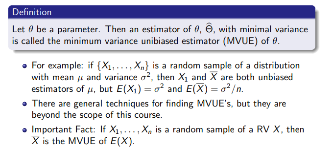

### Estimate Error

- Another way to choose a good estimator is to minimize the **error**

- Given $\hat \Theta$ , the ***standard error*** is:

  $\sigma_{\hat \Theta} = \sqrt{V(\hat\Theta)}$

  - If the **standard error** contains unknown parameters, they may be estimated and substituted into the standard error to obtain the ***estimated standard error***, denoted $S_{\hat\Theta}$

### Biased Estimators

- Sometimes, we have no choice but to use a **biased estimator**
  - S is often used for $\sigma$
- When using a **biased estimator**, it is often useful to measure error

- **Mean Square Error** = $\text{MSE}(\hat\Theta) = E[(\hat\Theta - \theta)^2]$
  - $\text{MSE}(\hat\Theta) = V(\hat\Theta) + (E(\hat\Theta) - \theta)^2$

## Week 9 

### Confidence Interval on the Mean of a Normal Distribution

- An **interval estimate** for a **population parameter** is called a ***confidence interval***
  - Suppose that $X_1,X_2, ... , X_n$ is a **random sample** from a **normal distribution** with unknown mean, $\mu$ and known variance $\sigma^2$, then the sample mean $\bar{X}$ is **normally distributed** with $\mu, \sigma^2$ , 
    - We may **standardize** $\bar X$ by $Z = \dfrac{\bar X - \mu}{\sigma / \sqrt(n)}$
  - **confidence interval estimate for $\mu$** = interval of the form $l \leq \mu \leq u$
    - endpoints $l, u$ are computed from the sample data
    - Because different samples will produce different values, these are random variables $L$ and $U$
      - $P\{L \leq \mu \leq U\} = 1 - \alpha$ 
      - **Confidence Coefficient**

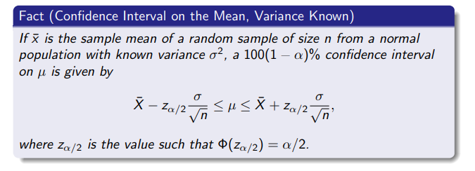

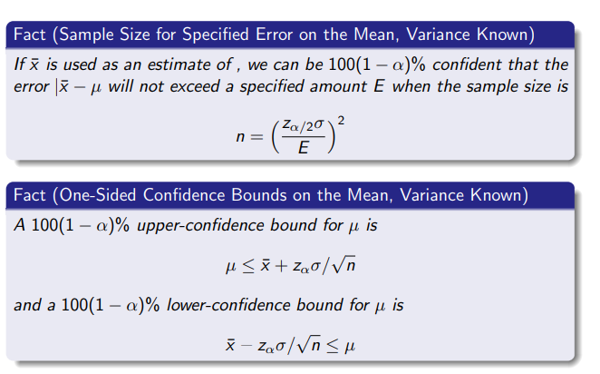

#### Confidence Interval: Mean & Variance Unknown

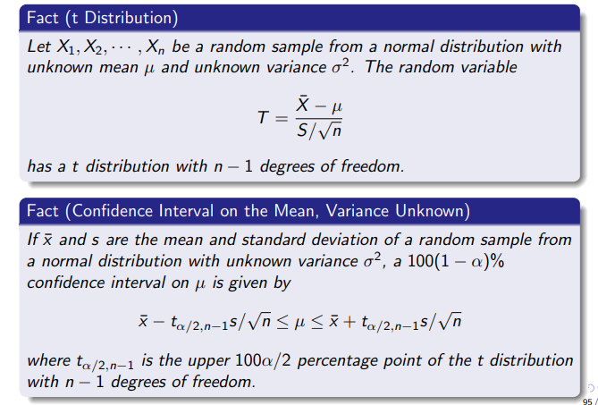

#### Normal Approximation for Binomial Proportion

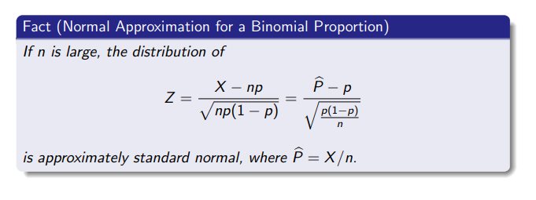

## Week 10

### Hypothesis Testing for a Single Variable

- **Statistical Hypothesis** = a statement about parameters of one or more populations
  - general structure consists of a ***guess*** and an ***alternate guess***

#### Structure of a Hypothesis Test

- **$H_0$** = ***Null Hypothesis*** (statement initially assumed true)
  - Usually of the form $\theta = r$, for some r
  - We may guess $\mu = 50$
- $H_1$ = ***Alternate Hypothesis*** ( statement that contradicts the *null hypothesis*)
  - If $H_0=\theta = r$, $H_1$ may be
    - $\theta \ne r$ (two sided alternate hypothesis)
    - $\theta \geq r$ (upper one-sided alternate hypothesis )
    - $\theta \leq r$ (lower one-sided alternate hypothesis)

#### Procedure

1. Assume $H_0$
2. Consider the data: is there something that is very unlikely, implausible given $H_0$
3. If YES: reject *null hypothesis* in favour of $H_1$
4. If NO, accept $H_0$

#### Objectives

- Testing if a parameter has changed
- Testing a theory
- Conformance testing

#### Method

1. Assume $H_0$
2. Pick an estimator for your parameter $\hat \Theta(X_1,..., X_n)$
   1. For example, if the paramater of interest is $\mu$, we could choose the sample mean $\bar X$
3. Choose a ***critical region***, determined by some critical values
   1. For example, for $\theta \ne r$, choose critical region to be the complement
      1. $C = \mathbb{R}/(r-l, r+u)$ for critical values $r-l$ and $r+u$
4. Take a sample $x_1, ..., x_n$ and compute a point estimate $\hat \theta = \hat \Theta(x_1, ..., x_n)$
5. Is the point estimate in the critical region? In other words, $\hat \theta \in C$

#### Outcomes 

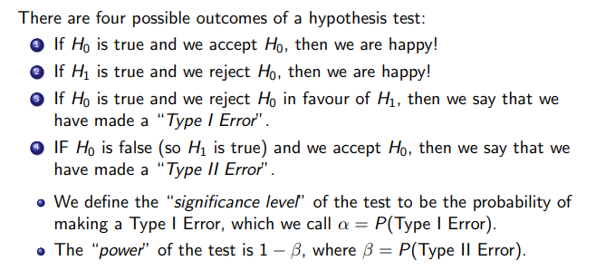

#### Fixed Significance Level Testing

- One way to determine a **critical region** is to require that our test has a ***fixed significance level*** $\alpha$ 
  - Recall: $\alpha$ is the probability that we incorrectly reject $H_0$, given that $H_0$ is true
- Suppose that $\hat\Theta$ is an estimator for a parameter $\theta$ and that we have a null hypothesis $H_0$ : $\theta = r$ and a $H_1:$ $\theta \ne r$ 
  - We fix a ***significance level*** $\alpha$ 
  - Choose critical values based on this value
  - We choose aim to find a symmetric region defined by critical values $r - a$ and $r + a$
    - 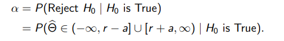

### P- Values

- **P-Values** give a more dynamic approach to hypothesis testing 

  - Suppose we have a test with null hypothesis $H_0$ 

  - **P-Value of the test** = smallest *significance level* that would lead to a rejection of $H_0$ with the sample 

    - P-value as the probability of being in a sort of variable critical region
    - Sometimes called **observed significance**

  - Consider $H_0: \theta = r$ and $H_1: \theta \ne r$ , and $\hat\Theta(X_1, ... , X_n)$

    - suppose $\hat\theta = \hat\Theta(x_1, ... , x_n)$

    - assuming $H_0$, our "observed" critical values are $r \pm | r- \hat\theta | $

    - Then the **P-Value Test** is:

      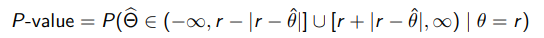

  - P-value of the observation is the probability of making an observation ***at least as far from $\theta = r$ as $\hat\Theta$***

    - Measure of the *risk* that we make an incorrect decision if we reject $H_0$ based on sample data
    - If we make an observation / point estimate that has a very high P-value, then we are at ***high risk*** of making a Type 1 error if we reject $H_0$

- We can use P-values to refine the *fixed significance level testing procedure*

  - Fix a significance level $\alpha$ and construct a **critical region** based on $\alpha$
  - The observed value $\hat\theta$ in the **critical region** iff ($\iff$ )the P-value is ***at most*** $\alpha $, and so we reject $H_0$ iff $P-value \leq \alpha$
  - Accept  $H_0  \iff P-value > \alpha$ 

### Relationship between Hypothesis Testing and Confidence Intervals

- Let $\theta$ be an unknown paramter
  - There is a close relationship between **hypothesis test ** and **confidence intervals ** for $\theta$
  - suppose (L, U) is a $100(1 - \alpha)$ confidence interval for $\theta$ constructed around a point estimate $\bar\theta$
    - Consider a $H_0 : \theta = r, H_1: \theta \ne r$ 
    - Then the observation $\hat\theta$ leads to a rejection of $H_0$ , iff ($\iff$)$r \notin (L,U)$
    - This gives us an equivalent way of performing **fixed significance testing**
      1. Given a test $H_0: \theta = r, H_1: \theta \neq r$
         1. Choose a test statistic $\hat\Theta$ and a **significance level** $\alpha$
         2. For a point estimate, $\hat\theta = \hat\Theta(x_1,...,x_n)$ construct the $100(1-\alpha)\%$ **confidence interval** around $\hat\theta$
         3. If $r \in (L,U)$, accept $H_0$
         4. If $r \notin (L,U)$, reject $H_0$ in favour of $H_1$

## Week 11

### Tests on the Mean of a Normal Distribution Variance Known

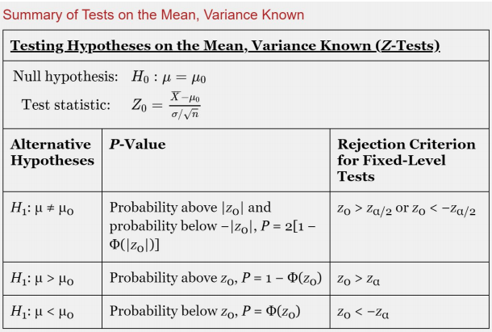

### Type II Error and Choice of Sample Size

$ H_0 = \mu = \mu_0$, $H_1: \mu \neq \mu_0$

- Suppose that the *null hypothesis* is **false** 
- Assume true value of the mean is $\mu = \mu_0 + \delta$
  - Therefore, $\delta$ = $\mu - \mu_0$ , or **predicted mean** minus **sample mean**
- Then, when $H_1$ is true, the **distribution of the test statistic $Z_0$** is
  - $Z_0 \sim N(\dfrac{\delta * \sqrt n}{\sigma},1)$

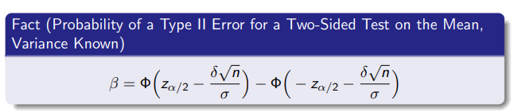

One may easily obtain formulas that determine the appropriate sample size to obtain a particular value of $\beta$ for a given $\alpha$ and $\delta$

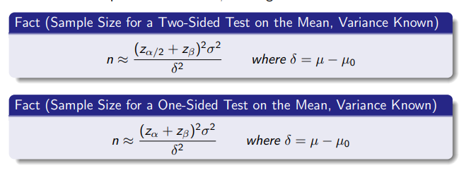 

### Tests on the Mean of  a Normal Distribution, Variance Unknown

- We $n$ is *large enough*, the **sample standard deviation**, $S$, can be substituted for $\sigma$ in the test procedures *with little effect*
  - Although we have given a test for the **mean** of a normal distribution with known $\sigma^2$, it can be easily converted into a ***large-sample test procedure*** for unknown $\sigma^2$
    - Valid regardless of the form of the distribution of the population
    - Relies on the **Central Limit Theorem**, just as the ***large-sample confidence interval on $\mu$*** did
- **Test Statistic** = $T_0 = \dfrac{\bar X - \mu_0}{\dfrac{S}{\sqrt n}}$

#### Summary

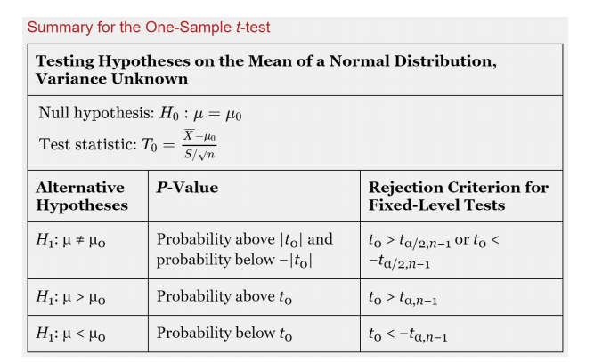

## Week 12

### Tests on a Population Proportion

- Modelling the occurrence of defectives with the **binomial distribution** is usually reasonable when the **binomial parameter *p* represents the proportion of defective items produces**
  - Consequently, many engineering decision problems involve **hypothesis testing** about *p*
  - An approximate test based on the **normal approximation** to the **binomial** is given
    - Procedure will be valid as long as **$p$ is not extremely close to 0 or 1**
    - **sample size** is relatively large
  - Let X be the *number of observations in a random sample of size $n$*  that belongs to the **class** associated with $p$
    - If $H_0: p = p_0$ is true:
      - $X \sim N[np_0, np_0(1p_0)]$
      - $Z_0 = \dfrac{X - np_0}{\sqrt{np_0(1-p_0)}}$

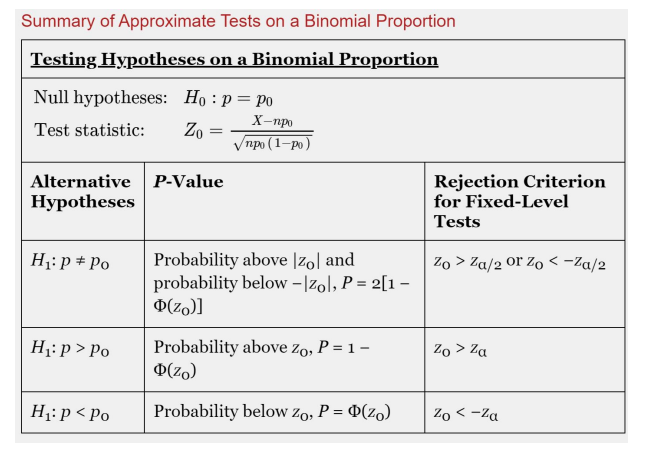

### Type II Error and Choice of Sample Size

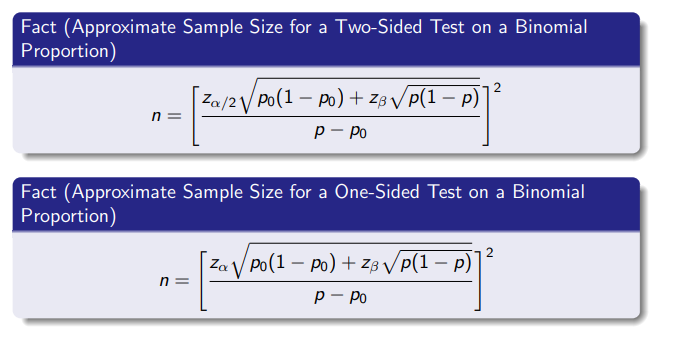

### Hypotheses Tests on the Difference in Means, Variances Unknown

#### Case 1: $\sigma^2_1 = \sigma_2^2 = \sigma^2$

- This means, the standard deviation of the two random variables is the same

$H_0: \mu_1 - \mu_2 = \Delta_0$, $H_1: \mu_1 - \mu_2 \ne \Delta_0 $

- Let $X_{11}, ..., X_{1n_1}$ be a random sample of $n_1$ observations from *first* population
- Let $X_{21}, ... , X_{2n_2}$ be a random sample of $n_1$ observations from the *second* population
- Let $\bar X_1, \bar X_2, S^2_1, S^2_2$ be the *sample means* and *sample variances* respectively
- **Expected Value** of the ***difference in means*** = $\bar X_1 - \bar X_2 = E(\bar X_1 - \bar X_2)$
  - Therefore $\bar X_1 - \bar X_2$ is an ***unbiased estimator*** for the **difference in means**
- **Variance** of $\bar X_1 - \bar X_2 = V(\bar X_1 - \bar X_2) = \sigma^2 (\dfrac{1}{n_2}+\dfrac{1}{n_2})$

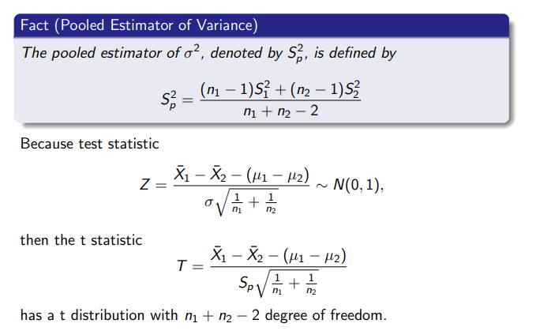

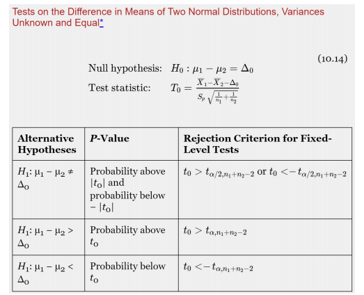

### Case 2: $\sigma_1^2 \ne \sigma_2^2$

#### Test Statistic for the Difference in Means: Variance Unknown and Not Assumed Equal

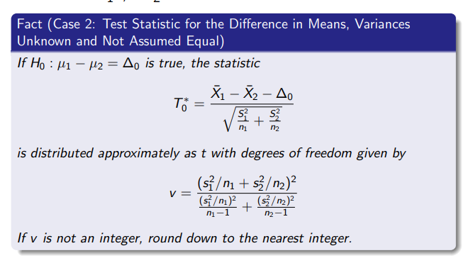

### Empirical Models

- **Regression Analysis** = The collection of statistical tools are used to **model** and *explore* relationship between variables in a non-deterministic manner

  - Only one independent or predictor variable, $x$

    - Study  the relationship with the response, $y$, which is assumed to be linear

    - Reasonable to assume the mean of $Y$ is related to $x$ by

      $Y = \beta_0 + \beta_1x + \epsilon$

      - Slope and intercept of the line are called **regression coefficients**
      - $\epsilon$ is the **random error term**

    - We call this model the **simple linear regression** model

      - It only has one independent variable, or ***regressor***

    - Suppose that the **mean** and **variance** of $\epsilon$ are 0 and $\sigma^2$

      Then:

      ​	$E(Y | x) = \beta_0 + \beta_1x)$ and $V(Y|x) = \sigma^2$

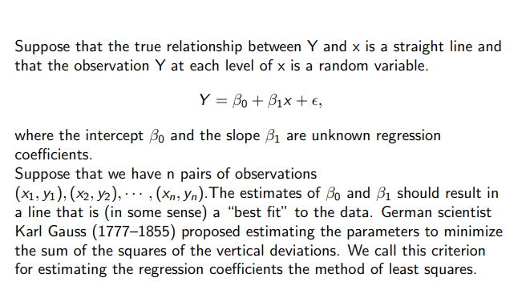

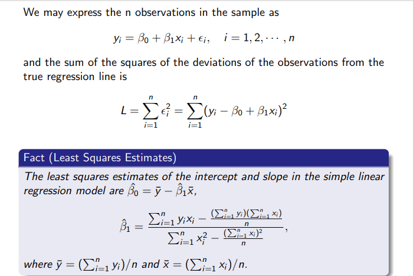

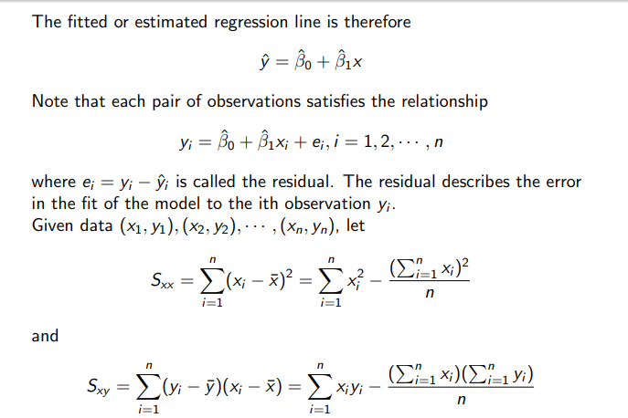

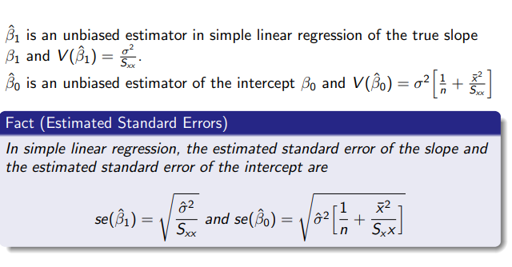