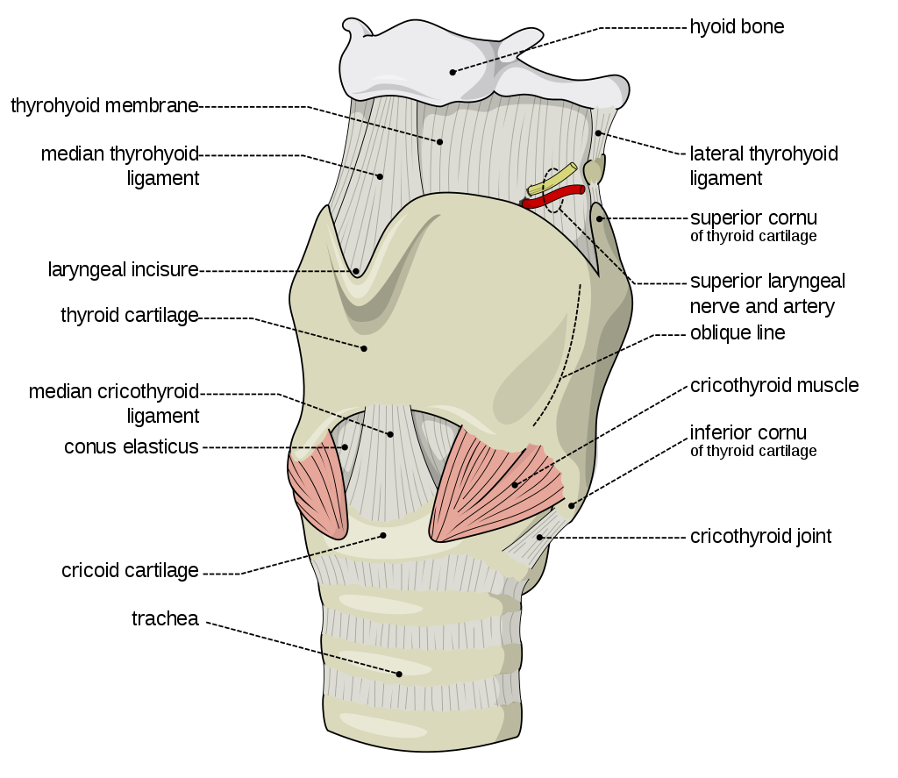
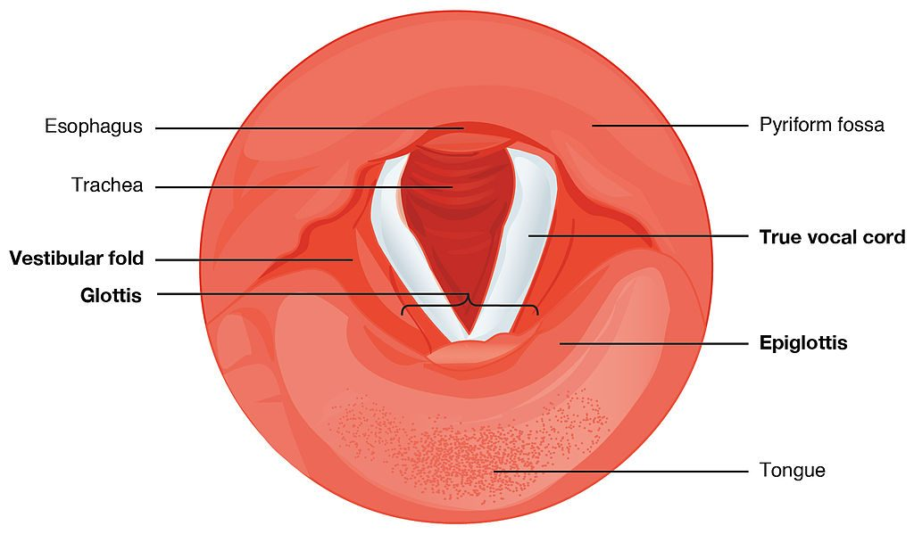
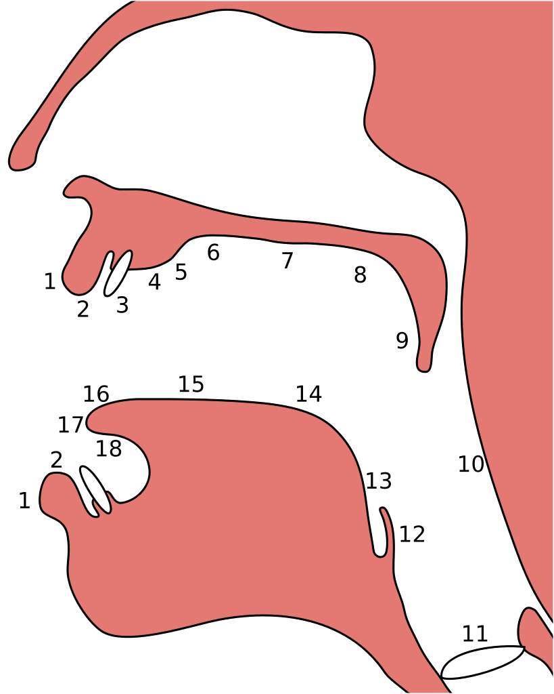

# Linguistics 1A03 | Intro Linguistics: Sounds, Speech, & Hearing

## Lecture 0 : Meta Lecture / Syllabus - 2021-01-15

**Instructor**: Dr. Anderson 

- Quizzes every week on Thursday 8:00am to Friday 5:00pm
- Best 5/8

**Quizzes**

- [ ] Jan 28 - Quiz 1 -  8%
- [ ] Feb 4 - Quiz 2 -  8%
- [ ] Feb 11 -  Quiz 3 -  8%
- [ ] Feb 25 - Quiz 4 -  8%
- [ ] March 4 -Quiz 5 - 8%
- [ ] March 11  - Quiz 6 - 8%
- [ ] March 18  - Quiz 7 - 8%
- [ ] March 25  - Quiz 8 - 8%
- [ ] April 1 - Quiz 9 - 8%

- [ ] April 8 - Quiz 10 - 8%

**Written Exercises**

Each exercise is graded for completion; a reasonable attempt earns 4%. Submit five of eight exercises to earn full points.

Exercises are due at 10:30 a.m. on Fridays. The first exercise is due on January 29; the last on April 9. No exercise due during the Winter Break.

- [ ] Jan 29 - Exercise 1 - 4%
- [ ] Feb 5 - Exercise 2 - 4%
- [ ] Feb 12 - Exercise 3 - 4%
- [ ] Feb 26 - Exercise 4 - 4%
- [ ] March 5 - Exercise 5 - 4%
- [ ] March 12 - Exercise 6 - 4%
- [ ] March 19 - Exercise 7 - 4%
- [ ] March 26 - Exercise 8 - 4% 
- [ ] April 2 - Exercise 9 - 4%
- [ ] April 9 - Exercise 10 - 4%

**Projects**

- [ ] Feb 12 - Project 1 - 12%
- [ ] March 12 - Project 2 - 12%
- [ ] April 14 - Project 3 - 12%

Teams of 2 students 

## Week 1 | Thinking Like a Linguist 2021-01-22

### Linguistics is a Science

- **Linguistics =** science of language

  - **empirical observations**: observe quantifiable data
  - Not a value judgement 
  - follows a ***descriptive approach*** to language, not prescriptive
    - describe the features of language as they are by making observations
  -  linguists observe what people say and how they say it, and come up with theories of why people say certain things or make certain sounds but not others.

- Human differences that facilitate language:

  - **articulatory system** = system that allows us to produce speech

    - lungs

    - larynx

    - vocal folds

    - shape of tongue

    - teeth

    - lips

    - nose

      *no other animal has the way to make speech like a human, not even our closest ancestors*

  - **Auditory system** = 

    - Ears are sensitive to exactly the frequencies that are most common in human speech
    - Other species have similar patterns of auditory sensitivity
      - human newborns pay special attention to human speech, even more so than synthetic speech that is matched for acoustic characteristics

  - **Neural system**

    - No other species has a brain as complex and densely connected as ours with so many connections dedicated to producing and understanding language

### Mental Grammar

- **Cognitive science** = study of what goes on in the mind

  - **Linguistics** is a subset of ***cognitive science***
    - interested in how lanuage knowledge is represented and organized in the human mind

- **Mental Grammar** = the shared system that allows minds to communicate

  - primary goal is to find out what that shared system is like
  - All speakers of the same language *share* a mental grammar
  - focus on *english* for this course

  Five Core Aspects of Mental Grammar (*core subfields of theoretical linguistics*):

  - **Phonetics** = study of speech sounds
    - humans are limited in the phonetic capability by their **sound systems**
  - **Phonology** = how the mental grammar of a language organizes sounds in the mind
  - **Morphology** = strategy that language use to form meaningful words
  - **Syntax** = the different ways that languages combine words to form phrases and sentences
  - **Semantics** = the way that meanings of words and sentences are organized in the mind

### Creativity and Generativity

The foremost property of mental grammar is that it is **generative**: it allows each speaker to **create** new words and sentences that have never been spoken before. The mental grammar **generates** these new words and sentences according to systematic principles that every speaker knows unconsciously.

- **Creativity ** = fundamental property of human language
  - Every language can express *any possible concept*
  - Every language can generate an infinite number of possible new words and sentences.
  - Every language has a *finite set* of words in it called a **vocabulary**
- Every language can use that *finite* **vocabulary** and that *finite* set of **principles** to ***generate*** an *infinite* number of **sentences**
  - Likewise, every language has a *finite* set of **sounds** and a *finite* set of **principles** for combining those sounds. Every language can use those finite resources to generate an infinite number of possible new words in that language
- **Human Grammar is Generative**
- Creativity is governed by **systemic principles**
  - every fluent speaker of a language uses systematic principles to combine sounds to form words and to combine words to form sentences

### Fundamental Properties of Languages

This unit addresses some of the common myths that people believe about languages, and responds to these misconceptions with fundamental truths about human language:

- All languages have a grammar.
- All languages & grammars are equally valid, in linguistic terms.
- All languages have some universal properties in common.
- Every language changes over time.
- Most of our knowledge of the mental grammar of our language is unconscious.

- ***Grammar*** is a property fundamental to all languages 
  - all languages have 
    - a sound system
    - a system for forming words
    - a way of organizing words into sentences
    - a systematic way of assigning meaning
  - Even languages that *don't* have a writing systems have a shared mental grammar 

- **typology =** field of linguistics concerned with ***universal properties of language***
  - some at the level of ***phonology***
    - all languages have **consonants** and **vowels**
  - some at the ***morphology*** and ***syntax***  level
    - all languages make a distinction between **nouns** and **verbs**
    - in *nearly* all languages, the **subject** of a **sentence** comes *before* the **verb** and *before* the **object** of the **sentence**
- **every languages changes over time**
  - some language change is as simple as **vocabulary change**
- language is learned subconsciously through *input* and **much of your knowledge of your mental grammar is not accessible to your conscious awareness**

### Language Change in Progress

- Every part of a language's grammar can change, but some change ***faster*** than other:
  - **lexicon** = vocabulary of a language
    - new words enter a language all the time as technologies and concepts emerge
  - **Sound system** changes more gradually
  - ***morphology*** and ***syntax*** may change but much more slowly

## Week 2 | Producing Speech Sounds

### How Humans Produce Speech

- **Phonetics**= study of human speech
  - **acoustic phonetics** = branch of linguistics and physics
    - concerned with the physical, acoustic properties of the sound waves that we produce
  - **Articulatory Phonetics** = use of the human biological system to produce speech sounds
    - Focus of the class

#### 3 Mechanisms of Producing Speech

1. **Source of Energy**
   - Movement of air in the lungs 
2. **Source of Sounds**
   - Air flowing from the lungs arrives at the **larynx**
   - **Larynx:** cartilage and muscle structure that produces sound
   - 
   - 
     - Opening of the larynx can be covered by two folds of skin called **vocal folds**
     - Opening *between* the **vocal folds** is the **glottis**
3. The sound is then filtered, or shaped, by the **articulators**.

#### Effects of Glottis and Vocal Fold on Speech

- **Glottal Stop**: Stop of air flowing through vocal tract by covering the glottis
- **Voiceless:** if vocal folds don't vibrate when speaking
  - ***vocal folds*** are help **open**
- **Voiced:** if vocal folds vibrate when speaking
  - ***vocal folds*** vibrate when speaking

#### Summary

So to sum up, the three mechanisms that we use to produce speech are:

- **respiration** at the lungs,
- **phonation** at the larynx, and
- **articulation** in the mouth

### Articulators

- **Speaking** involves *controlling* parts of the mouth and nose to shape the air that comes from the lungs.
  - We use : 
    - the tongue,
    -  lips and teeth,
    -  the alveolar ridge, 
    - the palate, 
    - the velum, 
    - and the nasal cavity.

- **Articulators**: the parts of the body that shape the airflow from the larynx 

  - **Sagittal Section**: depcits the inside of the head from a profile cross-section

    

  - **Lips**:

    - Rounding of the lips can influence what vowel sound is made
    - ex. we can use our lips to block the flow of air *completely*
      - [b] and [p]

  - **Teeth:**

    - Tip of the tongue can be placed between the teeth, for sounds like [$\theta$] and [$\eth$]
    - Movement of the top teeth can also create [f] and [v] when against the bottom lip

  - **Palate**:

    - English doesn't contain many palate sounds
    - [j] is a glide

  - **Alveolar Ridge**:

    - Blocking airflow off here will create [t] and [d], [l] and [n]
    - (some people make [s] here)

  - **Nasal Cavity**:

    - Blocking airflow from the mouth and making them circulate through the nasal cavity creates [m] and [n] and [ɳ]

  - **Velum:**

    - Most used
    - Soft palate
    - [k] and [g] , lets air in and out of the nose

  - **Uvula and Pharynx**

    - English doesn't use these

### Describing Speech Sounds in IPA

- Speaking and listening are primary skills in linguistics
  - Not all languages have writing systems, and not all languages rely on speech
- **International Phonetic Alphabet** (IPA)
  - System of spelling with no ambiguity about which sound a given symbol refers to
  - Each symbol represents only one sound
  - Each sound maps onto only one symbol
  - language transcription tool
  - Denoted using square brackets
- **Phonetic Transcription**: visual representation of sounds
  - written record of the sounds of spoken language

### IPA Symbols and Speech Sounds

#### STOPS

| [p]  | **p**each, a**pp**le, ca**p**     |
| ---- | --------------------------------- |
| [b]  | **b**ill, a**b**ove, ri**b**      |
| [t]  | **t**all, in**t**ernal, ligh**t** |
| [d]  | **d**ill, a**d**ore, ki**d**      |
| [k]  | **c**ave, ti**ck**et, lu**ck**    |
| [ɡ]  | **g**ive, ba**gg**age, di**g**    |

####  FRICATIVES

| [f]  | **ph**one, ra**ff**le, lea**f**     |
| ---- | ----------------------------------- |
| [v]  | **v**ideo, li**v**ely, lo**v**e     |
| [θ]  | **th**in, au**th**or, ba**th**      |
| [ð]  | **th**ere, lea**th**er, brea**th**e |
| [s]  | **c**elery, pa**ss**ing, bu**s**    |
| [z]  | **z**ebra, depo**s**it, shoe**s**   |
| [ʃ]  | **sh**ell, o**c**ean, ru**sh**      |
| [ʒ]  | **g**enre, mea**s**ure, rou**ge**   |
| [h]  | **h**ill, a**h**ead                 |

#### AFFRICATES

| [tʃ] | **ch**ip, a**ch**ieve, di**tch** |
| ---- | -------------------------------- |
| [dʒ] | **j**ump, a**dj**oin, bri**dge** |

#### NASALS

| [m]  | **m**ill, ha**mm**er, broo**m**  |
| ---- | -------------------------------- |
| [n]  | **n**ickel, su**nn**y, spoo**n** |
| [ŋ]  | si**ng**er, wro**ng**            |

#### APPROXIMANTS

| [l]  | **l**amb, si**ll**y, fa**ll**  |
| ---- | ------------------------------ |
| [ɹ]  | **r**obot, fu**rr**y, sta**r** |
| [j]  | **y**ellow, ro**y**al          |
| [w]  | **w**inter, flo**w**er         |

####  FLAP

| [ɾ]  | bu**tt**er, pe**d**al (*only between vowels when the second syllable is unstressed*) |
| ---- | ------------------------------------------------------------ |
|      |                                                              |

####  FRONT VOWELS

| [i]  | s**ee**, n**ea**t, p**ie**ce                                 |
| ---- | ------------------------------------------------------------ |
| [ɪ]  | p**i**n, b**i**t, l**i**ck                                   |
| [e]  | s**ay**, pl**a**ce, r**ai**n (*in spoken Canadian English,* [e] *becomes* [eɪ]) |
| [ɛ]  | t**e**n, s**ai**d, br**ea**d                                 |
| [æ]  | m**a**d, c**a**t, f**a**n                                    |
| [a]  | f**a**r, st**a**rt                                           |

#### BACK VOWELS

| [u]  | p**oo**l, bl**ue**                                           |
| ---- | ------------------------------------------------------------ |
| [ʊ]  | l**oo**k, g**oo**d, b**u**sh                                 |
| [o]  | thr**ow**, h**o**le, t**oe** (*in spoken Canadian English,* [o] *becomes* [oʊ]) |
| [ʌ]  | b**u**s, m**u**d, l**u**nch                                  |
| [ɔ]  | st**o**re, m**o**re, c**o**rn                                |
| [ɑ]  | d**o**g, b**a**ll, f**a**ther                                |

#### CENTRAL VOWELS

| [ə]  | b**e**lieve, cinn**a**mon, s**u**rround (*in an unstressed syllable*) |
| ---- | ------------------------------------------------------------ |
| [ɨ]  | ros**e**s, want**e**d (*in an unstressed syllable that is a suffix*) |
| [ɚ]  | weath**er**, edit**or** (*in an unstressed syllable with an r-quality*) |
| [ɝ]  | b**i**rd, f**ur** (*in a stressed syllable with an r-quality*) |

#### DIPHTHONGS

| [aɪ] | fl**y**, l**ie**, sm**i**le   |
| ---- | ----------------------------- |
| [aʊ] | n**ow**, fr**ow**n, l**ou**d  |
| [ɔɪ] | b**oy**, sp**oi**l, n**oi**se |
| [ju] | c**ue**, f**ew**              |

### Sonority, Consonants, and Vowels

- **Sonority**: the relative loudness of a speech sound	
  - has to do with how much acoustic energy a given speech sound has
  - measure of how ***sonorous*** a sound is
  - 3 categories, ***vowels, consonants, and glides***
- Not just limited to loud ness
  - Sounds that are made with lots of airflow from the lungs and with vocal folds vibrarting are **sonorous** sounds
  - sounds that have less airflow or don't have voicing from the vocal folds have ***less*** **sonority**
- Sonority and articulation allow us to create 3 categories

#### Vowels

- **Vowels**
  - Produced with vocal tract quite ***open***
  - Usually voiced with vocal folds vibrating
  - More sonorous on average; can be held for a long time

#### Consonants

- **Consonants**: articulators are used to obstruct the vocal tract, either partially or completely
  - Less air flows from the lungs due to obstruction; less sonorous on average
  - Usually shorter than vowels
  - Voiced or voiceless

#### Glides

- **Glides**: have properties of vowels and some of consonants
  - Vocal tract is unobstructer for glides
  - Shorter and less sonorous than vowels

### Syllable

- **Syllable** = peak of sonority that is surrounded by less sonorous sounds
  - syllable is made up of a vowel, or some other very sonorous sound, with some sounds before it and after it that are less sonorous
    - usually glides or consonants
  - **Nucleus**: peak of sonority for a syllable

### Classifying Consonants

- **Consonants**: 