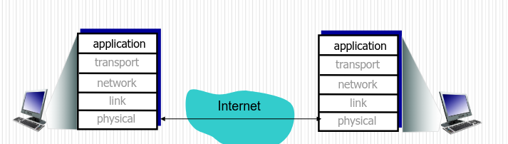

# FWRENG 4C03 | Computer Networks and Security

## Lecture 0 : Meta Lecture / Syllabus - 2020-09-10

**Instructor**: Rong Zheng - `rzheng@mcmaster.ca`

**Zoom:** https://mcmaster.zoom.us/j/98862152627?pwd=bXlqaGc5Y3BCSkhUNk05L0lYWDhJdz09

**Piazza:**https://piazza.com/class/jqfhmvosg3t3jj

**Textbook:** 

>  James F. Kurose, Keith W. Ross, "Computer Networking: A Top-Down Approach Featuring the Internet", 8th ed. Pearson Education 

**Synopsis:** 

> Computer networking is a rapidly advancing field. The Internet is already an integral part of society. It is important for computer scientists and computer engineers to be familiar with the fundamentals as well as practices of computer networking. This graduate course will emphasize on the algorithms, protocols and performance evaluation of the Internet. Topics include TCP/IP protocol stack, routing, congestion control, wireless networks and selected materials in network security. 

**Grading**

- Online quizzes (~5): 25% (*typically due in one week*)
- 6 Assignments: 40% total
- Final: 35%
- 3% bonus for students who answer the most questions and/or ask the most GOOD questions on piazza

**Course Coverage:**

- UI Design Goals
- Mockups, wireframing, prototyping
- Users, tasks
- User Research
- Accessible Design
- Design heuristics, principles, theories
- Design thinking
- User interface design processes
- Testing user interfaces
  - Usability testing
- Implementing user interfaces
  - Technologies, related architectures when relevant
- User help (videos, manuals, etc)
- HCI research & case studies

**MSAF policy**: 

​	- Missing assignments with MSAF approvals will be counted toward the total grade of assignments of the ***\*SAME\**** category. 

Late submission policy:

- a deduction of 10% of the maximum mark available from the actual mark achieved by the student shall be imposed upon expiry of the deadline;
- a further deduction of 5% of the maximum mark available from the actual mark achieved by the student shall then be imposed on each of the next subsequent days;

## Lecture 1 | Introduction to Computer Networks

### Computer Networks

- **Computer Network** = **system** for **communication** among two or more **computers**
  - **System** = both *software* & *hardware*
  - What are *computers*?
  - What *kind* of **communication?** 
    - **DIGITAL**

==Focus of the class is on *the **Internet***==

### Internet Trivia

- email 
- QWERTYUIOP

### History of the Internet

### Growth of the Internet 

### Why Learn Computer Networks

- To **understand** how things work
  - Help fixing day to day problems
- To **develop** distributed applications
- To **configure** and to **operate** (as a system administrator)
- To **improve** and **design**
- To **defend**
- To **contribute** to public discourse and policy making

### What is the Internet?

- **Internet**: billions of connected computing devices
  - **hosts** = end systems
  - running *network applications*
- **Communication links**: media connection between computing devices
  - fiber, copper, radio, satellite
  - **bandwidth:** transmission rate
- **Packet Switches:** device that forward packets
  - **packet**:  chunk of data
  - ex. *routers* and *switches*

### Internet Structure

- **ISP:** *Internet Service Provider*

  - End systems access the ***Internet*** through *Internet Service Providers*
  - Types:
    - Tier-1
    - Tier-2
    - Tier-3
    - Local

- **Connection Types**

  - **Customers and Providers:**

    -  customer pays provider for access to the ***Internet***

      

  - **Peering Relationship**: 

    - Peers provide transit betweent their respective customers

    - Peers do not provide transit between peers

      

#### ISP Tiers

- Roughly hierarchical structure

- ***Tier-1 ISP***

  - Provide national/multi-national coverage

  - Treat each others as equal

    

- ***Tier-2 ISP***

  - Connect to one or more ***tier***-***1*** ISPs

    - Each ***tier-1*** ISP has many ***tier-2*** customers
    - Tier-2 nets sometimes ***peer directly*** with each other
      - bypassing tier-1

    

- ***Tier-3 & Local ISP***

  - *Customer* of higher tier ISPs

    - last ***hop*** (access) network : 
      - closest to the end systems

    

A message passes through ***many*** networks from **source** host to **destination** host

### Traceroute

- **Traceroute Program**: tool that provides delay measurements from ***source*** to ***router*** along end-to-end internet path towards destination
  - For all i:
    - sends 3 packets that will reach router $i$ on path towards destination
    - Router $i$ will return **packet **to **sender**
    - Sender *time interval*  between transmission and reply

### Packet-Switching

#### Store-and-Forward

- **Packet**: partition of application message typically ~1000 bytes
- **Store and Forward**:
  - entire **packet** must arrive at router *before* it can be transmitted on next link
  - packets are forwarded from one router to the next, across links on path from source to destination
  - Individual packet can be forwarded along ***different network paths***

#### Loss and Delay Causes

- **Packets** queue in router buffers
- Packet arrival rate to link exceeds output link capacity
  - More show up than can be processes or stored
- Packets queue, wait for turn

#### 4 Sources of Packet Delay

1. **Processing Delay**

   - Check bit errors
   - Determine output link
   - Deep packet inspection
   - $\mu s$

2. **Queueing Delay**

   - Time waiting at output link for transmission

   - Depends on congestion level of router 

     - how full the queue is / buffer is

   - ms

     

3. **Transmission Delay**

   - **R:** link bandwidth (bps)
   - **L:** packet length (bits)
   - time to send bits into link = $\dfrac{L}{R}$
   - Transmission delay = $\dfrac{L}{R}$

4. **Propagation Delay**

   - **d:** length of physical link
   - **s**: propagation speed in medium
   - **propagation delay=**$\dfrac{d}{s}$

#### Nodal Delay

#### Packet Loss

- Transmission links can be unreliable
  - Bit error rate of ~10^-6 in radios and 10^-15 over optics
- Queue(aka buffer) has *finite* capacity
  - when packet arrives to full queue, packet is dropped --- aka **lost**
  - Lost packet may be:
    -  retransmitted by previous node, 
    - by source node, 
    - or not at all

## Lecture 2 | 2021-01-18

### Review of Week 1 

- Internet is a network of networks consisting of ISPs at different tiers

  - Resilience

  - "multihoming"

    

- Traceroute allows end hosts to "probe" the paths that packets follows to specified destination

- Packets delivered hop-by-hop through the Internet

  - **lossy and varying latency**

- Sources of delays in store-and-forward networks

### Internet Protocols

**Protocols ** = control sending, receiving of messages

​	e.g. *ICP, IP, HTTP, Skype, 802.11*

**Internet Standards**

- **RFC:** Request for comments
- **IETF**: Internet Engineering Task Force

### What's a Protocol?

- **Protocol** = Definition of **formats, order of msgs, action taken on msg transmission &receipt**
  - eg, *TCP, IP, HTTP, FTP, PPP, ICMP*

### Protocol "Layers"

- **Network components**:
  - Hosts
  - Routers
  - Links of various media
  - applications
  - protocols
  - hardware/software

### Why Layering? An Imaginary 2-tier

- New application has to interface to all existing media 
  - adding new application requires `O(m)` work, `m = # media`
- New media requires all existing applications be modified
  - adding new media requires `O(a)` work, with `a = # apps`
- Total work in system `O(ma) ` 
  - eventually too much work to add apps/media
- Applications end points may not be on the same media!

### Solution: Indirection

- **Solution:** Introduce an *intermediate* **layer** that provides a *single abstraction* for various network technologies
  - `O(1)`work to add app/media
  - Indirection is an often used technique in computer scinece

### Network Architecture

- **Architecture =** how to *organize* implementation
  - Not the implementation itself
  - *what* interfaces are supported
  - *where* functionality is implemented
- Architecture is the modular design of the network

### Modularity

| Software Modularity                                          | Network Modularity                                        |
| ------------------------------------------------------------ | --------------------------------------------------------- |
| Break system into **modules**                                | Implementation ***distributed*** across routers and hosts |
| Well-defined **interfaces** gives flexibility - can change implementation of modules - can extend functionality of system by adding new modules | Must decide **how** to break system into modules          |
| **Interfaces hide information** - Seperation of concerns - allows for flexibility - but may hurt performance | Must decide **where** modules are implemented             |

### Layering 

- **Layering = ** particular form of **modularization**

  - system is broken into a ***vertical hierarchy*** of logically distinct entities (layers)
  - Rigid structure: easy reuse, performance may suffer

  

### Key Concepts

- **Service** = says what a layer does
  - *Ethernet:* unreliable subnet unicast /multicast /broadcast datagram service
  - *IP*: unreliable end-to-end unicast datagram service
  - *TCP:* reliable end-to-end bi-directional byte stream service
- **Service Interface** = says how to access the service
  - E.g. socket interface
- **Protocal** = says how is the service implemented
  - a set of rules and message formats that govern the communication between two peers

### Internet Protocal Architecture

- **TCP/IP Protocol Suite** = *basis* for the networks that we call the internet
  - **4 layers**
    - *Application*
    - *Transport*
    - *Network*
    - *(Data) Link*
  - **Computers (*hosts*)**
    -  implement all 4 layers
  - **Routers (*gateways*)** 
    - Network and Link layers
    - Sometimes Physical
  - 

### Layering in Action

## Lecture 3 | 2021-01-20

### Services of the Layers

- **applications** = supporting network applications
  - *FTP, SMTP, HTTP*
- **transport** = process-to-process data transfer
  - *TCP, UDP*
- **network** = routing of datagrams froms ource to destination
  - *IP, routing protocols*
- **link** = data transfer between neighbouring network elements
  - *Ethernet, 802.11 (Wifi), PPP*

### Layering in an Example

### Reality

- Layering is a convenient way to think about networks
- Layering not always followed rigorously
  - **Middle Boxes:** firewalls, network address translation
  - Cross layer optimization

### The Internet Design Question

- Support for common services (for diverse applications)
  - Reliability?
  - In-order delivery?
  - Guranteed bandwith?
  - Low Latency?
  - Accountability?
  - Security?
- What functialities should be supported?
- Where should the functionality be placed?

### Two Design Principles

In fact just one but from different perspectives

- At the network core: **the hourglass model**
- From the end systems' point of view: **end-to-end argument**

### Implications of Hourglass

- A single Internet layer module
- Allows all networks to *interoperate*
  - all networks technologies that support *IP* can exchange packets
- Allows all applications to function on all networks
  - all applications that can run on *IP* can use any network
- Simulataneous developments about and below *IP*
- Router implementation simplified

### The End-2 end Argument

- Leave it to the end-hosts, if implementing this functionality in the network:
  1. Doesn't reduce host implementation complexity,*and*
  2. Does increase network complexity, *and*
  3. Probably imposes delay and overhead on all applications, even if they don't need functionality

- Case Study:

  1. **Reliability:** Message is correctly and eventually delivered froma pplication process on the source to the destination host

     

- However, implementing in network can enhance performance in some cases

  - Very lossy link:
    - 

- Case Study:

  2. **Data Privacy:** application data should remain private (not visibly to 3rd parties)

### Application Layer

- **Services** = supporting network applications
  - **Protocols:** *FTP, SMTP, HTTP, SIP, RTP, RTSP*
  - **Applications:** file transfer, email, web brwoser, skype, multimedia streaming
- Use ***socket interfaces*** from the transport layer (*TCP & UDP*)

#### Application Layer Architectures

- Possible Structure of Applications:
  - *client - server*
  - *peer to peer (P2P)*
  - *hybrid*

#### Client-Server Architecture

- **Server**
  - Always-on host
  - permanent IP address
  - data centres for scaling
- **Clients**
  - communicate with server
  - may be intermittently connected
  - may have dynamic IP addresses
  - *do not commnicate directly* with each other

#### P2P Architecture

- No always-on server
- Arbitrary end systems directly communicate
- Peers request service from other peers, provide service in return to other peers
  - **self scalability -** new peers bring new service capacity,, as well as new service demands
- Peers are intermittently connected and change IP addresses
  - Complex management

#### Hybrid

- **Servers** provides account authentication and maintains information for clients
- Data communication is done ***directly*** between clients

### Communicating Processes

- **Process** = program running within a host
  - within same host:
    - two processes communicate using *inter process communication* (supported by OS)
  - Different host:
    - Communicate by *exchanging messages*
- **Client process** = process that initiates communication
- **Server process** = process that waits to be contacted

applications with P2P architectures have *both* **client processes** and **server processes**

### Sockets

- Process ends/receives messages to/from its **socket**

- **socket** analgous to door

  - sending process shoves message out of a door

  - sending process relies on transport infrastructure on other side of door to deliver message to socket at receiving process

    

### Addressing Processes

- To receive messages, process must have **identifier**
  - Host device has unique IP address
  - Identifier inclues bother *IP addres* and *port numbers* associated with process on host
  - example port numbers:
    - HTTP server: 80
    - SMTP mail server: 25
  - To sent HTTP request to `www.cas.mcmaster.ca` web server:
    - IP address: 130.113.68.10
    - port number: 80

#### Requirements: Common Apps

| Application           | Data Loss     | Throughput                                   | Time Sensitive     |
| --------------------- | ------------- | -------------------------------------------- | ------------------ |
| file transfer         | no loss       | elastic                                      | no                 |
| email                 | no loss       | elastic                                      | no                 |
| web documents         | no loss       | elastic                                      | no                 |
| real-time audio/video | loss-tolerant | audio: 5kbps- 1Mbps video: 10kbps-5Mbps | yes, 100's of msec |
| stored audio/video    | loss tolerant | same as above                                |                    |
| interactive games     | loss-tolerant | few kbps up                                  | yes, few secs      |
| text messaging        | no loss       | elastic                                      | yes and no         |

### Internet Transport Protocols Services

#### TCP Service: Transmission Control Protocol

- **Reliable transport** between sending and receiving process
- **flow control**: sender won't overwhelm receiver
- **congestion control:** throttle sender when network overload
- **does not provide**
  - timing
  - minimum throughput guarantee
  - security
- **connection oriented**: setup required between client and server Processes

#### UDP Service: User Datagram Protocol

- **Unreliable Data transfer** between sending and receiving process
- **does not provide**:
  - reliability
  - flow control
  - congestion control
  - timing
  - throughput gurantee
  - security
  - connection setup

#### Internet Apps: Application and Transport Protocols

| application            | application layer protocol                        | underlying transport protocol |
| ---------------------- | ------------------------------------------------- | ----------------------------- |
| email                  | **SMTP** [ RFC 2821]                              | TCP                           |
| remote terminal access | **Telnet** [RFC 854]                              | TCP                           |
| Web                    | **HTTP**                                          | TCP                           |
| file transfer          | **FTP**                                           | TCP                           |
| streaming multimedia   | **HTTP** (e.g. YouTube) **RTP** [ RFC 1889 ] | TCP or UDP                    |
| internet telephony     | **SIP, RTP,  proprietary(e.g. Skype)**       | TCP or UDP                    |

