# COMPSCI 4ML3 | Introduction to Machine Learning

## Lecture 0 | Course Outline - 2021-01-13

**Instructor: ** Hassan Ashtiani `zokaeiam@mcmaster.ca`

**TAs/Tutorials**

- **Tutorials**:  Tuesdays 12:30-1:20pm

- Each TA will have a weekly office hour which will be posted on MS Teams.
  - Qin Liu `liuq90@mcmaster.ca`
  - Nima Mashayekhi `mashan1@mcmaster.ca`
  - Keivan Nalaie  `nalaiek@mcmaster.ca`

**Grade Breakdown**

- Assignments | 40%
  - 4 assignments - 10% each
- Midterm | 30%
  - **Thursday, March 4, during lecture time**
- Final | 30%

### AI vs. ML vs. Patttern Recognition

- **AI** exists when machines:
  - Think/act *like* humans
  - Think/act *intelligently*
- **Machine learning** = task of making machines intelligent by allowing them to learn from experience / data
  - Instead of giving detailed instructions to a machine, we program it to *find* good instructions based on the given examples
- Machine learning is a term used by computer scientists
- Patter recognition is an older term, used initially by engineers

For the most part, ML and PR are now used interchangeably, though ML is somewhat broader

## Lecture 1 | 2021-01-14

### Curve-Fitting

- Predict **height** of a person given her / his age?

- Collect a set of "data points"

- Represent data point $i$ by $(x^i,y^i)$

  - **index**: represented by superscript

  - $$
    \{(x^i,y^y)\}^n_{i=1}
    
    
    \\
    \text{we have } n \text{ data points}
    $$

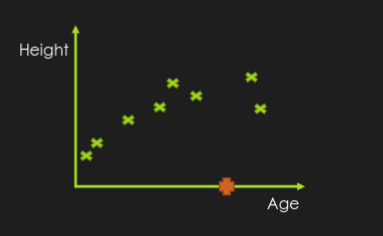

#### Linear Curve Fitting

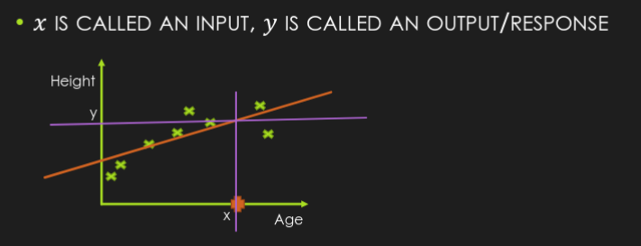

#### Non-Linear Curve Fitting

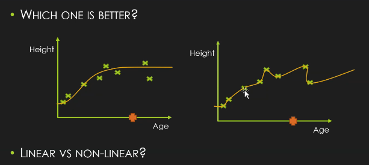

- The **right** approach is a curve that goes through all of the data points
  - Very sensitive to each point
- **Left** is consistent with prior knowledge
  - Age and height relate in that manner in the real world
- The **left** may generalize better 

### Multi-Dimensional Curve Fitting

- $x$ and $y$ could be *multi-dimensional*
- For example, predict the height based on the age *and* weight
- 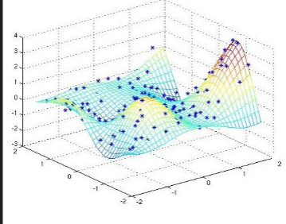
- eg. in the right picture $x \in \mathbb{R}^2, y \in \mathbb{R}$

### Curve Fitting is Everywhere

- Fitting a curve enables **interpolation** and **extrapolation**

  - **interpolation:** things that are outside the range of the data 

    - more meaningful in single dimension

      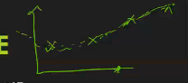

- This is a type of supervised learning prediction
  - Prediction, because we predict $y$ given $x$
  - Supervised because {($x^i,y^i$)$\}^n_i=1$ is given
  - x is real valued and that is why we fit a curve

### Prediction is Everywhere

#### Facial Recognition

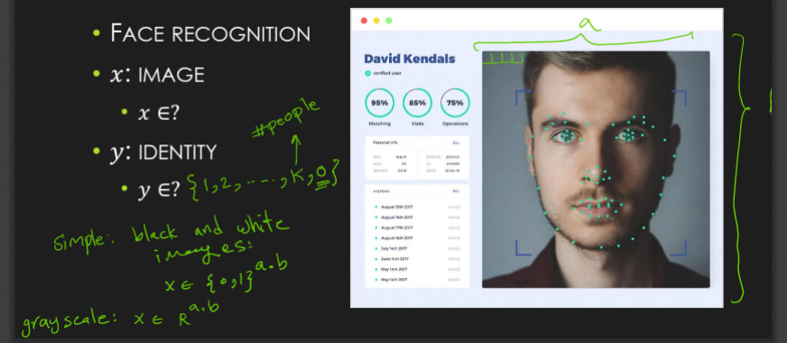

#### Biomedical Imaging

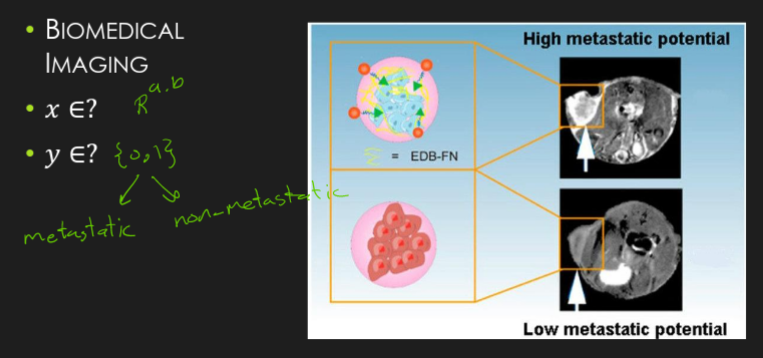

#### Spam Detection

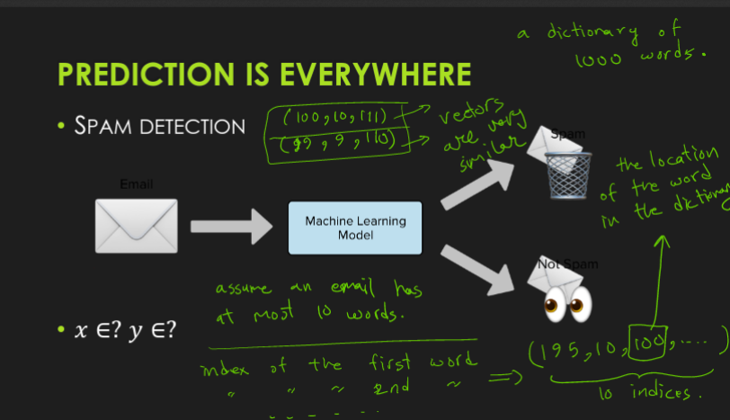

#### Stock Prediction

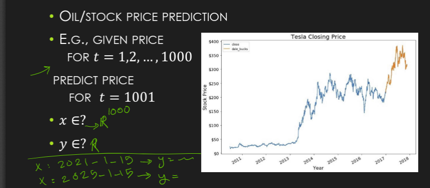

### Linear Regression

- Prediction where:
  - $x \in \mathbb{R}^d$ : 
  - $y \in \mathbb{R}^k$
- **Linear Regression:** the case where $x,y \in \mathbb{R}$
  - i.e. best way of fitting a line
  - begs the question: what does it mean to fit the data best?

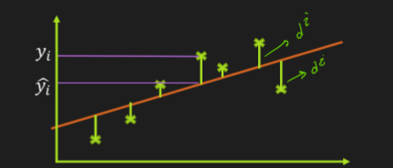

- **model** **prediction**: $\hat{y^i}$		
  - let $d^i = | y^i - \hat{y^i}| \text{  } \implies$ this is the absolute difference between actual and predicted value
  - **Best Line Minimizes:** $\displaystyle\sum_{i=1}^n d^i$

#### Choice of Object Function:

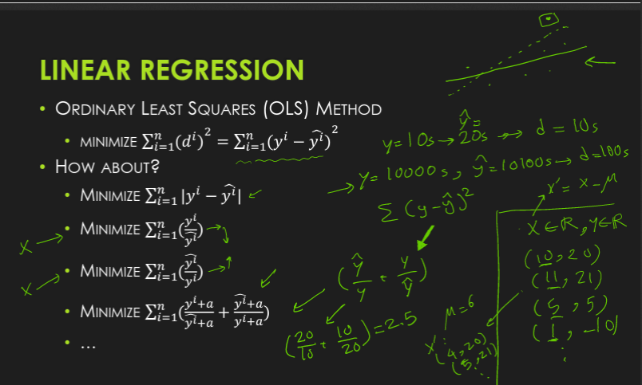

#### 1-D Ordinary Least Squares

- Given $x,y \in \mathbb{R}$ 

- Find $a,b \in \mathbb{R}$ such that $\hat y = ax + b \approx y$

  - Given $\{(x^i,y^i)\}^n_{i=1}$, learn $a$ and $b$ from the data

- $\min _{a,b} \displaystyle\sum^n_{i=1} ((a x^i + b) - y^i)^2$

  - $\hat y = ax^i+b$

- Optimal a and b?

  - $$
    a = \dfrac{\bar{(xy)}-\bar x \bar y}{\bar{x^2} - (\bar x)^2} = \dfrac{\text{cov}(x,y)}{\text{var}(x)}\\ b = a\bar x - \bar y
    $$

  - $\bar z = \displaystyle\sum^n \dfrac{z^i}{n}$

##### Proof

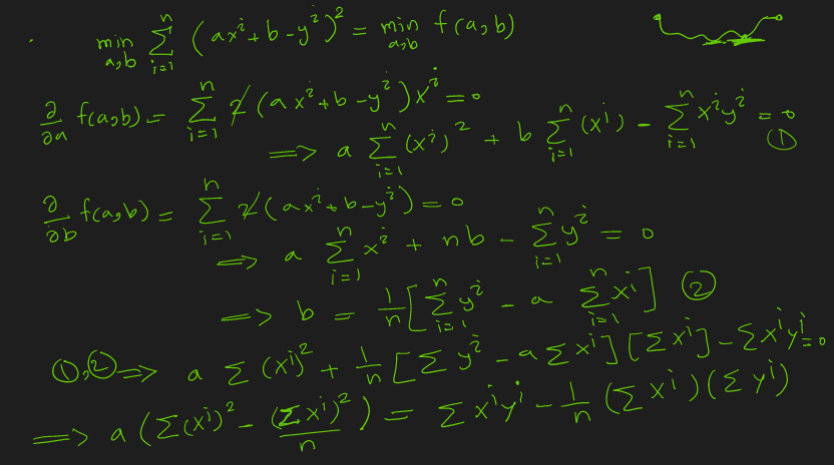

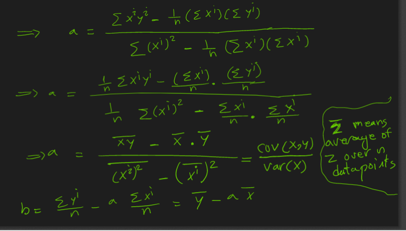

## Lecture 2 

## Lecture 3 

## Lecutre 4 | 2021-01-27

### Review of Lecture 

- We wanted to fit a hyperplane to the data we recieved 
- If we write things in the matrix format
  - $X$ is n wide, number of data points, and d for each feature
  - $Y$ is one dimensional output
  - $W$