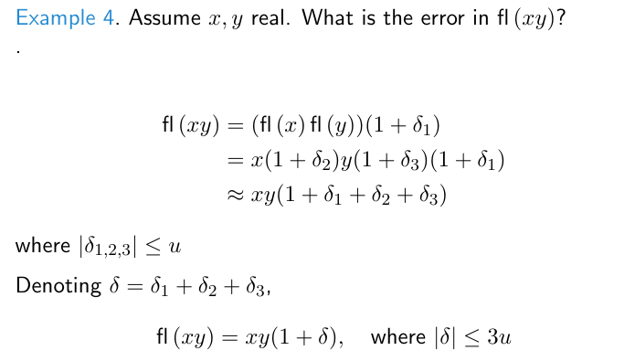

# SFWRENG 4X03 | Scientific Computation

## Lecture 0 : Meta Lecture / Syllabus - 2020-09-10

**Instructor**: Ned Nedialkov  - `nedialk@mcmaster.ca`

**Teaching Instructors**: 

| Bo Cao              | caob13@mcmaster.ca   |
| ------------------- | -------------------- |
| Shahrooz Derakhshan | derakhsb@mcmaster.ca |
| Dylan Bassi         | bassidj@mcmaster.ca  |
| Hong Sung Park      | parkhs5@mcmaster.ca  |

### **Learning objectives**

**Postcondition** A *learning objective* for a course is something the student is expected to know and understand or to be able to do by the end of the course. The learning objectives for this course are given below. Taken together, this set of learning objectives constitute the *postcondition* of the course.

1. Students should know and understand

   1. issues in floating-point (FP) computations, overflow, cancellations, roundoff errors
   2. truncation errors
   3. solving linear systems
   4. linear least squares
   5. solving non-linear equations
   6. interpolation
   7. numerical integration
   8. stability of methods for initial-value problems in ordinary differential equations

2. Students should be able to

   1. perform roundoff error analysis

   2. derive error bounds

   3. interpret numerical results

   4. perform simple complexity analysis

   5. analyze convergence

   6. analyze stability

   7. write Matlab programs implementing numerical methods


**Precondition** The *precondition* of the course is the set of university-level learning objectives that the student is expected to have achieved before the start of the course.

The precondition includes knowledge of calculus and linear algebra

**Textbook:** 

>  [Ward Cheney and David Kinkaid. Numerical Mathematics and Computing](http://www.ma.utexas.edu/CNA/NMC7/index.html)

**Synopsis:** 

> Computer networking is a rapidly advancing field. The Internet is already an integral part of society. It is important for computer scientists and computer engineers to be familiar with the fundamentals as well as practices of computer networking. This graduate course will emphasize on the algorithms, protocols and performance evaluation of the Internet. Topics include TCP/IP protocol stack, routing, congestion control, wireless networks and selected materials in network security. 

**Grading**

| Assignment 1 | 10%  | 22 January – 2 February  |
| ------------ | ---- | ------------------------ |
| Assignment 2 | 10%  | 2 February – 12 February |
| Midterm      | 15%  | 26 Feb, during class     |
| Assignment 3 | 10%  | 5 March – 19 March       |
| Assignment 4 | 10%  | 19 March – 2 April       |
| Final exam   | 45%  |                          |

**Course Coverage:**

- Floating-point arithmetic
- Interpolation and numerical differentiation
- Numerical integration
- Solving systems of linear equations
- Computing eigenvalues
- Least squares
- Solving nonlinear equations
- Introduction to machine learning
- Methods for initial value problems for ordinary differential equations

**Assignments**

- Late work will not be graded without an MSAF.

**Missed work**

- The MSAF accommodation for a missed assignment is a three calendar day extension from the original assignment deadline.
- The MSAF accommodation for a missed midterm is to roll the weight of the midterm into the weight of the final examination.

**Remarking**

- Requests for remarking of an assignment or a test must be made within one week after the marked assignment/test is returned.
- Requests that are later than a week will not be accommodated.

**Changes**

- The instructor reserves the right to modify elements of this course and will notify students accordingly.

### Reading and Exercises

- Chapter 1

  - §1.1: 8, 10 (§1.1: 8, 10)

  - §1.2: 8, 9, 23, 30, 41 ( §1.2: 8, 9, 23, 30, 41)

  - §1.3: 13, 14, 18, 22, 24, 45 (§2.1: 13, 14, 18, 24, 45)

  - §1.4: 8, 11, 13, 14, 24, 26, 29 (§2.2: 8, 11, 14, 24, 26, 29)

    Note: you can skip the theorem on loss of precision

- Chapter 2

  - §2.1: 1, 2, 7a (§7.1: 1, 2, 7a)
  - §2.2: 1, 8, 9, 23 (§7.2: 1, 8, 9, 23)

- Chapter 8

  - §8.1, pp. 358–365, 371–373: 2, 4, 11, 15, 18, 23

    (§8.1, pp. 293–302, 306–307: 2, 4, 11, 15, 18, 23)

- Chapter 4

  - §4.1, pp. 153–168: 1, 9, 12, 18, 40 (§4.1, pp. 124–141: 1, 9, 12, 18, 40)
  - §4.2: 5, 9, 10, 15 (§4.2: 5, 9, 10, 15)

- Chapter 5

  - §5.1, up to p. 210: 1, 6, 7, 8, 11 (§5.2, up to p. 196: 2, 4, 5, 7, 19)
  - §5.3: 1, 2, 4 (§6.1: 1, 2, 4)

- Chapter 9

  - §9.1: 3, 5, 13, 25 (§12.1: 3, 5, 13, 25)

- Chapter 3

  - §3.2: 1, 3, 13, 14, 23 (§3.2: 1, 3, 13, 14, 23)
  - §3.1: 8, 12, 13 (§3.1: 8, 12, 13)
  - §3.3: 2, 3 (§3.3: 2, 3)

- Chapter 8

- Chapter 7

## Lecture 1 | Introduction | 2021-01-13

### Taylor Series

- **Taylor Series** = series of an infinitely differntiable (*real or complex*) $f$ at $c$
  $$
  f(x) = f(c) + f'(c)(x-c) + \dfrac{f''(c)}{2!}(x - c)^2 + ... \\
  = \displaystyle\sum^\infin_{k=0}\dfrac{f^{(k)}(c)}{k!}(x-c)^k
  $$
  
- **Maclaurin Series ** = $c = 0$
  $$
  f(x) = f(0) + f'(0)x + \dfrac{f''(c)}{2!}x^2 + ... \\
  = \displaystyle\sum^\infin_{k=0}\dfrac{f^{(k)}(0)}{k!}(x)^k
  $$

- Assume $f$ has $n+1$ **continuous derivatives** in the range $[a,b]$, noted:

  $ f \in C^{n+1} [a,b]$

- Then, for any $c$ and $x$ in $[a,b]$
  $$
  f(x) = \sum_k^n \dfrac{f^{(k)(c)}}{k!}(x-c)^k+E_{n+1}
  $$
  - where 
    $$
    E_{n+1} = \dfrac{f^{n+1}(\zeta)}{(n+1)!}(x-c)^{n+1} \text{   and } \zeta = \zeta(c,x) \text{ is between } c \text{ and } x
    $$
    Replacing $x$ by $x+h$ and $c$ by $x$ we obtain
    $$
    f(x+h) = \sum^n_k \dfrac{f^{(k)}(x)}{k!}h^k + E_{n+1}
    $$

    - where 
      $$
      E_{n+1} = \dfrac{f^{n+1}(\zeta)}{(n+1)!}h^{n+1}
      $$
      where $\zeta$ is between $x$ and $x+h$

- We say the error term $E_{n+1}$ is of order $n+1$ and write as 
  $$
  E_{n+1} = \dfrac{f^{n+1}(\zeta)}{(n+1)!}h^{n+1} = O(h^{n+1})
  $$

  - That is, 
    $$
    |E_{n+1}| \leq ch^{n+1}, \text{for some } c > 0
    $$

#### Examples 1:

- How to approximate $e^x$ for given $x$?

- Suppose we use $ e^x \approx 1 + x + \dfrac{x^2}{2!} + ...$

  - Then
    $$
    e^x = 1 + x + \dfrac{x^2}{2!} + E_3\\
    E_3 = \dfrac{\zeta^3}{3!}   \text{for } \zeta \text{ between 0 and x}
    $$

  - Let $x = 0.1$, Then $e^{0.1} \approx 1.105$

    - Error: $E_3 = \dfrac{\zeta^3}{3!} \leq \dfrac{0.1^3}{3!} \approx 1.6667 \times 10^-4$

#### Example 2

How to measure the error?

- We can compute a more accurate value using `MATLABS` `exp()` function

  - ```matlab
    exp(0.1) = 1.105170918075648e+00
    ```

  - Using this value, the error in our approximation is:
    $$
    | 1.105 - 1.105170918075648 | \approx 1.7092 \times 10^-4
    $$

  - **Theoretical error** is usually $\leq$ **computed error:**

    - $E_3 \lesssim 1.6667 \times 10^-4 \leq 1.7092 \times 10^-4$

#### Example 3

- If we approximate using three terms, $e^x \approx 1 + x + \dfrac{x^2}{2!} + \dfrac{x^3}{3!}$ 
  - $E_4 = \dfrac{\zeta^4}{4!} \leq \dfrac{x^4}{4!} \implies E_4 \leq \dfrac{0.1^4}{4!} \approx 4.1667 \times 10^{-6}$
  - Using `exp(0.1)`, the error is
    - $|1.105166666666667−1.105170918075648| \approx 4.2514 \times 10^{−6}$

### Errors in Computing

#### Roundoff Errors

#### Example 4

- **roundoff error**: rounding off of infinite representation in floating point arithmetic
  - $\epsilon$ : the symbol used to define the **roundoff error**

- Consider computing `exp(0.1):`
  - `0.1`'s binary representation is ***infinite***:
    - $0.1_{10} = (0.0 \text{ } 0011 \text{ } 0011 ...)_2$
  - **input** to the `exp` function is ==not exactly $0.1$ but $0.1 + \epsilon$==
  - `exp` function *also* has its own **error**
  - *then* hte output of `exp(0.1)` is rounded when converting from binary to decimal

Error can propogate quickly

#### Example 5

- Compute `3(*(4/3-1)-1)*2^52)` in favourite language
  - **exact value:** 0 
  - **double precision:** -1
  - **single precision:** 536870912

#### Example 6

```c
#include <stdio.h>
int main() {
    int    i = 0, j = 0;
    float  f;
    double d;
    for (f = 0.5; f < 1.0; f += 0.1)    i++;
    for (d = 0.5; d < 1.0; d += 0.1)    j++;
    printf("float loop %d  double loop %d \n", i, j);
}
```

outputs `float loop 5 double loop 6`

#### Example 7

- Let $a_i = i \cdot a_{i-1} - 1$ 
  - $a_0 - e - 1$
  - What is $a_{25}$

```c
#include <stdio.h>
int main(){
    int i;
    a = exp(1)-1;
    for (i = 1; i <= 25; i++) a = i * a - 1;
    printf("%e\n", a);
    return 0;
}
```


### Truncation Errors


### Approximating First Derivative


### Mean-Value Theorem

- If $f \in C^{1} [a,b], a < b$
  - that is to say, for some function *f*, that is differentiable over the interval a,b, with a being less tha b
  - $f(b) = f(a) + (b-a)f'(\zeta), \text{for some } \zeta \in (a,b)$
  - from that, we can derive:
    - $f'(\zeta) = \dfrac{f(b) - f(a)}{b - a}$

## Lecture 2 | Computer Arithemetic | 2021-01-14

### Floating Point Number System

- **Floating Point (FP) System**: system characterized by four integers $(\beta, t, L, U)$

  - $\beta$: base of the system, or ***radix***
  - $t$: number of digits or ***precision***
  - [$L,U$] : exponent range

- A **number** $x$ in the system is represented as:
  $$
  x = \pm ( d_0 + \frac{d_1}{\beta} + \frac{d_2}{\beta^2} + ... + \frac{d_{t-1}}{\beta^{t-1}}) \times \beta^e
  $$
  where:

  - $0 \leq d_i \leq \beta -1 , i = 0, ..., t-1$
  - $e \in [L,U]$

-  **Mantissa**:  the string of base $\beta$ digits, $d_0, d_1, ..., d_{t-1}$

  - also called ***significand***
  - **fraction**: $d_1, d_2, ... , d_{t-1}$

- Another common way of expressing $x$ is:

  - $\pm d_0 \cdot d_1 .... d_{t-1} \times \beta^e$

- A FP number is **normalized** if $d_0$ is non-zero

  - **denormalized ** otherwise

#### Example 1


### Rounding

- How to store a real number $x$, that is represented as:

  - $$
    x = \pm ( d_0 + \frac{d_1}{\beta} + \frac{d_2}{\beta^2} + ... + \frac{d_{t-1}}{\beta^{t-1}}) \times \beta^e
    $$

  - but in $t$ digits?

- `fl(x)` : notation for the FP representation of $x$

  - Rounding by *chopping* (also called rounding towards zero)
  - Rounding to nearest `fl(x) ` is the nearest FP to $x$
    - if a tie, round to the *even* FP
  - Rounding towards $+ \infin$: 
    - `fl(x)` is the *smallest* FP $\geq x$ 
  - Rounding towards $- \infin$:
    - `fl(x)` is the *largest* FP $\leq x$ 

#### Example 2


### Machine Epsilon

- **Machine Epsilon**: the distance from 1 to the next larger FP number

  - e.g. in $(10,3,-2,2)$ , $\displaystyle\epsilon_{\text{machine}} = 1.01 - 1 = 0.01 = 10^-2$
  - **Another definition:** smallest $\epsilon > 0 $ such that `fl(1+e)` $> 1$ 
    - two definitions ***are not equivalent***

- **Unit Roundouff**: $u = \dfrac{\epsilon_{\text{machine}}}{2}$

  - When rouding to the nearest

    

### IEEE 754

- IEEE 754 
  - Standard for FP arithmetic (1985)
  - IEEE 754-2008 and IEEE 754-2019
- Most common single and double precision in binary
  - since 2008 also includes half precision


#### Exceptional Values

- `Inf, -Inf`: when the result overflows, e.g. 1/0.0
- `NaN`: *"Not a number"*, results from undefined operations
  - 0/0
  - 0*`Inf `
  - `Inf`/`Inf`

#### Diagram


- Sign 0 positive, 1 negative
- Exponent is biased
- First bit of mantissa is not stored:
  -  "sticky bit", assumed 1

#### Single Precision

- `Inf`:
  - **sign:** 0 for *positive infinity*, -1 for *negative infinity*
  - **biased exponent**: all 1's, 255
  - **fraction:** all 0's
- `NaN`:
  - **sign**: 0 or 1
  - **biased exponent:** all 1's, 255
  - **fraction:** at least one 1
- `0`:
  - **sign**: 0 for +0, 1 for -0
  - **biased exponent:** all 0's
  - **mantissa**: all 0's
- Floating Point Numbers:
  - **biased exponent**: from 1 to 254, bias: 127
  - **actual exponent:** 1 - 127 = -126 to 254 - 127 = 127

#### Double Precision

- **Bias:** 1023
- **Biased Exponent**: from 1 to 2046
- **Actual Exponent:** from -1022 to 1023

The rest is similar to single precision

#### FP arithmetic


#### Example 3


#### Example 4



#### Example 5


### Cancellations

#### Example 6


#### Example 7


#### Example 8


## Lecture 3 | Computer Arithmetic | 2021-01-19

### Cancellations

- Consider $x-y$

  - assume no roundoff in the subtraction

    - i.e. $fl(x-y) = fl(x) - fl(y)$

  - 

    

#### Example 1

Consider a decimal FP system with 5 digits:

Let $x = 9.23450001 \text{ and } y = 9.23455001$


#### Example 2

How to evaluate $\sqrt{x+1} - \sqrt{x}$ to avoid ***Canellations***"

"


#### Example 4

Which is better to compute?

- $x^2 - y^2$ 
- $(x-y)(x+y)$

**Test:**

```matlab
clear all;
h = 1e-10;
x = sin(1+h);
y = sin(1-h);
a = (x-y)*(x+y);
b = x^2-y^2;
% evaluate in higher precision
x = vpa(x, 32);
acc = (x-y)*(x+y);
fprintf(’a           = %.8e\n’, a);
fprintf(’b           = %.8e\n’, b);
fprintf(’accurate = %.8e\n’, acc);
fprintf(’rel error a=%.1e\n’, abs((acc-a)/acc));
fprintf(’rel error b=%.1e\n’, abs((acc-b)/acc));
```

**Output:**

```matlab
a           = 1.81859466e-10
b           = 1.81859416e-10
accurate = 1.81859466e-10
rel error a=1.0e-17
rel error b=2.7e-07
```

#### Example 4

- Consider approximiating $e^{-x} \text{ for } x > 0 $ by

$$
e^{-x} \approx 1 - x + \dfrac{x^2}{2!} - \dfrac{x^3}{3!} + ... + (-1)^k \dfrac{x^k}{k!}, \text{ for some } k
$$

- From $e^{-x} = \dfrac{1}{e^x}$ it is better to approximate
  $$
  e^{-x} \approx 1 + x + \dfrac{x^2}{2!} + \dfrac{x^3}{3!} + ... + \dfrac{x^k}{k!}, \text{ for some } k
  $$

  - and to the compute $\dfrac{1}{e^x}$

### Solving $ax^2 + bx + c$

#### Example 5


