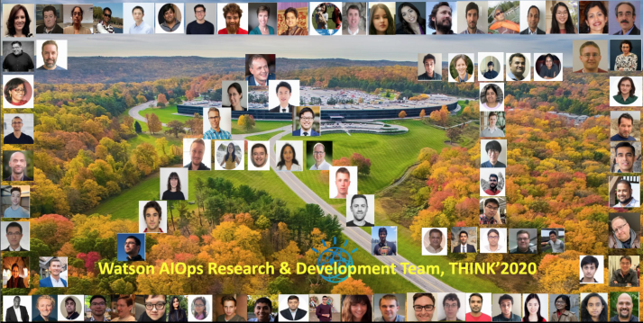
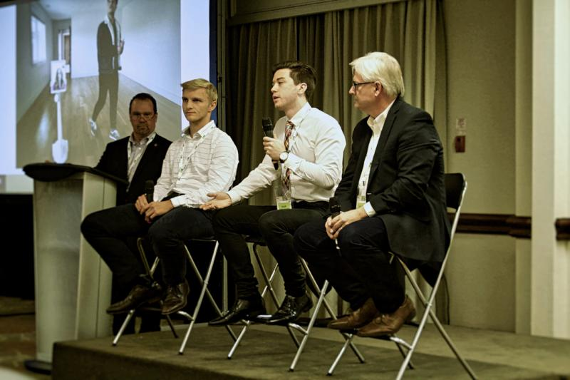
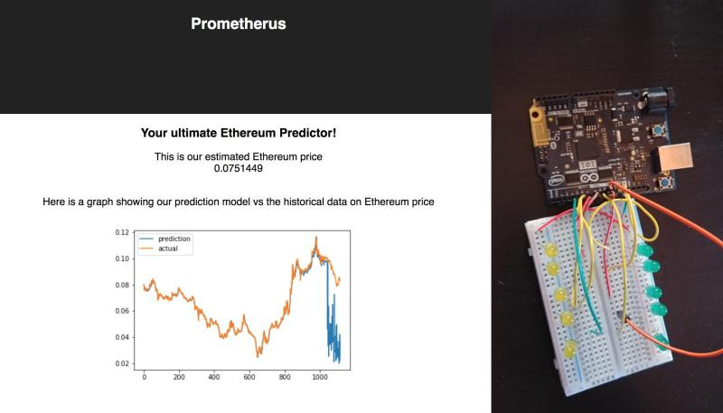
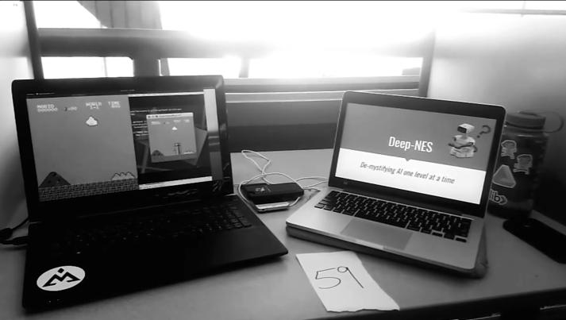

## Jacob Gordon | Portfolio

### About

I'm currently an undergraduate student in my final year of software engineering at McMaster University. During my studies, I've served on the Software Engineering Society, the McMaster Engineering Society, and the McMaster Artificial Intelligence Society. I'm passionate about learning, and through my various roles at Mac I've tried to promote and increase accessibility to experiential learning experiences for all students. While working at IBM as a Cognitive Software Developer, I helped launch a new IBM Watson product as one of core developers. I also worked on the Laboratory Robotics team, where I programmed robot behaviours and gave presentations for the team at IBM events and conferences.  My interest lies in the intersection of software engineering, deep learning, AI, cognition and linguistics. I love rock climbing, music, Linux, and learning new things.

### Experience

#### IBM Internship

### 

In my time at IBM I had the opportunity to join and work on the Lab Robotics team. There I worked on behaviours and programs for the Pepper and Nao robots. Our aim was to program a robotic concierge to greet clients and escort them to their meetings. I also gave presentations at conferences and community events, to engage IBMers, clients, and even high school students to raise technical literacy. Our team worked with several Women in STEM programs.

My main role in IBM was Cognitive Developer on IBM Watson AIOps. We grew from a small team of 11 developers in Toronto to an international effort. I worked on DevOps and AI technologies, and helped develop several python based microservices. 

#### McMaster Artificial Intelligence Society

I've been a member of Mac AI since 2018, and have served as software project manager, and am current Co - President. 

In my time at Mac AI, I've started the projects team, which now has placed internationally at conferences for work in computer vision, and is currently running community engagement projects to help give back to Hamilton.

One of my main goals for Mac AI was to increase the accessibility of concepts and tools for machine learning to university students who could use and apply these ideas.  Hands on experiential opportunities are one of the best way to learn a skill, and so we've focused on tutorials and projects. I've worked to promote resources, such as with this [reading list](https://github.com/McMasterAI/wiki/wiki/Reading-List) and the Mac AI wiki.

I have had the privilege of representing Mac AI at several events, and spoke at the 2018 RAHB ProDev+ Conference. I've also published reports of conferences attended for McMaster students in the Mac AI newsletter, and yearly report.

I've helped plan this year's [MacHacks](https://www.mcmasterai.com/machacks), an Major League Hacking 2020-2021 hackathon focused on AI, Quantum Computing and Biotech. Mac AI founded MacHacks last year to promote curiosity and interest in AI tech for Canadian undergrads. This year we've partnered with IBM Quantum to provide resources, and help spread awareness and literacy on the technologies for all.

### Projects

#### Beasley Neighbourhood Traffic Mapper

[github repo](https://github.com/McMasterAI/BNA-traffic-mapper)

The Traffic Mapper is a real time map and analytic dashboard of usage of Cannon Street in Hamilton. It will use computer vision to extract entities and spatial location from streaming video, following online and real‑time system following kappa architecture.

My role in the project is dealing with the flow of data in the system, and designing the architecture to accommodate the distributed computing setup of the project. An embedded system will take streaming video and feed that to a back-end application, which will process analytics to be consumed by a dashboard.

I'll be designing the Kafka streaming system to facilitate timely and real-time data processing. Kafka is an encrypted data-transfer application, and part of my my responsibility is to ensure the privacy and security of transferred data captured from our embedded camera system. I have also been involved in the project with determining methods to serialize the streaming video efficiently for transfer over Kafka. 

#### Space Invaders Deep Q-Network

[github repo](https://github.com/Jzar/Space-Invaders-DQN)

Implemented a Asynchronous Deep Q Learning Network for playing the Atari game *Space Invaders*. The model consisted of several agents concurrently playing the game in separate environments, with all of the agents sharing one model. The agents would update and use the same model in parallel.

### Hackathon

#### PromEtherus |*"Best Pitch" Winner* - Hack The Valley II 

[github repo](https://github.com/Jzar/HTVII)

I helped develop a RNN (recurrent neural network) that forecasted the value of the cryptocurrency *Ethereum* utilizing historical date, and a signal generated from the average sentiment of users of twitter tweeting `#ethereum`

#### SeeingIsBusLeaving | ”Sustainable City Challenge” Winner ‑ uOttaHack

[github repo](https://github.com/dcxia/SeeingIsBusleaving)

 We built a hardware solution to encourage people to ride public transit more often. It was a real-time map of bus locations with LEDs representing bus stops. We won the Accenture Smart City prize for our hack.

#### DeepNES | DeltaHacks V

[github repo](https://github.com/Jzar/DeltaHacksV)

Implemented a Policy Gradient reinforcement learning model to play the original Mario Bros. on NES using TensorFlow and Python.

### Contact

**Phone:** (905)-407-7322

**Email:** gordoj7@mcmaster.ca

**LinkedIn:** https://www.linkedin.com/in/jgordonzarankin/

**Github:** https://github.com/Jzar